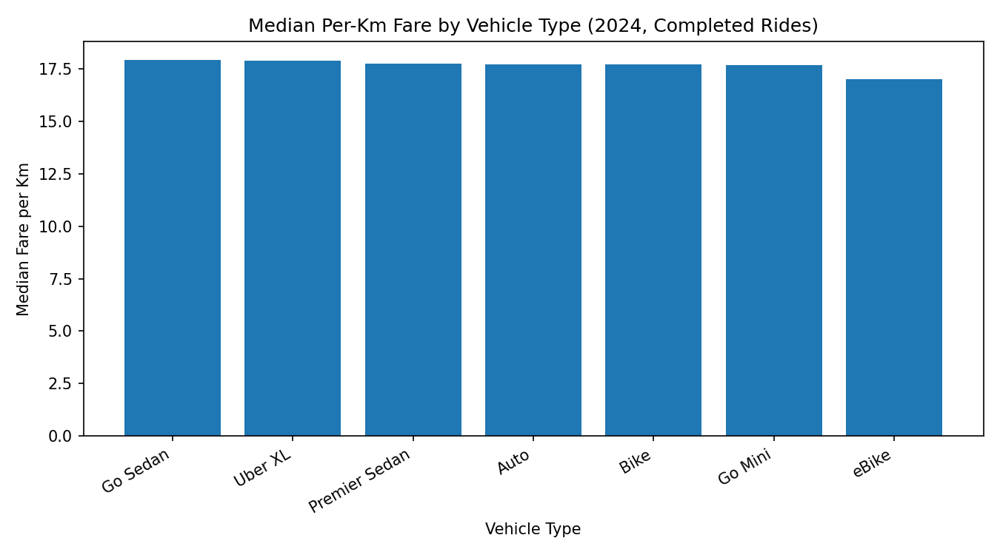
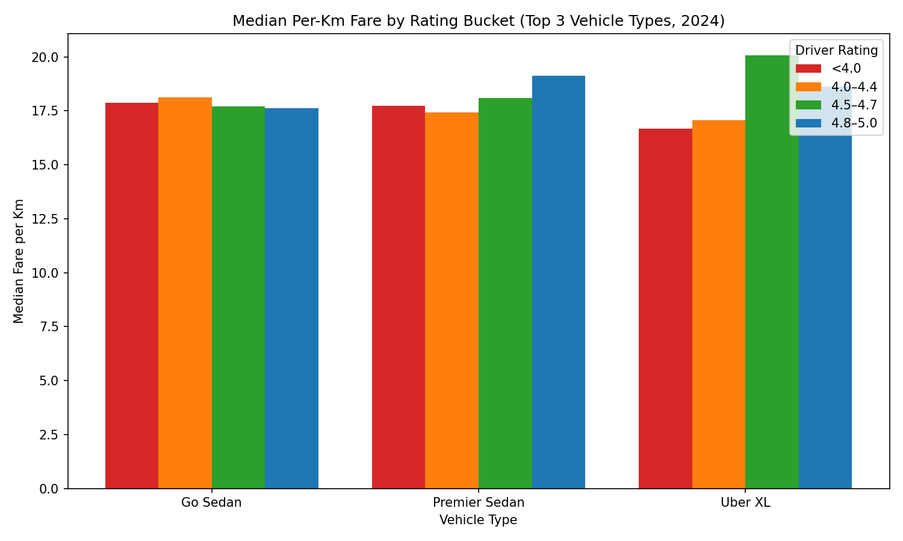

Executive Summary
To maximize annual earnings, prioritize vehicle types with higher per‑km fares and strong completion rates, and maintain a driver rating aligned with the category’s fare dynamics. In 2024 data:
- Highest median per‑km fares were in Go Sedan (17.918), Uber XL (17.914), and Premier Sedan (17.767) INR/km. eBike was lowest at 17.012 INR/km.
- Completion rate was highest for Uber XL (62.55%), slightly above Bike (62.33%) and Go Mini (62.23%), with Go Sedan lowest (61.44%).
- Ratings matter more for premium categories: Premier Sedan drivers at 4.8–5.0 rating reached 19.134 INR/km (+7.7% vs category median 17.767); Uber XL at 4.5–4.7 rating hit 20.071 INR/km (+12% vs category median 17.914).

What drives earnings (2024, SQL/Python basis)
- Data source: sheet1 table; filtered Date LIKE '2024/%'. Fields used: Vehicle Type, Booking Status, Ride Distance, Booking Value, Driver Ratings. Per‑km fare computed as Booking Value / Ride Distance for completed rides only (Python).
- Queries and code steps: 
  • Grouped completed rides by Vehicle Type to compute median per‑km fare and ride counts.
  • Aggregated all bookings by Vehicle Type and Booking Status to compute completion rates.
  • Bucketed Driver Ratings into <4.0, 4.0–4.4, 4.5–4.7, 4.8–5.0, and computed median per‑km fare within the top-3 vehicle types by median per‑km.

Visual 1: Median per‑km fare by vehicle type

Key takeaway: Go Sedan (17.918), Uber XL (17.914), and Premier Sedan (17.767) have the highest median per‑km fares; eBike is lowest at 17.012. This matters because selecting a higher-paying category can lift earnings per distance by up to ~5% versus the lowest category, compounding over a year.
- Observation: Median per‑km fare (INR/km) across vehicle types: Go Sedan 17.918; Uber XL 17.914; Premier Sedan 17.767; Auto 17.722; Bike 17.706; Go Mini 17.673; eBike 17.012.
- Root cause: Pricing structures and demand characteristics of premium/heavier vehicles tend to support slightly higher base and surge pricing; micromobility/eBike categories have lower base fares.
- Business impact / Recommendation: If eligible, prefer Uber XL or Go Sedan to capture the highest per‑km fares. Avoid eBike if maximizing per‑km income is the goal.

Visual 2: Median per‑km fare by driver rating bucket (Top 3 vehicle types)

Key takeaway: Ratings significantly influence per‑km fare in premium categories. Premier Sedan at 4.8–5.0 yields 19.134 INR/km (+7.7% vs Premier median 17.767), while Uber XL at 4.5–4.7 yields 20.071 INR/km (+12% vs Uber XL median 17.914). In Go Sedan, the 4.0–4.4 bucket is slightly higher (18.124) than the category median, and 4.8–5.0 is slightly lower (17.616), indicating less monotonic rating impact.
- Observation: 
  • Premier Sedan median per‑km (INR/km): 4.0–4.4 at 17.429; 4.5–4.7 at 18.082; 4.8–5.0 at 19.134; <4.0 at 17.738.
  • Uber XL: 4.0–4.4 at 17.060; 4.5–4.7 at 20.071; 4.8–5.0 at 18.635; <4.0 at 16.682.
  • Go Sedan: 4.0–4.4 at 18.124; 4.5–4.7 at 17.692; 4.8–5.0 at 17.616; <4.0 at 17.858.
- Root cause: High ratings in premium categories likely unlock more surge-eligible trips, preferred dispatch, or customer selection effects; in mid-tier Go Sedan, trip mix may dilute the rating premium.
- Business impact / Recommendation: 
  • If driving Premier Sedan, aggressively target 4.8–5.0 rating to capture ~7–10% higher per‑km.
  • If driving Uber XL, aim for at least 4.5–4.7 rating (20.071 INR/km), which is ~12% above the category median.
  • For Go Sedan, maintain a strong rating (≥4.5) for platform benefits (matching priority, retention), but expect only a modest per‑km uplift.

Completion rate by vehicle type (All bookings, not just completed)
- Observation: Completion rate is highest in Uber XL (62.55%), followed by Bike (62.33%), Go Mini (62.23%), Premier Sedan (62.13%), eBike (62.05%), Auto (61.88%), and Go Sedan (61.44). Total bookings reflect demand: Auto 37,419; Go Mini 29,806; Go Sedan 27,141; Bike 22,517; Premier Sedan 18,111; eBike 10,557; Uber XL 4,449.
- Root cause: Demand-supply balance and rider preferences vary by category; Uber XL’s higher completion may reflect less competition or more decisive riders for larger vehicles.
- Business impact / Recommendation: Favor categories with both higher per‑km and higher completion (Uber XL) to reduce idle time. If Uber XL demand is thin locally, consider Go Mini or Auto to keep a full daily schedule, accepting a small per‑km trade-off.

Additional operational insights
- Trip length and booking value medians are broadly similar (median distance ~26 km; median booking value ~412–417 INR) across vehicle types, so the per‑km fare drives earning quality more than distance mix in this dataset.
- Minimizing cancellations and maintaining high acceptance will modestly improve completion rates, compounding daily earnings through less downtime.

Prioritized recommendations for 2025 planning
1) Vehicle Type Choice:
   - If qualified and demand is sufficient in your area, choose Uber XL for a strong combination of high per‑km (17.914 median) and best completion rate (62.55%). 
   - If Uber XL is not viable, Go Sedan offers the top per‑km (17.918) but slightly lower completion (61.44%); Auto and Go Mini provide very similar per‑km with higher demand volume for steadier rides.
   - Avoid eBike if the target is maximizing per‑km, given its lower median (17.012).
2) Service Quality Rating Targets:
   - Premier Sedan: maintain 4.8–5.0 for ~19.134 INR/km (+7.7% vs category median).
   - Uber XL: maintain 4.5–4.7 for ~20.071 INR/km (+12% vs category median).
   - Go Sedan: rating has limited monotonic effect on per‑km; still aim ≥4.5 for marketplace benefits.
3) Daily Ops:
   - Focus on acceptance and completion to minimize idle time; Uber XL shows a slight advantage here.
   - Work peak periods that typically increase surge for premium categories; high ratings may amplify access to those trips.
   - Keep vehicle cleanliness, punctuality, and polite communication to sustain target rating buckets.

Methodological notes (traceability)
- SQL: Inspected schema (PRAGMA table_info) and enumerated vehicle types (SELECT DISTINCT). 
- Python: Filtered rows where Date LIKE '2024/%', Booking Status='Completed', and Ride Distance/Booking Value were non-null. Computed per_km_fare and grouped by Vehicle Type and rating buckets. Calculated completion rates from all Booking Status counts. Plots generated with matplotlib and saved as median_per_km_by_vehicle.png and median_per_km_by_rating_top3.png.

Overall, your optimal strategy is to drive Uber XL (where available) and maintain at least a 4.5–4.7 rating; if you operate Premier Sedan, push for 4.8–5.0 to unlock a clear per‑km premium. If category eligibility or demand is constrained, Go Sedan or Auto remain solid options with near‑top per‑km fares and substantial ride volume.
