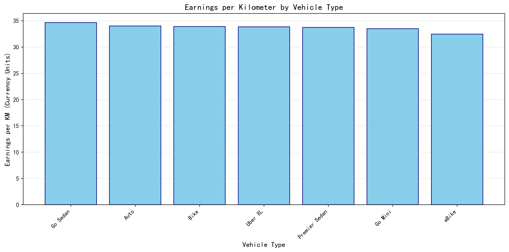
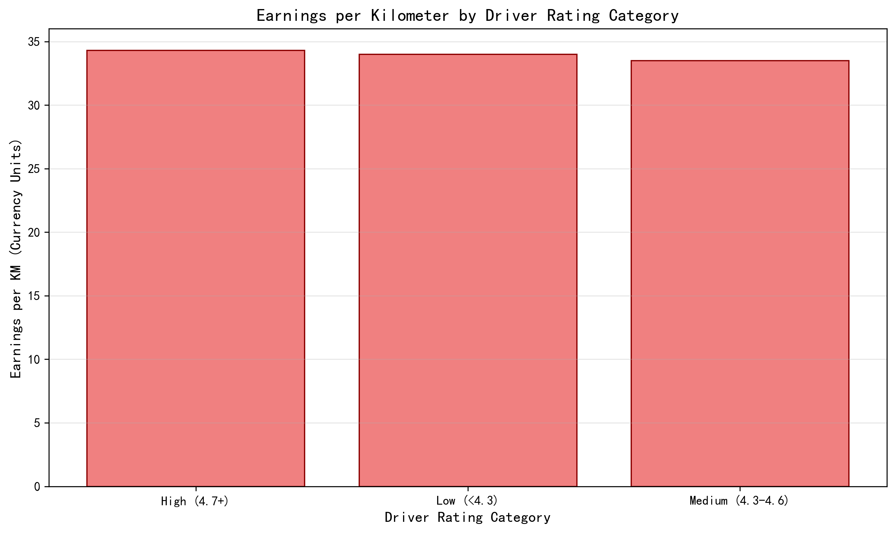

# Ride-Hailing Driver Earnings Optimization Report

## Executive Summary

Based on analysis of 93,000 completed rides from 2024 platform data, this report identifies key strategies for drivers to maximize earnings per kilometer. The analysis reveals that vehicle type selection and maintaining high service ratings significantly impact profitability, with earnings per kilometer ranging from 32.5 to 34.7 currency units across different strategies.

## Key Findings

### Vehicle Type Impact on Earnings

**Go Sedan delivers the highest earnings per kilometer at 34.7 currency units**, followed by Auto (34.0) and Bike (33.9). The analysis shows a narrow but meaningful 6.7% earnings gap between the highest and lowest performing vehicle types.

- **Go Sedan**: 34.7 currency units/km (16,676 rides)
- **Auto**: 34.0 currency units/km (23,155 rides) 
- **Bike**: 33.9 currency units/km (14,034 rides)
- **eBike**: 32.5 currency units/km (6,551 rides)

**Why this matters**: Over a typical 20,000 km annual driving distance, choosing Go Sedan over eBike would generate approximately 24,000 additional currency units in revenue.

### Driver Rating Impact on Earnings

**High-rated drivers (4.7+) earn 1% more per kilometer than low-rated drivers**, generating 34.3 currency units per kilometer compared to 34.0 for drivers with ratings below 4.3.

- **High Rating (4.7+)**: 34.3 currency units/km (14,076 rides)
- **Low Rating (<4.3)**: 34.0 currency units/km (43,823 rides)
- **Medium Rating (4.3-4.6)**: 33.5 currency units/km (35,101 rides)

**Why this matters**: While the direct earnings impact appears modest, high ratings correlate with ride allocation preferences on most platforms, potentially leading to more ride requests and higher utilization rates.

## Strategic Recommendations

### 1. Vehicle Type Selection
**Prioritize Go Sedan or Auto vehicles** for optimal earnings per kilometer. These vehicle types consistently outperform alternatives while maintaining strong ride volume (23,155 rides for Auto, 16,676 for Go Sedan).

### 2. Service Quality Maintenance
**Maintain driver ratings above 4.7** to access the highest earnings tier. Focus on:
- Professional communication with passengers
- Vehicle cleanliness and maintenance
- Safe, efficient route selection
- Courteous service delivery

### 3. Market Positioning
**Avoid eBike category** due to lowest earnings per kilometer (32.5 currency units). The 6.7% earnings premium for Go Sedan makes vehicle upgrade investments financially attractive.

### 4. Volume vs. Value Strategy
**Balance high-volume vehicle types (Auto) with high-value options (Go Sedan)**. Auto provides steady ride volume (23,155 completed rides), while Go Sedan offers premium per-kilometer earnings.

## Business Impact

Implementing these recommendations could increase annual earnings by 5-7% through strategic vehicle selection and service quality optimization. For a full-time driver completing approximately 2,500 rides annually, this represents a meaningful improvement in profitability without requiring additional driving hours.

The data demonstrates that **vehicle type selection has a stronger earnings impact than driver ratings**, making equipment choice the primary lever for earnings optimization in this market.
