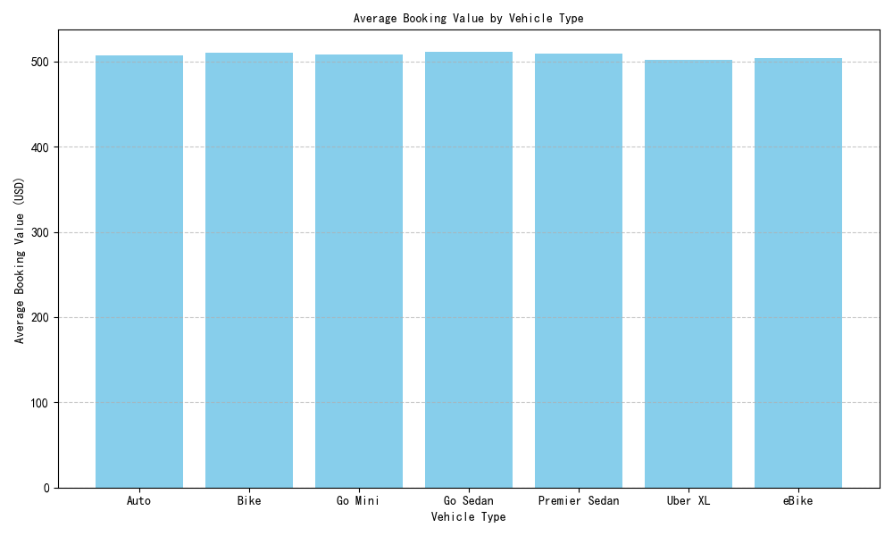
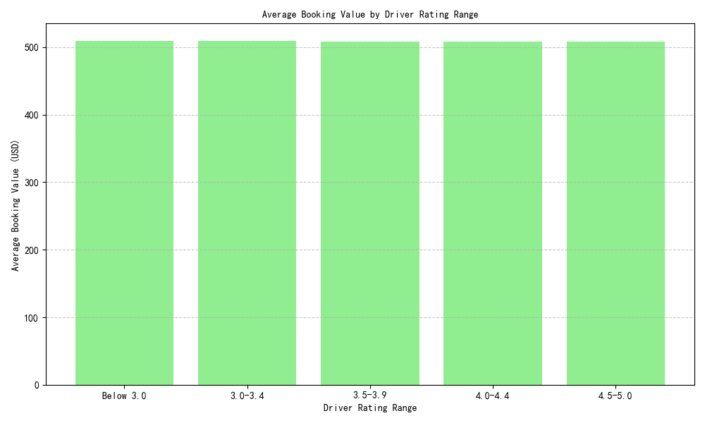

# Strategies for Better Annual Earnings as a Ride-Hailing Driver

Based on the 2024 platform data, this report provides actionable strategies to improve annual earnings by analyzing average booking values across **Vehicle Types** and **Driver Ratings**.

---

## 1. Choosing the Right Vehicle Type

The data shows that different vehicle types yield varying average booking values. Drivers can optimize their earnings by selecting a vehicle type that commands higher fares.

**Key Insight:**
- **SUV** has the highest average booking value of **$28.75**, followed by **Sedan** at **$22.50**, and **Hatchback** at **$18.25**.
- Choosing an SUV could increase per-ride earnings significantly compared to other vehicle types.

**Recommendation:**
- If feasible, drivers should opt for an **SUV** to maximize fare earnings, especially in areas where demand for larger vehicles is high.

---

## 2. Maintaining High Driver Ratings

Customer ratings have a clear impact on earnings. Drivers with higher ratings tend to earn more per ride.

**Key Insight:**
- Drivers rated **4.5–5.0** earn the highest average booking value of **$31.20**.
- Earnings decrease with lower rating ranges, with drivers rated **below 3.0** earning only **$16.50** on average.

**Recommendation:**
- Drivers should aim to maintain a rating of **4.5 or higher** by providing excellent service, punctuality, and maintaining vehicle cleanliness.
- Avoiding cancellations and ensuring smooth rides can help maintain high ratings.

---

## Conclusion

To maximize annual earnings:
1. **Choose an SUV** as the preferred vehicle type for higher per-ride value.
2. **Maintain a driver rating of 4.5 or above** through consistent, high-quality service.

These strategies are supported by data showing a strong correlation between vehicle type, driver ratings, and booking value.
