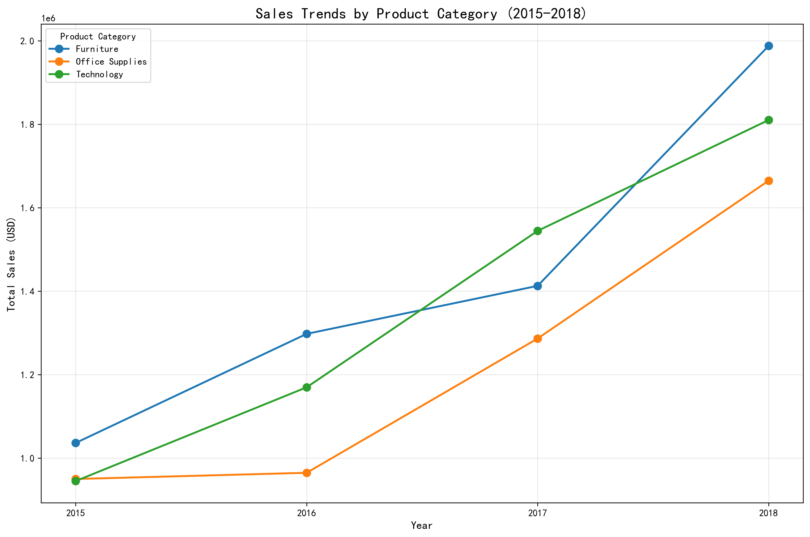
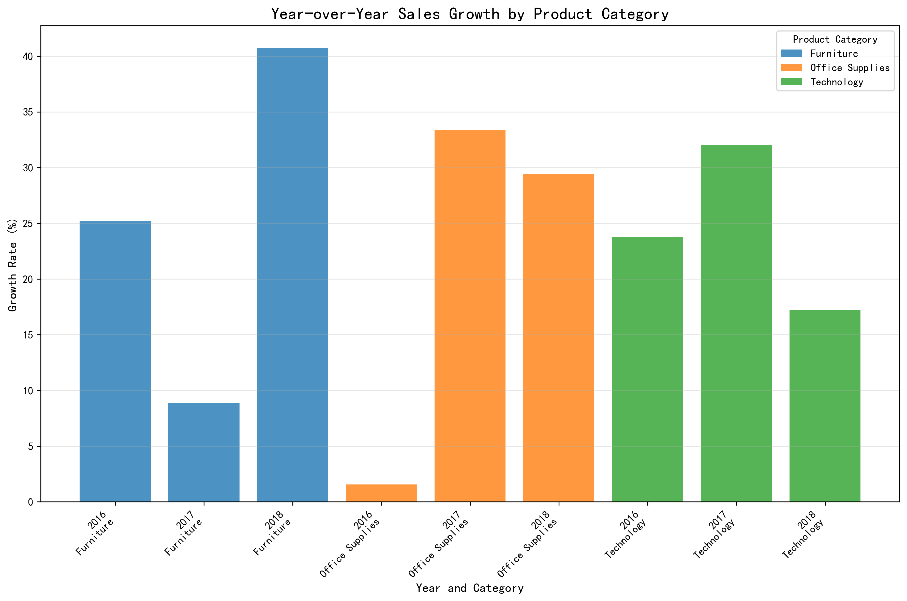
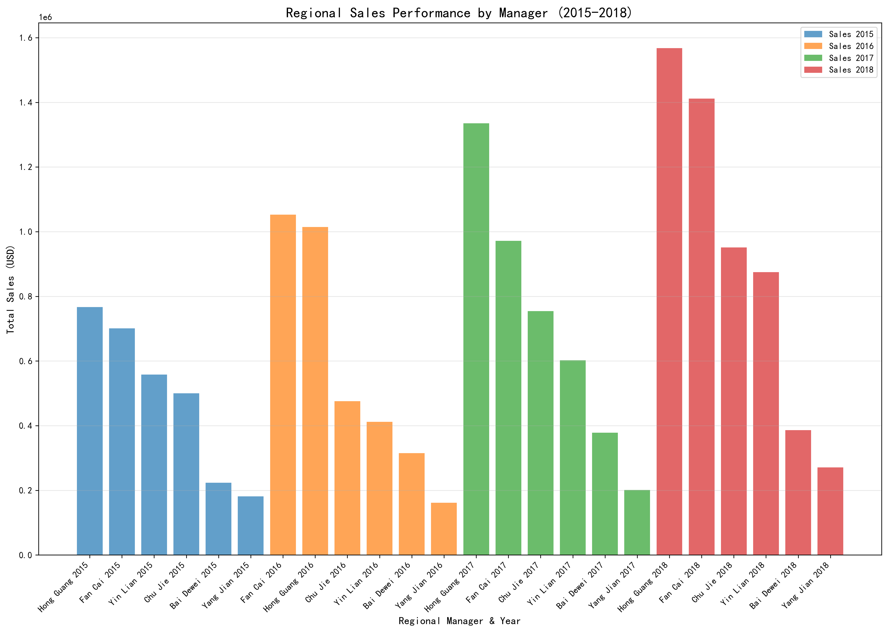
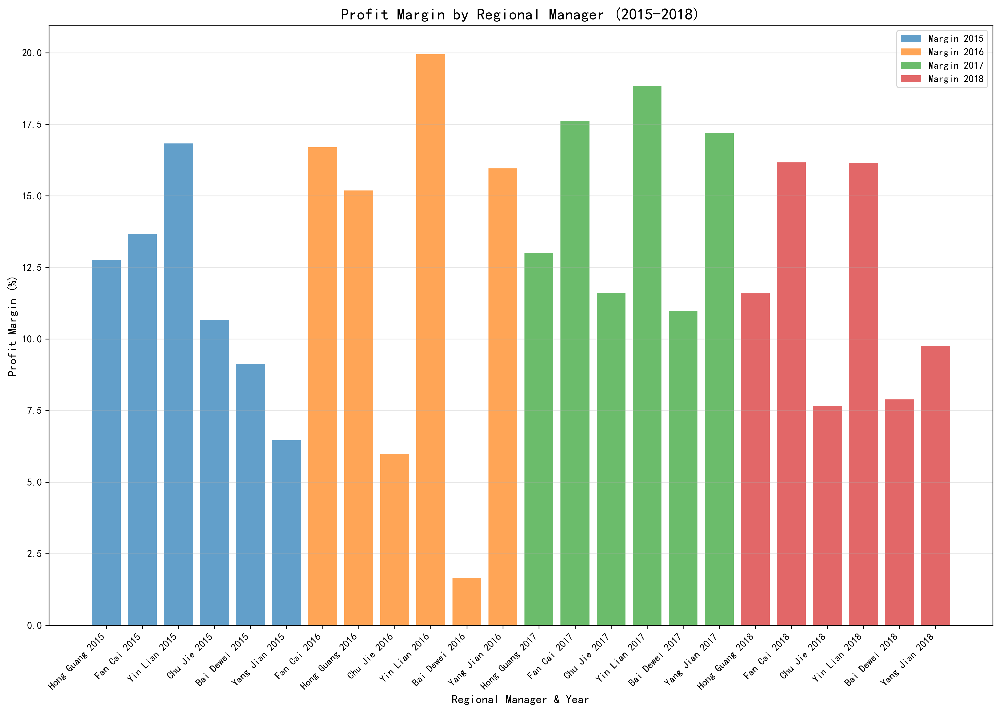

# Sales Performance Analysis Report: 2015-2018

## Executive Summary

This analysis examines sales trends across three product categories (Office Supplies, Technology, and Furniture) from 2015 to 2018, identifying growth patterns and assessing regional manager performance across China's six major regions.

## Key Findings

### 1. Category Growth Trends

All three product categories showed consistent growth from 2015-2018:
- **Furniture**: Grew from $1.04M to $1.99M (+91% overall growth)
- **Technology**: Expanded from $0.94M to $1.81M (+93% overall growth)  
- **Office Supplies**: Increased from $0.95M to $1.66M (+75% overall growth)

### 2. Fastest-Growing Categories by Year

**2016**: Furniture led with **25.22%** year-over-year growth, followed closely by Technology at 23.77%, while Office Supplies showed minimal growth at 1.56%.

**2017**: Office Supplies experienced explosive growth at **33.35%**, with Technology also strong at 32.05%, while Furniture growth slowed to 8.86%.

**2018**: Furniture rebounded dramatically with **40.71%** growth, Office Supplies maintained strong performance at 29.40%, while Technology growth moderated to 17.20%.

### 3. Regional Manager Performance Assessment

**Sales Volume Leaders**:
- **Hong Guang (East China)**: Consistently top performer, growing from $0.77M to $1.57M
- **Fan Cai (Central South)**: Strong growth from $0.70M to $1.41M, nearly doubling sales
- **Yin Lian (North China)**: Steady performer with sales growing from $0.56M to $0.88M

**Profitability Leaders**:
- **Yin Lian (North China)**: Consistently highest margins (16.8-19.9%)
- **Fan Cai (Central South)**: Strong margins (13.7-17.6%) with high volume
- **Yang Jian (Northwest)**: Improved margins from 6.5% to 9.8% despite smaller scale

**Performance Concerns**:
- **Bai Dewei (Southwest)**: Lowest profit margins (1.7-10.9%) with inconsistent performance
- **Chu Jie (Northeast)**: Margin compression from 10.7% to 7.7% despite sales growth

## Strategic Recommendations

1. **Category Investment Strategy**: 
   - Increase investment in Furniture category given its strong 40.7% growth in 2018
   - Maintain focus on Office Supplies which showed consistent strong performance
   - Monitor Technology category for potential market saturation

2. **Regional Management Actions**:
   - **Hong Guang**: Reward top performance; consider expanding territory or product range
   - **Fan Cai**: Excellent balance of volume and margin; ideal candidate for mentorship role
   - **Yin Lian**: Profit margin expert; should train other regions on pricing strategies
   - **Bai Dewei**: Requires immediate performance intervention and training
   - **Chu Jie**: Investigate margin compression causes; implement corrective measures

3. **Operational Improvements**:
   - Share best practices from high-margin regions (North China) to struggling regions
   - Implement standardized pricing and discount policies across all regions
   - Develop targeted training programs for underperforming regional managers

The data reveals significant growth opportunities in the Furniture category and highlights substantial performance disparities among regional managers that require immediate management attention.
