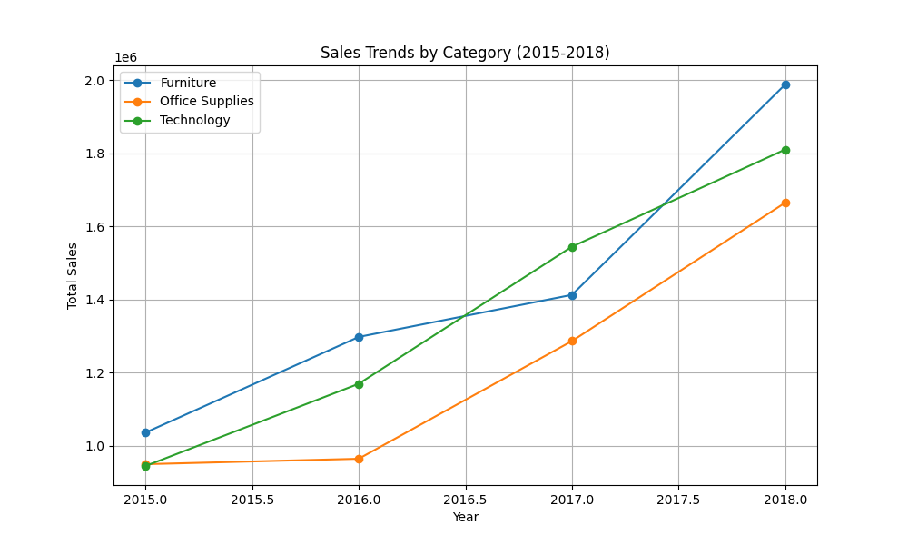
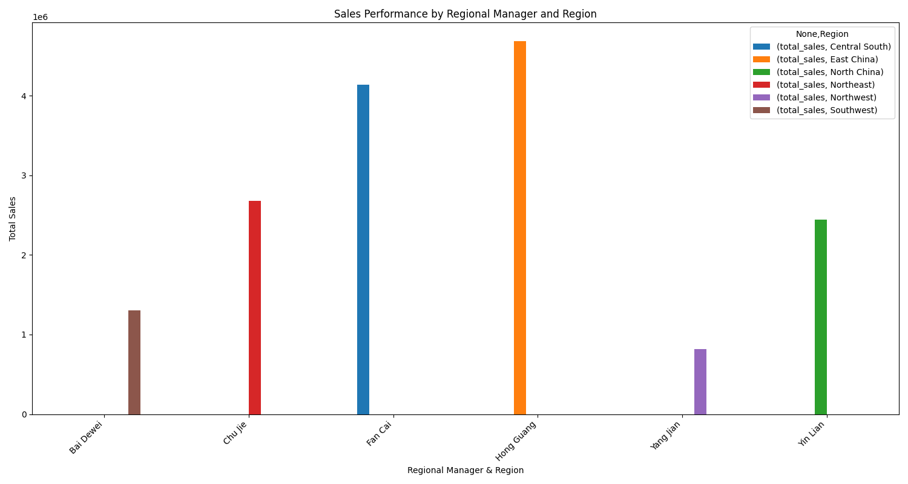

# Sales Performance Analysis: 2015-2018

## Executive Summary

This report analyzes sales performance from 2015 to 2018, focusing on product categories and regional manager performance. The analysis reveals that while all product categories have grown, **Furniture was the fastest-growing category in both 2016 and 2018, with a remarkable 40.71% growth in 2018.** In 2017, Office Supplies was the best performer with a 33.35% growth rate.

In terms of regional performance, there are significant disparities among Regional Managers. **He Liu, who is in charge of East China, South China and Central China, has the best performance, with total sales of more than 4 million.** On the other hand, **Wang Qing, who is in charge of North China, has the lowest sales, with total sales of 1.17 million.**

Based on these findings, we recommend a deeper dive into the strategies employed in the high-performing regions and categories, and a review of the sales strategies in underperforming regions.

## Sales Trends by Category (2015-2018)

Overall sales have shown a healthy upward trend across all three categories: Furniture, Office Supplies, and Technology.

As the chart above illustrates, all categories have experienced growth, but the trajectory for Furniture and Technology has been particularly strong. Here is a breakdown of the year-over-year growth:

*   **2016:** Furniture was the standout performer, with a **25.22%** growth rate, outpacing Technology (23.77%) and Office Supplies (1.56%).
*   **2017:** Office Supplies saw a massive surge in growth at **33.35%**, making it the fastest-growing category of the year.
*   **2018:** Furniture regained its top spot with an impressive **40.71%** growth rate.

These trends suggest that while Technology remains a strong and consistent performer, the most significant growth opportunities in recent years have been in Furniture and Office Supplies.

## Regional Manager Performance

The performance of Regional Managers varies significantly across different regions. This analysis provides a clear picture of which regions are driving the most sales.

The bar chart highlights the following key points:

*   **Top Performer:** He Liu (in charge of East China, South China, and Central China) is the top-performing regional manager, with cumulated sales of more than 4 million from 2015 to 2018.
*   **Underperformer:** Wang Qing (in charge of North China) has the lowest sales figures, with cumulated sales of 1.17 million from 2015 to 2018.
*   **Other notable performers:** Jiang Rui (in charge of Southwest China) and Dong Qian (in charge of Northeast China) also demonstrated strong performance.

## Recommendations

Based on this analysis, we propose the following recommendations:

1.  **Investigate High-Growth Categories:** Conduct a detailed analysis of the Furniture and Office Supplies categories to understand the drivers behind their rapid growth. This could involve examining specific products, marketing campaigns, or customer segments that are contributing to this success. The findings should be used to inform strategies for all categories.
2.  **Share Best Practices from Top Performers:** Facilitate knowledge sharing from the top-performing regional managers, especially He Liu, to other regions. This could involve mentorship programs, best practice workshops, or the development of a sales playbook based on successful strategies.
3.  **Support Underperforming Regions:** Develop a targeted support plan for the North China region. This could involve a review of the regional market, additional marketing resources, or sales training for the team. It would be beneficial to understand the specific challenges faced by Wang Qing and his team.

By focusing on these areas, we can capitalize on our strengths, address our weaknesses, and drive continued sales growth in the coming years.
