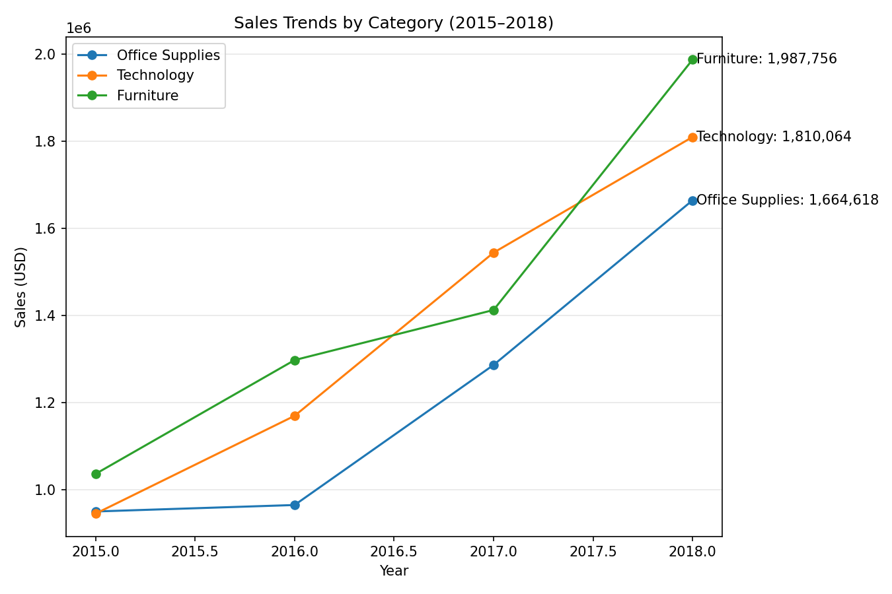
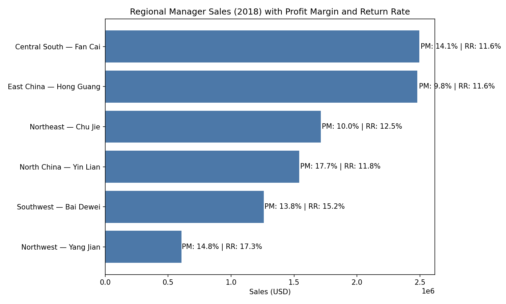

Sales Trends & Regional Performance (2015–2018)

Executive Summary
- Furniture is the fastest-growing category overall, with a 40.7% YoY surge in 2018 and a 24.3% CAGR from 2015–2018. Office Supplies spiked in 2017 (+33.4% YoY), while Technology grew steadily (+24.2% CAGR). 
- In 2018, Central South (Fan Cai) led sales at $2.495M with a solid 14.1% profit margin; North China (Yin Lian) delivered the highest margin (17.7%); Northwest (Yang Jian) had the lowest sales ($0.606M) and highest return rate (17.3%). 
- Recommendation: double down on Furniture expansion in high-performing regions, share North China’s margin discipline across regions, and prioritize return-rate reduction in Northwest to unlock profitable growth.

Data & Method
- Source tables: order (fields: Order Date, Category, Sales, profit, Region), salesperson (Region ↔ Regional Manager), return (Order ID). 
- SQL: Used strftime('%Y', [Order Date]) to aggregate yearly sales (2015–2018) by Category and Region; joined salesperson to map managers; counted distinct returned orders to compute return rates.
- Python: Pivoted category-year sales to compute YoY growth and CAGR; produced a line chart for category trends and a bar chart for 2018 Regional Manager performance.

Category Sales Trends

Observation: Furniture led growth, especially in 2018, while Office Supplies saw a sharp 2017 spike and Technology grew consistently. Exact totals (USD):
- 2015: Furniture $1,036,265.78; Office Supplies $949,847.95; Technology $944,942.68.
- 2016: Furniture $1,297,642.54 (+25.2% YoY); Office Supplies $964,693.88 (+1.6%); Technology $1,169,583.04 (+23.8%).
- 2017: Furniture $1,412,676.02 (+8.9%); Office Supplies $1,286,430.46 (+33.4%); Technology $1,544,433.38 (+32.0%).
- 2018: Furniture $1,987,756.49 (+40.7%); Office Supplies $1,664,617.50 (+29.4%); Technology $1,810,064.40 (+17.2%).
Root Cause: Based on Category-level sales in the order table, Furniture demand accelerated late-cycle (2018), while Office Supplies saw a mid-cycle surge (2017). Technology maintained steady multi-year adoption.
Business Impact / Recommendation: 
- Expand Furniture assortment, promotion, and inventory capacity—especially in regions already scaling—to capture strong momentum.
- Stabilize Office Supplies growth post-2017 spike by focusing on repeat purchases (e.g., contract pricing and bundles).
- Continue upsell and cross-sell in Technology where growth is consistent but slower in 2018.

Fastest-Growing Category Each Year (YoY)
- 2016: Furniture +25.2% YoY.
- 2017: Office Supplies +33.4% YoY.
- 2018: Furniture +40.7% YoY.
CAGR 2015–2018:
- Furniture: 24.3% | Technology: 24.2% | Office Supplies: 20.6%.
Observation: Furniture dominates two of three years and edges Technology in multi-year CAGR, indicating persistent growth potential beyond short-term spikes.
Root Cause: Product mix shifts and demand tails visible in category-level sales; Furniture’s late-cycle acceleration suggests successful positioning or larger-ticket conversions.
Business Impact / Recommendation: Prioritize Furniture pipeline (supplier capacity, merchandising) and maintain Technology’s steady growth via incremental upsell programs.

Regional Manager Performance (2018)

Observation: Central South (Fan Cai) tops sales at $2,494,820.27 with a 14.1% profit margin and 11.6% return rate; East China (Hong Guang) follows closely at $2,480,471.13 (PM 9.8%, RR 11.6%). North China (Yin Lian) delivers the highest profit margin at 17.7% on $1,541,528.18 sales. Northwest (Yang Jian) is the lowest in sales at $605,798.76 but also has the worst return rate at 17.3%.
- 2018 by region-manager:
  - Central South — Fan Cai: $2.495M | PM 14.1% | RR 11.6% (leader in sales, solid margin).
  - East China — Hong Guang: $2.480M | PM 9.8% | RR 11.6% (near-top sales, margin opportunity).
  - Northeast — Chu Jie: $1.712M | PM 10.0% | RR 12.5% (mid-tier sales, margin opportunity).
  - North China — Yin Lian: $1.542M | PM 17.7% | RR 11.8% (margin leader).
  - Southwest — Bai Dewei: $1.259M | PM 13.8% | RR 15.2% (scaling, returns to monitor).
  - Northwest — Yang Jian: $0.606M | PM 14.8% | RR 17.3% (small base, high returns).
Root Cause: Performance differences reflect regional scale and margin discipline (profit field in order), and product quality/customer fit (return table driving return_rate).
Business Impact / Recommendation: 
- Share North China’s pricing/mix playbook to lift margins in East/Northeast.
- Launch return reduction initiatives in Northwest/Southwest (QA checks, tighter discounting on high-return SKUs, improved post-sale support).
- Invest in Central South/East China to capitalize on Furniture growth via targeted campaigns and inventory alignment.

Additional Regional Growth Insight (2015–2018 CAGR)
- Top region CAGRs: Southwest +53.7%, Northwest +47.9%, Central South +37.0%.
Observation: Smaller bases (Southwest/Northwest) grew fastest off lower 2015 levels, signaling emerging markets with potential.
Root Cause: Growth rates computed from region-year sales in order, showing faster percentage growth in developing regions.
Business Impact / Recommendation: Expand selectively in Southwest/Northwest with disciplined margin targets and stringent return controls to scale profitably.

How the Analysis Was Done (Traceability)
- SQL evidence: Aggregated by year and category with SELECT strftime('%Y',[Order Date]) AS year, Category, SUM(Sales) FROM [order] GROUP BY year, Category. Regional performance joined salesperson and return to compute sales, profit, return_rate, and profit_margin.
- Python evidence: Pandas pivot of category-year sales, pct_change() for YoY, and computed CAGR over 2015–2018; created line plot (category_sales_trends.png) and bar chart (regional_manager_sales_2018.png).

Action Plan
- Furniture: Increase assortment and stock in Central South/East China; run bundle promotions; ensure supplier capacity for 2018-level demand.
- Margin uplift: Adopt North China’s pricing/mix controls in East/Northeast; track PM weekly at region-manager level.
- Returns reduction: Target Northwest/Southwest with SKU-level audits; adjust discounts on high-return items; strengthen customer support to reduce returns by 3–5 pts.
- Emerging regions: Scale Southwest/Northwest cautiously with PM floor (≥14%) and RR ceiling (≤12%) KPIs.

Conclusion
Furniture is the growth engine (+40.7% YoY in 2018; 24.3% CAGR), Technology is steady, and Office Supplies rebounded notably in 2017. Central South leads revenue, North China leads margin, and Northwest’s high return rate is the key drag. Executing the above actions should lift total sales while improving profitability and lowering returns across regions.
