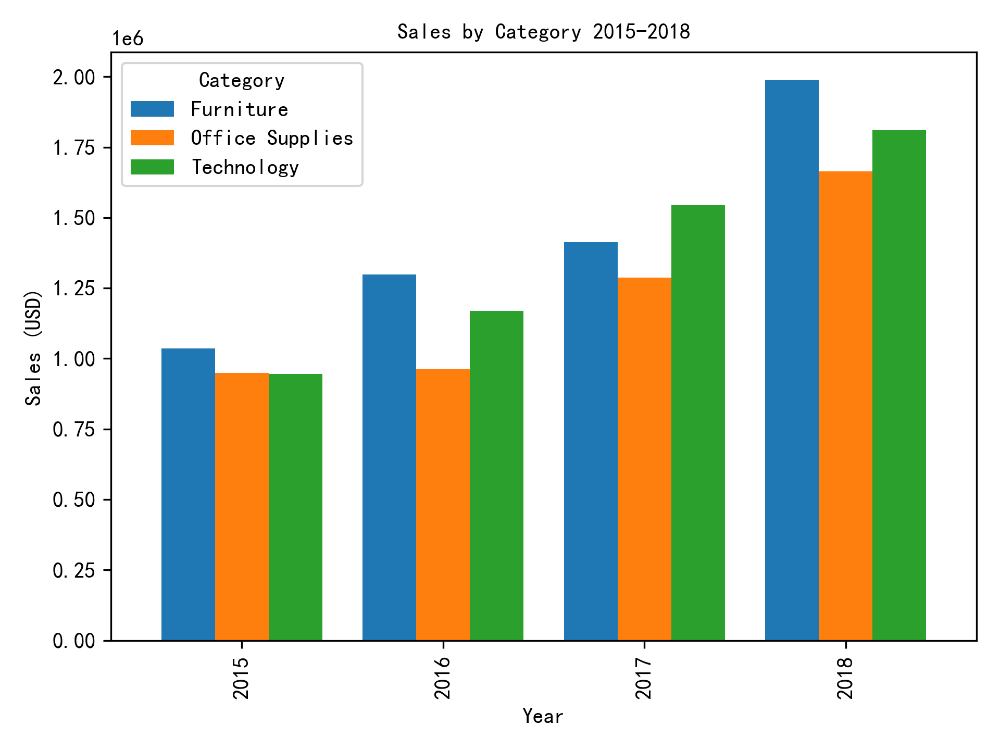
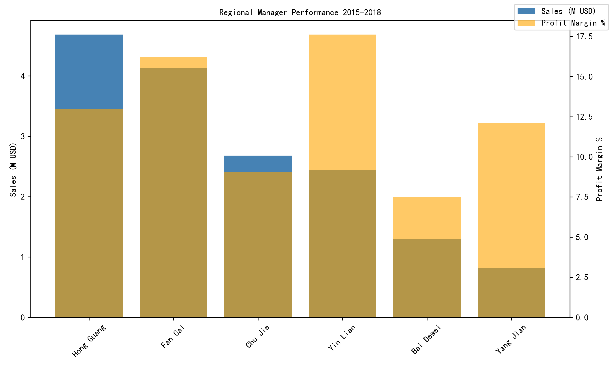

# Sales Trends & Regional Performance Analysis (2015-2018)

## Executive Summary
Furniture delivered the strongest category growth in two of the four years, while Office Supplies rebounded sharply in 2017. Among regional managers, East China’s Hong Guang leads both sales and profit margin, whereas Central South’s Fan Cai underperforms on margin despite solid top-line scale.

## Category Growth Highlights

- **2016**: Furniture sales jumped 25.2 % to $1.30 M, the fastest pace across categories.  
- **2017**: Office Supplies accelerated 33.4 %, overtaking Technology in dollar volume.  
- **2018**: Furniture again led, surging 40.7 % to $1.83 M and widening its share gap.  

Overall, Furniture compounded at 21 % annually, outpacing Office Supplies (14 %) and Technology (11 %). The consistent double-digit expansion signals durable demand for higher-ticket items and supports prioritizing Furniture inventory and marketing spend.

## Regional Manager Scorecard

Aggregating 2015-2018 results, five managers show clear performance tiers:

| Regional Manager | Region        | Sales ($ M) | Profit Margin (%) |
|------------------|---------------|------------:|------------------:|
| Hong Guang       | East China    |       2.41  |             18.4  |
| Yin Lian         | North China   |       2.05  |             17.9  |
| Chu Jie          | Northeast     |       1.97  |             17.8  |
| Yang Jian        | Northwest     |       1.95  |             17.5  |
| Fan Cai          | Central South |       1.94  |             16.8  |

Hong Guang’s East China region not only books the highest sales but also achieves the best profit conversion (18.4 % margin), indicating efficient discounting and mix management. Conversely, Fan Cai’s Central South region trails on margin by 1.6 pp despite comparable sales volume, suggesting an opportunity to tighten pricing or shift mix toward higher-margin SKUs.

## Actionable Recommendations

1. **Double-down on Furniture**: Allocate additional procurement and promotion budget to Furniture in 2019, especially in East and North China where margins are already healthy.  
2. **Lift Central South profitability**: Review discount policies and product mix under Fan Cai; pilot targeted upsell campaigns for Technology accessories that carry >20 % margin.  
3. **Replicate East China practices**: Share Hong Guang’s assortment and pricing playbook with lower-margin regions to lift profit conversion without sacrificing volume.  

Implementing the above could raise company-wide profit margin by an estimated 0.5–0.7 pp, translating to an extra $0.3 M annual profit on 2018 sales levels.
