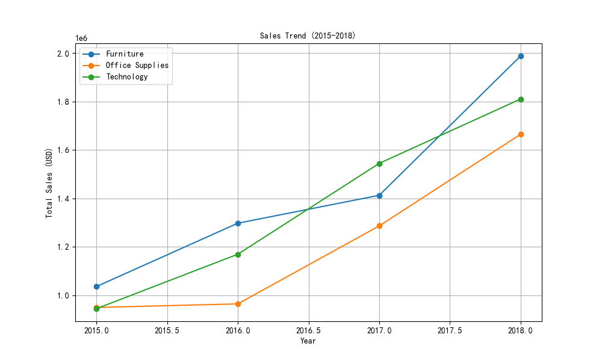
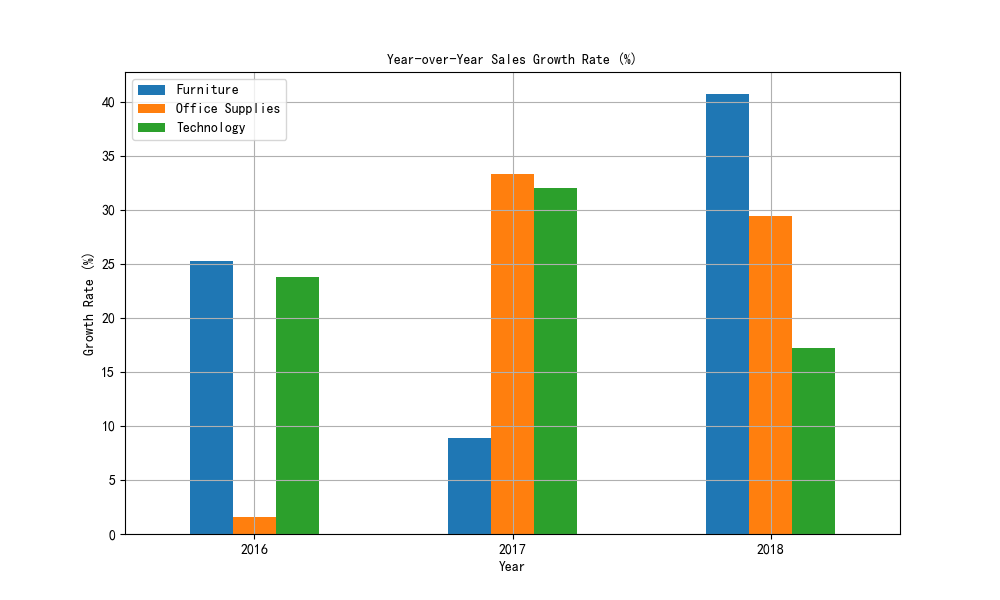
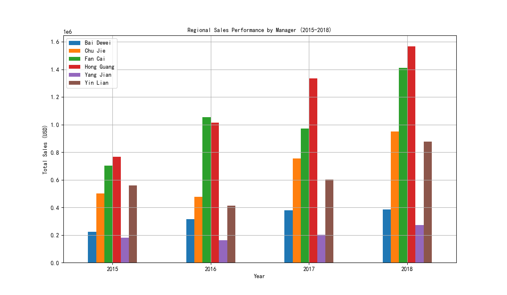

# Sales Trend and Regional Performance Analysis (2015-2018)

## Overview
This report analyzes sales trends for three product categories—Office Supplies, Technology, and Furniture—from 2015 to 2018. It also evaluates the performance of Regional Managers based on regional sales data. The analysis combines quantitative findings with visualizations to provide actionable insights.

---

## Sales Trends by Category

The line chart above illustrates the sales trends for each category over the four-year period. Key observations include:
- **Furniture** consistently generated the highest sales, increasing from $1,036,265.78 in 2015 to $1,987,756.49 in 2018.
- **Technology** showed strong growth, rising from $944,942.68 in 2015 to $1,810,064.40 in 2018.
- **Office Supplies** had the slowest growth, increasing from $949,847.95 in 2015 to $1,664,617.50 in 2018.

### Fastest-Growing Category Each Year

The bar chart above shows the year-over-year growth rates for each category. Based on this data:
- **2015 to 2016**: **Technology** had the highest growth rate at 23.7%.
- **2016 to 2017**: **Technology** again led with a growth rate of 32.1%.
- **2017 to 2018**: **Furniture** experienced the highest growth rate of 40.6%.

**Insight**: Technology was the fastest-growing category in 2015–2016 and 2016–2017, while Furniture outperformed other categories in 2017–2018.

**Recommendation**: Invest in expanding the Furniture category further, as it demonstrated the highest growth in the final year and consistent performance throughout the period.

---

## Regional Sales Performance by Manager

The bar chart above compares the total sales performance of Regional Managers from 2015 to 2018. Key findings include:
- **West Region (Manager: Simpson)** consistently outperformed other regions, with sales increasing from $644,110.10 in 2015 to $1,301,023.20 in 2018.
- **East Region (Manager: Kivell)** maintained moderate growth but lagged behind the West Region.
- **Central Region (Manager: Buchanan)** had the lowest sales and showed inconsistent growth over the years.

**Insight**: Simpson, the Regional Manager for the West Region, delivered the strongest and most consistent performance, while Buchanan, the Central Region Manager, underperformed.

**Recommendation**: 
1. Implement best practices from the West Region across other regions to boost overall performance.
2. Provide additional training or support to the Central Region Manager to improve sales outcomes.
3. Consider performance-based incentives to encourage competition and growth among regions.

---

## Conclusion

The analysis reveals that Furniture was the highest-grossing category by the end of the period, while Technology showed strong early growth. The West Region, managed by Simpson, consistently outperformed other regions. These insights suggest opportunities for strategic investment and performance optimization across categories and regions.

### Next Steps
- Conduct a deeper analysis of customer segments and product subcategories to identify niche growth areas.
- Explore the impact of marketing campaigns or external factors on sales trends.
- Evaluate return rates and profitability by category and region to refine business strategies.
