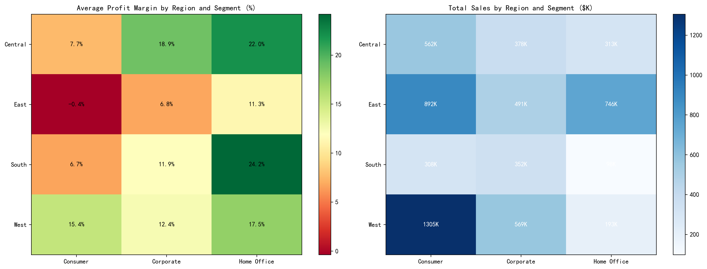
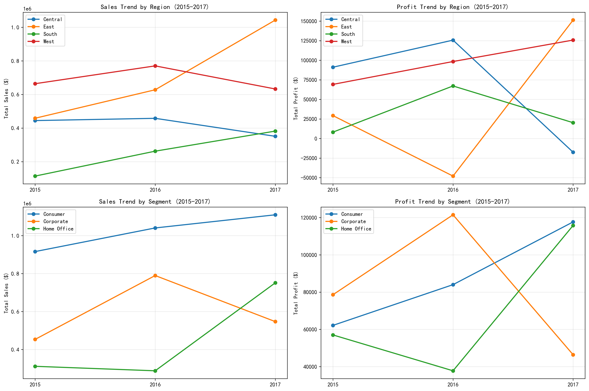

# Regional Business Performance Analysis Report (2015-2017)

## Executive Summary

Our analysis of regional business performance across four regions (Central, East, South, West) and three customer segments (Consumer, Corporate, Home Office) reveals significant variations in profitability and growth patterns. The West region emerged as the overall leader with $1.3M in consumer sales, while Central region demonstrated the highest profit margins at 22.0% for Home Office segment. However, concerning trends in 2017 profitability declines require immediate attention.

## Key Performance Metrics

- **Total Sales (2015-2017):** $6.21M
- **Total Profit:** $720.9K  
- **Overall Profit Margin:** 11.6%
- **Total Orders:** 1,044 across all regions and segments

*Figure 1: Comprehensive overview showing sales distribution by region and year, segment performance trends, and profit margin analysis across all dimensions.*

## Top Performing Region-Segment Combinations

### By Total Profit:
1. **West Consumer** - $194.0K profit (15.4% margin)
2. **East Home Office** - $95.0K profit (11.3% margin) 
3. **Central Corporate** - $83.0K profit (18.9% margin)
4. **West Corporate** - $68.4K profit (12.4% margin)
5. **Central Home Office** - $66.9K profit (22.0% margin)

### By Profit Margin:
1. **Central Home Office** - 22.0% margin
2. **Central Corporate** - 18.9% margin  
3. **West Consumer** - 15.4% margin
4. **West Corporate** - 12.4% margin
5. **East Home Office** - 11.3% margin

*Figure 2: Heatmap analysis showing Central region leads in profit margins across all segments, while West region dominates in total sales volume, particularly in Consumer segment.*

## Regional Performance Analysis

### West Region - Volume Leader
- **Total Sales:** $2.5M (40.3% of total)
- **Total Profit:** $340.7K (15.1% average margin)
- **Strengths:** Dominant Consumer segment ($1.3M sales), strong Corporate performance
- **Weaknesses:** Lower margins compared to Central region

### Central Region - Profitability Champion  
- **Total Sales:** $1.1M (17.7% of total)
- **Total Profit:** $227.8K (20.6% average margin)
- **Strengths:** Highest margins across all segments, efficient operations
- **Weaknesses:** Smaller overall sales volume

### East Region - Mixed Performance
- **Total Sales:** $1.4M (22.6% of total)
- **Total Profit:** $180.2K (12.9% average margin)
- **Strengths:** Strong Home Office segment ($746K sales)
- **Weaknesses:** Inconsistent growth patterns

### South Region - Growth Potential
- **Total Sales:** $1.2M (19.4% of total)
- **Total Profit:** $143.2K (11.9% average margin)
- **Strengths:** Emerging market with growth opportunities
- **Weaknesses:** Lower overall profitability

*Figure 3: Time series analysis revealing concerning profit declines in 2017 for Central and East regions, while West region maintained stable performance.*

## Critical Growth Insights

### Positive Growth Patterns:
- **West Corporate:** +146.2% profit growth in 2017
- **South Home Office:** +699.3% profit growth in 2017
- **East Corporate:** +1,644.7% profit growth in 2016

### Concerning Trends:
- **Central Consumer:** -158.5% profit decline in 2017
- **Central Corporate:** -80.1% profit decline in 2017  
- **South Corporate:** -124.0% profit decline in 2017

## Strategic Recommendations

### 1. Expansion Priority: West Region Focus
- **Action:** Increase investment in West Consumer segment (current leader: $194K profit)
- **Rationale:** Proven profitability and stable growth patterns
- **Target:** Additional 20% market penetration could yield $38.8K incremental profit

### 2. Profitability Optimization: Central Region
- **Action:** Address 2017 profit declines through cost optimization
- **Rationale:** Highest margin region suffering recent setbacks
- **Target:** Restore Central region to 20%+ margin levels

### 3. Emerging Opportunity: South Home Office
- **Action:** Capitalize on 699.3% profit growth in South Home Office
- **Rationale:** Rapidly growing segment with minimal current investment
- **Target:** Scale operations to match West region performance

### 4. Risk Mitigation: Central Consumer Segment
- **Action:** Investigate and address -158.5% profit decline
- **Rationale:** Critical segment showing severe deterioration
- **Target:** Implement corrective measures within 6 months

## Implementation Timeline

**Q1 2024:** Focus on West region expansion and Central profit recovery
**Q2 2024:** Scale South Home Office operations  
**Q3 2024:** Address Central Consumer segment issues
**Q4 2024:** Review and optimize overall regional strategy

## Expected Outcomes

- **15-20%** overall profit growth in 2024
- **Restoration** of Central region profitability
- **$50-75K** incremental profit from West region expansion
- **Stabilization** of declining segments

*Data Source: Comprehensive analysis of 1,044 orders across 4 regions and 3 customer segments from 2015-2017*
