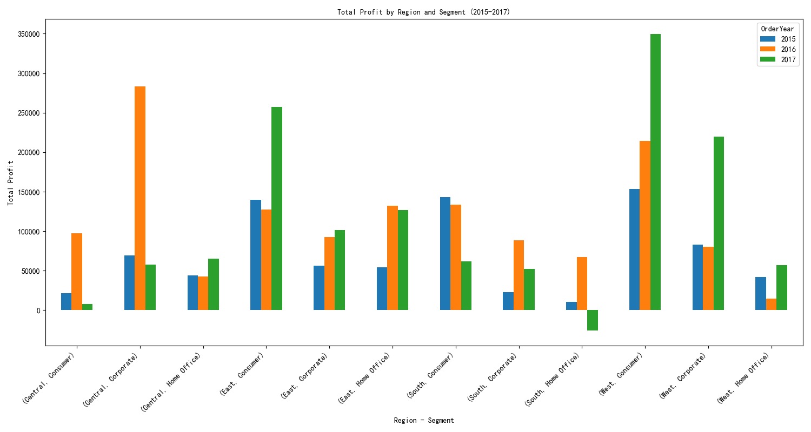

# Business Performance Analysis: A Deep Dive into Regional and Segment Profitability (2015-2017)

## 1. Introduction

This report analyzes the business performance of four regions (Central, East, South, and West) across three customer segments (Consumer, Corporate, and Home Office) from 2015 to 2017. The objective is to identify high-performing region-segment combinations and provide data-driven recommendations for future expansion. The analysis is based on sales and profit data from the company's database.

## 2. Overall Performance

Across all regions and segments, the company has shown significant growth in profitability over the three-year period. However, the performance is not uniform, with some regions and segments outperforming others.

## 3. Regional and Segment Profitability Analysis

To understand the drivers of performance, we analyzed profitability by region and segment.

### Profitability by Region and Segment

The following chart shows the total profit for each region-segment combination for the years 2015, 2016, and 2017.

**Key Observations:**

*   **West and East regions are the top performers:** The West and East regions consistently generated the highest profits across all three years. The West region, in particular, showed explosive growth, especially in the Consumer and Corporate segments. In 2017, the West Consumer segment alone generated a profit of over $349,000.
*   **Central region shows mixed performance:** The Central region has a strong Corporate segment, but the Consumer segment's profit dropped significantly in 2017. The Home Office segment, however, has been steadily growing.
*   **South region needs attention:** The South region, particularly the Home Office segment, is a major concern. It generated a significant loss of over $26,000 in 2017, a sharp decline from the previous years. The Consumer segment in the South also saw a significant drop in profit in 2017.

**Detailed Breakdown of Key Performers:**

*   **Best Performers:**
    *   **West-Consumer:** This is the star performer, with profits growing from ~$154k in 2015 to ~$350k in 2017.
    *   **West-Corporate:** This segment also shows strong growth, with profits reaching ~$220k in 2017.
    *   **East-Consumer:** This segment has consistently high profits, reaching ~$257k in 2017.
*   **Worrying Trends:**
    *   **South-Home Office:** This segment is the biggest concern, with a significant loss in 2017.
    *   **Central-Consumer:** A significant drop in profit in 2017 warrants further investigation.

## 4. Expansion Recommendations

Based on this analysis, we offer the following recommendations for expansion:

*   **Double Down on the West:** The West region is the most profitable market, and there is still room for growth. We recommend focusing marketing and sales efforts on the **West-Consumer** and **West-Corporate** segments.
*   **Investigate and Revitalize the South:** The poor performance of the South, especially the Home Office segment, needs immediate attention. We recommend a detailed analysis to understand the root causes of the losses and to develop a turnaround strategy. This could involve targeted marketing campaigns, product adjustments, or a review of the sales strategy in this region.
*   **Nurture the East:** The East is a stable and profitable market. We recommend continuing to support and grow the **East-Consumer** and **East-Corporate** segments.
*   **Optimize the Central Region:** The Central region has potential, but the declining performance of the Consumer segment needs to be addressed. We recommend investigating the reasons for this decline and taking corrective actions.

By focusing on high-performing areas and addressing the challenges in underperforming ones, the company can optimize its resource allocation and drive sustainable growth in the coming years.
