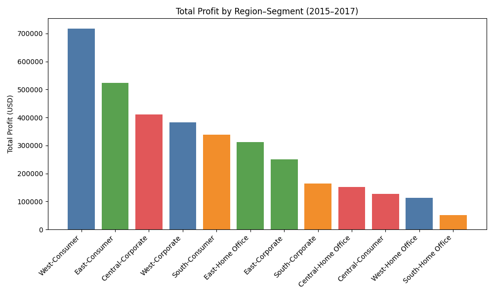

Executive summary
- West leads total profit across 2015–2017 at 1.21M USD on 7.41M USD sales, followed by East at 1.09M on 7.71M. Central generated 0.69M on 4.79M, and South 0.55M on 3.84M (SQL source: sheet1 + sheet2 joined on Order ID).
- The strongest region–segment engines are West–Consumer (718.0k profit; 19.2% margin), East–Consumer (524.1k; 12.5%), Central–Corporate (410.4k; 22.2%), West–Corporate (382.5k; 16.9%), and East–Home Office (313.0k; 21.0%).
- Penetration grew broadly (distinct customers per Region–Segment–Year), but profitability diverged: South–Home Office posted a 2017 loss (−26.0k; −11.2% margin) despite more customers; Central–Consumer’s 2017 margin sank to 1.2% even as customers grew.

How the analysis was done
- Data: sheet1 (Order Date, Segment, Region, Customer ID) joined to sheet2 (Sales per Unit, Quantity, Discount, Profit per Unit) by Order ID.
- Metrics (SQL): year = last 4 chars of Order Date; Sales = Sales per Unit × Quantity × (1 − Discount); Profit = Profit per Unit × Quantity; Penetration = COUNT(DISTINCT Customer ID) per Region–Segment–Year; Profit margin = total_profit / total_sales. Query aggregated Region–Segment–Year for 2015–2017.

Visualization: 3-year profit by region–segment
- Key takeaway: West–Consumer is the #1 profit engine (718,030.88 USD), followed by East–Consumer (524,095.08 USD) and Central–Corporate (410,445.01 USD). This concentration suggests scaling Consumer in West/East and Corporate in Central.
- Why it matters: These combinations deliver the bulk of contribution at healthy margins (e.g., West–Consumer 19.21%; Central–Corporate 22.19%) and rising penetration.

Regional performance overview (2015–2017 totals)
- West: 7.41M sales, 1.2139M profit; customers 1,002; orders 1,298. Profit share leader with two high-performing segments (Consumer, Corporate).
- East: 7.71M sales, 1.0878M profit; customers 903; orders 1,140. Strong Consumer and high-margin Home Office.
- Central: 4.79M sales, 0.6892M profit; customers 787; orders 945. Corporate is the standout; Consumer margins weak.
- South: 3.84M sales, 0.5548M profit; customers 564; orders 657. Mixed: Consumer profitable overall but volatility in 2017; Home Office risk.

Penetration and profitability by region–segment across years
Note: Penetration is distinct customers per year (e.g., West–Consumer customers: 149→160→199). Margins are profit/ sales per year.

West
- Consumer: Penetration up (customers 149→160→199; orders 186→206→270). Profit grew 153.6k→214.5k→349.9k; margin 14.54%→20.16%→21.64%. Observation: scaling with improving unit economics. Root cause: likely favorable product mix and disciplined discounting. Impact: primary growth pillar; continue investment.
- Corporate: Profit 82.8k (2015)→80.1k (2016)→219.5k (2017); margin 19.46%→10.97%→19.83%. Observation: 2016 dip, 2017 rebound with scale (1.11M sales in 2017). Root cause: 2016 pricing/mix pressure reversed in 2017. Impact: strong secondary engine; maintain margin guardrails.
- Home Office: Margin compressed 15.55%→3.63%→7.63% as sales scaled to 744k in 2017. Root cause: heavier discounting and/or lower-margin SKUs. Impact: de-prioritize or tighten pricing.

East
- Consumer: Profit 139.6k→127.2k→257.3k; margin 9.61%→10.80%→16.42%; customers 121→156→178. Observation: sharp 2017 margin improvement while scaling. Root cause: product mix shift and more disciplined discounts. Impact: attractive growth lane; scale marketing and inventory.
- Corporate: Steady profitability 56.5k→92.5k→101.7k; margins ~10.5%→13.6%→12.7%. Observation: consistent contributor. Impact: maintain, optimize targeting.
- Home Office: High margin, especially 2016 at 28.13% on 469k sales (132.0k profit); 2017 margin 18.49% on 687k sales (127.0k profit). Observation: high-quality growth. Impact: prioritize expansion tactics here (loyalty, bundles).

Central
- Corporate: Elite margins 23.34% (2015) and 30.01% (2016) on 944k sales (283.4k profit) in 2016; 2017 margin fell to 9.49% (57.7k profit on 608k). Observation: sharp 2017 margin compression. Root cause: mix shift or deep discounting. Impact: fix pricing/mix; still a top-3 profit pool across 3 years (410.4k; 22.2% cumulative margin).
- Home Office: Stable margins ~18–19% with profit rising 44.1k→42.7k→65.5k as sales grew to 348.1k in 2017. Impact: reliable mid-tier contributor; scalable with discipline.
- Consumer: Penetration grew (customers 103→121→173) but profitability weak: 2017 profit only 7.7k on 626.6k sales (1.22% margin). Observation: demand without profit. Root cause: discounting or low-margin SKU mix. Impact: do not scale until margin repaired.

South
- Consumer: Profitable in 2015–2016 (143.4k; 18.41% → 133.6k; 22.84%) but margin collapsed in 2017 to 7.52% (61.9k profit) despite higher sales (823.4k) and more customers (122). Root cause: price pressure or costly mix. Impact: investigate and correct before expansion.
- Corporate: 2016 peak (88.7k; 22.25% margin), 2017 margin normalized (10.10%). Impact: keep selective expansion with pricing oversight.
- Home Office: 2017 loss −26.0k on 233.3k sales (−11.15% margin) despite customers 19→34→40 (orders 19→40→52). Observation: unprofitable growth. Root cause: heavy discounting/negative unit economics. Impact: immediate remediation; pause promotions.

Best-performing region–segment combinations (2015–2017 totals)
- West–Consumer: 718,030.88 profit on 3,737,738.65 sales; margin 19.21%.
- East–Consumer: 524,095.08 profit on 4,197,609.65 sales; margin 12.49%.
- Central–Corporate: 410,445.01 profit on 1,849,612.28 sales; margin 22.19%.
- West–Corporate: 382,452.93 profit on 2,262,378.63 sales; margin 16.90%.
- South–Consumer: 338,912.89 profit on 2,187,362.20 sales; margin 15.49%.
- East–Home Office: 313,030.67 profit on 1,491,292.18 sales; margin 20.99%.

Risks and underperformers (year-level margins)
- South–Home Office 2017: −26,017.42 profit on 233,329.34 sales (−11.15% margin) with rising penetration. Action: stop-loss on promotions; review SKU/price.
- Central–Consumer 2017: 7,666.24 profit on 626,554.93 sales (1.22% margin). Action: tighten discounting; shift mix.
- West–Home Office 2016–2017: low margins 3.63%→7.63% as it scaled. Action: narrow range to profitable SKUs.

Recommendations
1) Double down on proven engines
- West–Consumer: Expand inventory breadth, targeted acquisition, and upsell programs. Goal: sustain >20% margin while scaling; expect incremental 200–300k profit next year based on 2017 run-rate (349.9k).
- East–Consumer and East–Home Office: Increase marketing and availability; preserve pricing discipline that lifted margins to 16.4% (Consumer) and kept Home Office >18%. Target +150–200k profit.
- Central–Corporate: Restore 2017 margin from 9.5% back toward 20%+ via discount guardrails and mix corrections; as margin normalizes, re-accelerate.

2) Repair or pause underperformers
- South–Home Office: Immediate pricing review; remove negative-margin SKUs, cap discounts, and introduce contribution-based promotion rules. Pause scale until margins >10%.
- Central–Consumer and South–Consumer (2017): Conduct deal-level discount analytics; set regional floor prices and push higher-margin substitutes to recover 5–10 pts of margin.

3) Mix and pricing governance
- Implement regional discount guardrails and margin-at-risk alerts (based on fields: Discount, Sales per Unit, Profit per Unit). Track profit margin weekly by Region–Segment.
- Prioritize higher-margin subcategories (from sheet2.Category/Subcategory) in East Home Office and Central Corporate to sustain >20% margins.

4) Penetration strategy
- Maintain acquisition in segments with healthy unit economics (West–Consumer, East–Home Office). Use targeted bundles/loyalty to deepen share-of-wallet rather than broad discounting.

Why this matters
- The identified region–segment plays account for the majority of profit with resilient margins and growing penetration. Prioritizing them while fixing loss-making pockets will lift total profit and reduce volatility across regions.

Appendix: selected year-by-year facts (from SQL/Python outputs)
- West–Consumer: Sales 1.06M→1.06M→1.62M; Profit 153.6k→214.5k→349.9k; Margin 14.54%→20.16%→21.64%; Customers 149→160→199.
- Central–Corporate: Sales 0.30M→0.94M→0.61M; Profit 69.3k→283.4k→57.7k; Margin 23.34%→30.01%→9.49%.
- East–Home Office: Sales 0.34M→0.47M→0.69M; Profit 54.0k→132.0k→127.0k; Margin 16.11%→28.13%→18.49%.
- South–Home Office: Sales 0.05M→0.22M→0.23M; Profit 10.3k→67.6k→−26.0k; Margin 20.32%→30.25%→−11.15%.
