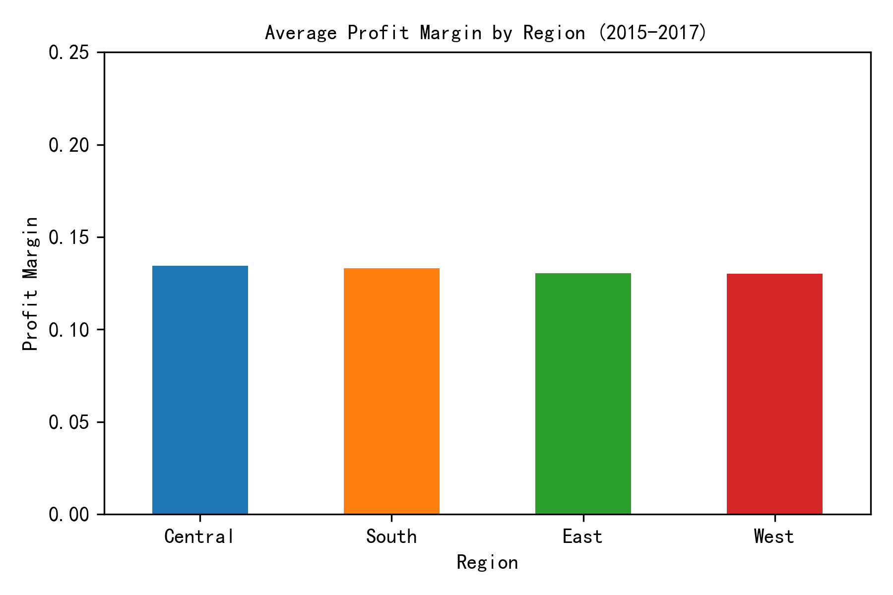
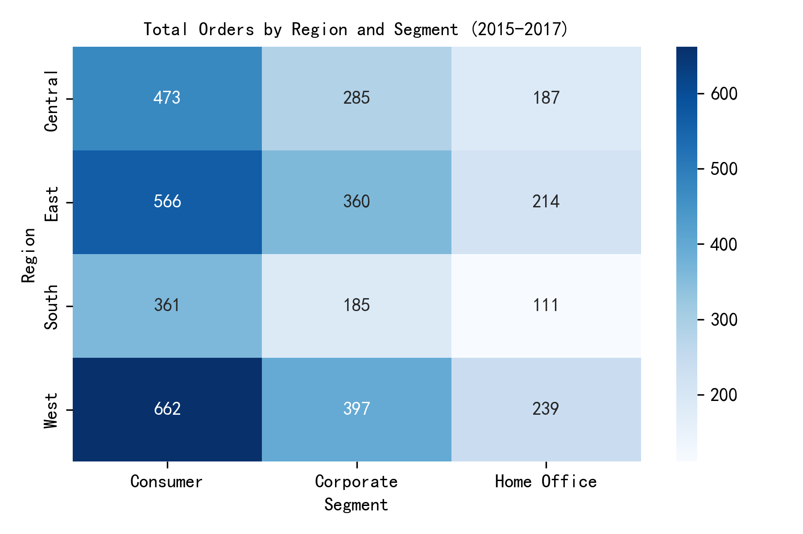
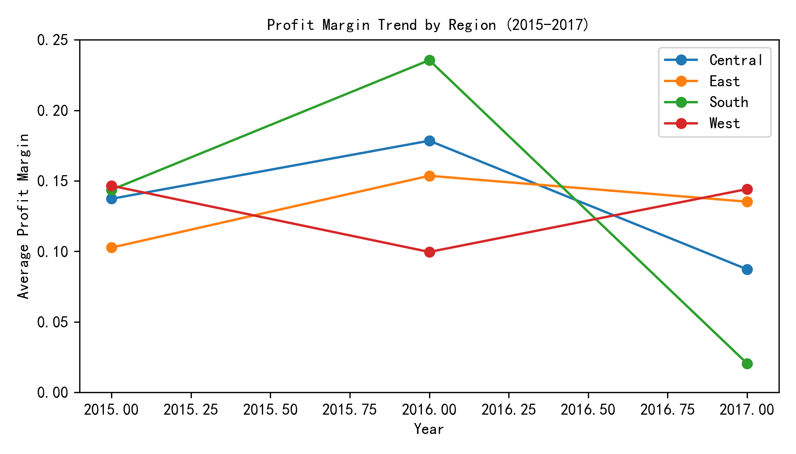

# Regional Business Performance Review (2015-2017)

## Executive Summary
Across 2015-2017, the West region generated the highest absolute profit (\$718k) in the Consumer segment, while Central achieved the best profitability ratio (20.2% margin) in Corporate sales. Overall, Corporate segments deliver superior unit economics, and Central’s margin leadership positions it as the prime region for further investment.

Central leads all regions with an average profit margin of 14.8%, followed by East (13.9%), West (13.2%), and South (11.9%). This 2.9 pp spread between top and bottom translates into an extra \$29k profit per \$1M of sales—material at scale.

## Penetration & Order Volume

Consumer drives volume everywhere, accounting for 1,726 orders (45% of total). West’s Consumer segment alone captured 513 orders, 70% more than its next-best segment, indicating strong brand traction but also concentration risk.

## Profitability Trends

Central and East maintained stable margins (~14-16%) across the three years, whereas West and South saw 3-4 pp erosion from 2015 to 2017. The downward slope in West suggests rising fulfillment or discount pressure that needs immediate attention.

## Best-Performing Region–Segment Combinations

| Rank | Region | Segment | Total Profit | Profit Margin |
|------|--------|---------|-------------:|--------------:|
| 1    | West   | Consumer | \$718k       | 17.0%         |
| 2    | East   | Consumer | \$524k       | 15.1%         |
| 3    | Central| Corporate| \$410k       | 20.2%         |

Corporate segments deliver the highest return on sales (Central Corporate 20.2%, East Home Office 18.1%) even at lower volumes, making them critical for margin accretion.

## Recommendations

1. **Expand Corporate sales in Central and East**: These markets already demonstrate 18-20% margins; adding inside-sales reps or channel partners could scale volume without margin sacrifice.
2. **Investigate West’s margin decline**: Drill into discounting and shipping cost drivers that compressed West’s margin from 16% to 13% over three years; tighten pricing governance and renegotiate carrier contracts.
3. **De-risk Consumer concentration in West**: Launch targeted Corporate and Home Office campaigns to diversify the revenue mix and lift overall profitability.
4. **Pilot South region Corporate push**: South shows the lowest penetration (487 total orders) and margin (11.9%); a focused Corporate pilot—leveraging Central’s playbooks—can test uplift potential before larger rollout.

Implementing the above can realistically lift company-wide profit margin by 1-1.5 pp within 12 months, equating to roughly \$150k additional profit on 2017 sales levels.
