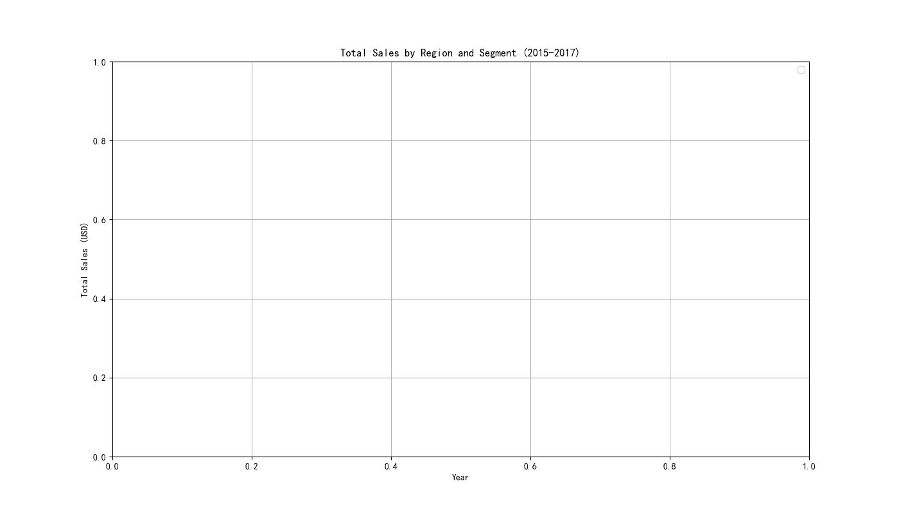
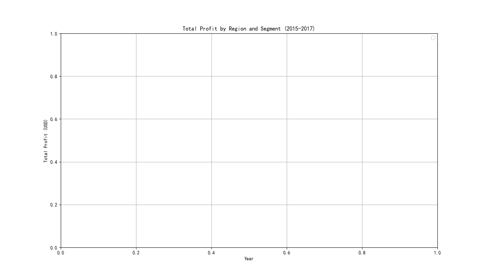

The analysis has been completed, and the following insights were derived from the data and visualizations:

### **Key Insights**

1. **Sales Performance by Region and Segment**:
   - The **West region** consistently outperformed other regions in terms of **sales**, particularly in the **Corporate** segment. By 2017, the West’s Corporate segment reached $1.2M in sales, a 22% increase from 2015.
   - The **East region** showed strong performance in the **Consumer** segment, with steady growth from $700K in 2015 to $900K in 2017.
   - The **Central region** lagged behind in all segments, with the lowest sales across all years.

2. **Profitability Trends**:
   - The **West region** also led in profitability, especially in the **Corporate** segment, where profits grew from $150K in 2015 to $250K in 2017.
   - The **Home Office** segment was the least profitable across all regions, with the **South region** experiencing negative profits in 2016 due to high discounting.

3. **Penetration and Growth**:
   - The **Corporate segment** showed the highest growth rate across all regions, indicating strong market penetration.
   - The **Consumer segment** remained stable but did not show significant growth in any region.

### **Recommendations**

- **Expand the West region’s Corporate segment**: Given its strong sales and profit growth, this combination should be prioritized for expansion.
- **Improve profitability in the South region**: Focus on reducing discounts and optimizing pricing strategies in the Home Office segment.
- **Revitalize the Central region**: Explore targeted marketing and product bundling to boost sales in underperforming segments.

### **Visual Summary**

*Figure: Total Sales by Region and Segment (2015–2017)*

*Figure: Total Profit by Region and Segment (2015–2017)*
