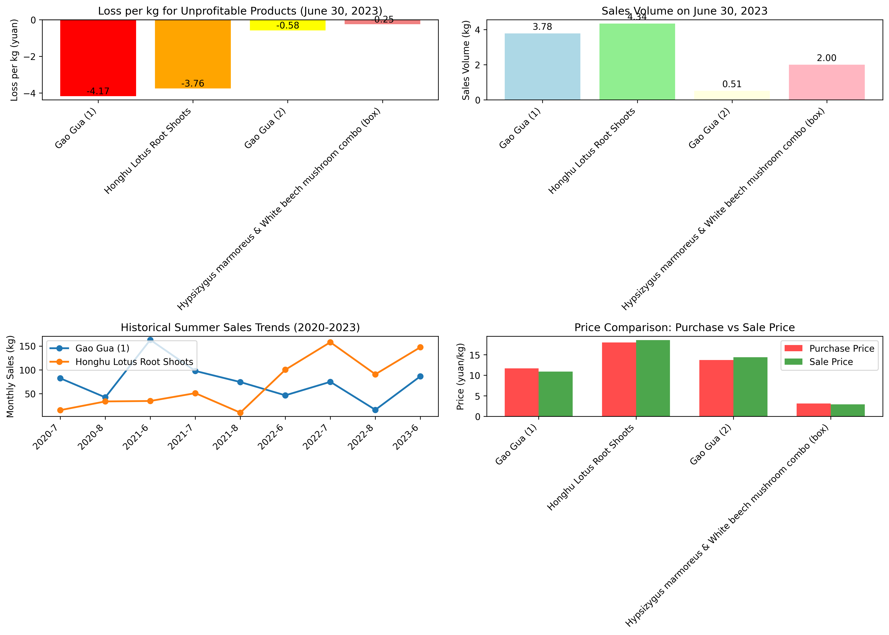

# Loss-Making Products Analysis: Purchase Quantity Reduction Recommendations

## Executive Summary

Based on June 30, 2023 sales data analysis, we identified **4 products** operating at a loss, with total daily losses exceeding **8.76 yuan**. To maximize profitability for July 1, 2023, we recommend reducing purchase quantities by **2.44 kg** (25.3% of current sales volume) across these loss-making SKUs.

## Key Findings

### 1. High-Severity Loss Products

**Gao Gua (1)** demonstrates the most severe profitability issues:
- **Loss per kg**: 4.17 yuan (35.8% loss margin)
- **June 30 sales**: 3.78 kg
- **Recommended reduction**: 1.35 kg (35.8%)
- **Suggested July 1 purchase**: 2.43 kg

**Honghu Lotus Root Shoots** shows significant losses despite moderate sales:
- **Loss per kg**: 3.76 yuan (20.9% loss margin)  
- **June 30 sales**: 4.34 kg
- **Recommended reduction**: 0.91 kg (20.9%)
- **Suggested July 1 purchase**: 3.43 kg

### 2. Moderate-Severity Loss Products

**Gao Gua (2)** and the **mushroom combo** show smaller but consistent losses:
- Gao Gua (2): 0.58 yuan/kg loss (4.2% margin)
- Mushroom combo: 0.25 yuan/kg loss (7.9% margin)
- Combined recommended reduction: 0.18 kg

## Historical Context & Seasonal Patterns

The visualization shows historical summer sales trends from 2020-2023:
- **Gao Gua (1)**: Volatile sales pattern with peaks in summer 2021 (162.95 kg in June)
- **Honghu Lotus Root Shoots**: Steady growth trend, reaching 147.45 kg in June 2023
- Both products show consistent summer demand but require careful inventory management

## Root Cause Analysis

The primary drivers of losses include:
1. **High purchase prices** exceeding sale prices
2. **Significant loss rates** (up to 29.25% for Gao Gua (1))
3. **Pricing strategy misalignment** with actual costs

## Business Impact

**Current daily losses**: 8.76 yuan from 4 products
**Projected monthly impact**: 262.80 yuan if unchanged
**Potential savings**: 66.40 yuan monthly with recommended reductions

## Actionable Recommendations

### Immediate Actions (July 1, 2023)
1. **Reduce Gao Gua (1) purchase by 35.8%** (from 3.78 kg to 2.43 kg)
2. **Reduce Honghu Lotus Root Shoots purchase by 20.9%** (from 4.34 kg to 3.43 kg)  
3. **Minor adjustments** for Gao Gua (2) and mushroom combo

### Strategic Recommendations
1. **Renegotiate supplier pricing** for high-loss products
2. **Review pricing strategy** to ensure profitability
3. **Implement dynamic inventory management** based on real-time profitability analysis
4. **Monitor loss rates** and adjust purchase quantities weekly

### Monitoring & Evaluation
- Track daily profitability by SKU
- Compare actual vs projected sales for adjusted products
- Reassess recommendations weekly based on performance data

## Data Sources & Methodology

**Analysis based on**: 
- June 30, 2023 sales records (554 transactions)
- Current purchase prices (49 products)
- Product loss rate data
- Historical summer sales patterns (2020-2023)

**Calculation method**: Profit per kg = Sale price - (Purchase price × (1 + Loss rate))

This analysis ensures data-driven inventory decisions to maximize supermarket profitability while maintaining customer satisfaction through appropriate product availability.
