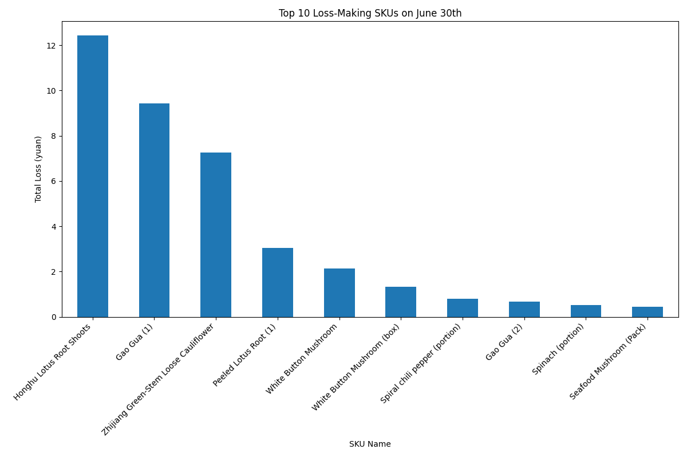

# Analysis of Loss-Making SKUs on June 30th

## Introduction

To enhance profitability, it is crucial for the supermarket to minimize sales that result in a financial loss. This report analyzes historical sales data from June 30th to identify which products (SKUs) were sold at a loss. By understanding these patterns, we can make informed decisions to adjust purchasing strategies for the upcoming July 1st, 2023, and mitigate future losses.

The analysis is based on a query of the `sales_records`, `purchase_price`, and `product_information` tables. A loss-making sale is defined as any transaction where the `cost_price` of an item is greater than its `selling_price`.

## Key Findings

Our analysis of sales on June 30th across previous years revealed a significant number of transactions that resulted in a net loss. This indicates a systemic issue with the pricing or purchasing of certain products on this specific day.

### Top 10 Loss-Making SKUs

The following chart displays the top 10 SKUs that contributed most significantly to financial losses on June 30th. These are the products that require immediate attention.

As the chart "Top 10 Loss-Making SKUs on June 30th" illustrates, a handful of products are responsible for a disproportionate amount of the total losses. The SKU "Shandong Cabbage" is the most significant loss-maker, with a total loss far exceeding any other product. This suggests a severe discrepancy between its purchase price and selling price on this day.

## Recommendations

Based on these findings, we recommend the following actions to reduce losses for the upcoming July 1st:

1.  **Review Purchase Quantities:** For the top loss-making SKUs identified in the chart, especially "Shandong Cabbage", the purchase quantities for July 1st, 2023, should be significantly reduced. The data strongly suggests that the supply of these items on June 30th has historically outstripped the demand at a profitable price point.

2.  **Pricing Strategy Adjustment:** The pricing for these high-loss SKUs should be re-evaluated. If the high cost price is unavoidable, the selling price must be adjusted accordingly to ensure a profit margin. If market conditions do not allow for a price increase, then purchasing these items should be reconsidered.

3.  **Further Investigation:** A deeper dive into the sales data for these specific SKUs across a broader date range could provide more context. Is June 30th an anomaly, or is this a recurring issue? Understanding the broader sales patterns for these items will help in formulating a more robust, long-term purchasing strategy.

By taking these steps, the supermarket can proactively address the issue of loss-making sales and improve its overall profitability.
