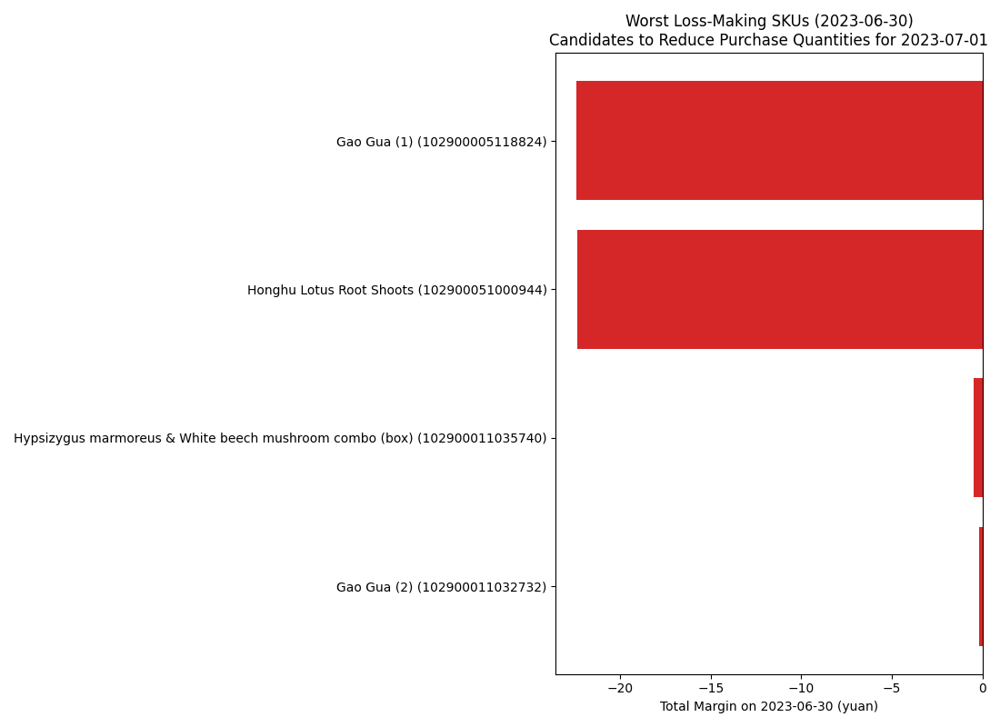

# Loss-Making SKUs on 2023-06-30 and Purchase Reduction Recommendations for 2023-07-01

Conclusion: Reduce purchase quantities for SKUs that generated negative margin on 2023-06-30; if 2023-07-01 supply follows June 30 volumes, these items will likely repeat losses.

Key metrics:
- Loss-making SKUs: 4
- Combined negative margin: -45.44 yuan on 10.63 kg sold (2023-06-30).
- SKUs missing wholesale cost (excluded from decision): 0

Why it matters: Average retail price fell below effective cost per kg (wholesale divided by (1 - loss rate)), indicating structural losses driven by shrinkage and cost/price mismatch.

Top 10 SKUs to reduce purchase quantities (2023-06-30 results):
- Gao Gua (1) (Code 102900005118824, Hydroponic Rhizome Category): Sold 3.78 kg at 10.56 yuan/kg; adjusted cost 16.49 yuan/kg; margin -5.93 yuan/kg; total margin -22.43 yuan.
- Honghu Lotus Root Shoots (Code 102900051000944, Hydroponic Rhizome Category): Sold 4.339 kg at 18.55 yuan/kg; adjusted cost 23.7 yuan/kg; margin -5.15 yuan/kg; total margin -22.35 yuan.
- Hypsizygus marmoreus & White beech mushroom combo (box) (Code 102900011035740, Edible Fungi): Sold 2.0 kg at 2.9 yuan/kg; adjusted cost 3.15 yuan/kg; margin -0.25 yuan/kg; total margin -0.49 yuan.
- Gao Gua (2) (Code 102900011032732, Hydroponic Rhizome Category): Sold 0.512 kg at 14.79 yuan/kg; adjusted cost 15.12 yuan/kg; margin -0.32 yuan/kg; total margin -0.16 yuan.

Observation → Root Cause → Recommendation:
- Observation: Each listed SKU had avg retail price below adjusted cost on 2023-06-30, yielding negative margin per kg and total losses.
- Root Cause: High loss rates (spoilage/shrink) and/or elevated wholesale prices versus retail, sometimes compounded by discounts, make sales unprofitable.
- Recommendation: For 2023-07-01, reduce purchase quantities for these SKUs relative to June 30 sold volumes (e.g., cut by 50%–100%), prioritize faster-moving substitutes, and review pricing and markdown timing to restore positive margin.

Methodology: June 30 sales were aggregated per SKU (quantity and weighted avg price) and joined to June 30 wholesale prices and SKU loss rates; adjusted cost per kg = wholesale_price / (1 - loss_rate%). SKUs with avg_price < adjusted cost were flagged as loss-making.

Full list saved to loss_skus_june30.csv for operational planning.
