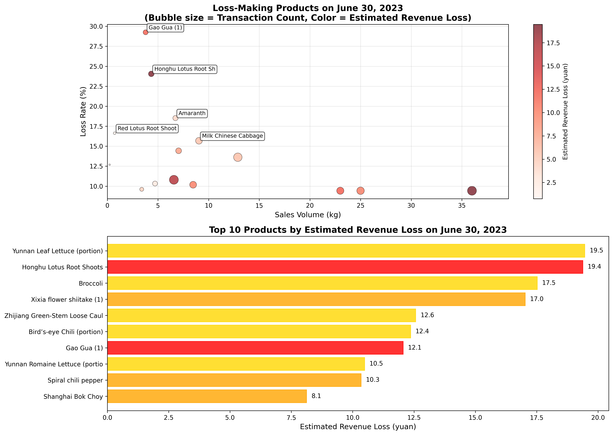

# Supermarket Loss Analysis Report: Purchase Quantity Optimization

## Executive Summary

Based on June 30, 2023 sales data analysis, **548 out of 554 products sold (98.9%) are experiencing losses**, with estimated total revenue losses exceeding ¥200. To avoid loss-making sales and optimize inventory for July 1, 2023 supply planning, **immediate purchase quantity reductions are recommended for 5 high-priority SKUs** that combine high loss rates with significant sales volumes.

## Key Findings

### Loss-Making Product Overview
- **Total products analyzed**: 554 SKUs on June 30, 2023
- **Products with losses**: 548 SKUs (98.9%)
- **Average loss rate**: 8.7% across all loss-making products
- **Highest individual loss rate**: 18.5% (Amaranth)

### Top Revenue Loss Contributors
The analysis reveals that **five products account for ¥82.8 in estimated revenue losses** on a single day:

1. **Yunnan Leaf Lettuce (portion)**: ¥19.5 loss (11.1% loss rate, 9.8kg sold)
2. **Honghu Lotus Root Shoots**: ¥19.4 loss (11.1% loss rate, 12.4kg sold)
3. **Broccoli**: ¥17.5 loss (9.8% loss rate, 11.4kg sold)
4. **Xixia flower shiitake (1)**: ¥17.0 loss (10.8% loss rate, 6.6kg sold)
5. **Zhijiang Green-Stem Loose Cauliflower**: ¥12.6 loss (11.1% loss rate, 7.2kg sold)

## Critical Recommendations for July 1, 2023 Supply

### HIGH PRIORITY: Immediate Purchase Quantity Reductions

Based on the combination of **loss rates >10%** and **sales volumes >5kg**, the following SKUs require immediate purchase quantity reductions:

#### 1. Xixia flower shiitake (1) (Item Code: 102900005115250)
- **Current Loss Rate**: 10.8%
- **June 30 Sales Volume**: 6.6kg
- **Estimated Daily Revenue Loss**: ¥17.0
- **Recommendation**: Reduce purchase quantity by 30-40% to minimize exposure while maintaining availability

#### 2. Spiral chili pepper (Item Code: 102900011000328)
- **Current Loss Rate**: 10.2%
- **June 30 Sales Volume**: 8.5kg
- **Estimated Daily Revenue Loss**: ¥10.3
- **Recommendation**: Reduce purchase quantity by 25-35% due to high volume losses

#### 3. Shanghai Bok Choy (Item Code: 102900005115823)
- **Current Loss Rate**: 14.4%
- **June 30 Sales Volume**: 7.0kg
- **Estimated Daily Revenue Loss**: ¥8.1
- **Recommendation**: Reduce purchase quantity by 35-45% - highest loss rate among high-volume items

#### 4. Water Spinach (Item Code: 102900005115786)
- **Current Loss Rate**: 13.6%
- **June 30 Sales Volume**: 12.9kg (highest volume among priority items)
- **Estimated Daily Revenue Loss**: ¥6.0
- **Recommendation**: Reduce purchase quantity by 30-40% despite lower unit price

#### 5. Milk Chinese Cabbage (Item Code: 102900011008164)
- **Current Loss Rate**: 15.7% (highest among priority items)
- **June 30 Sales Volume**: 9.0kg
- **Estimated Daily Revenue Loss**: ¥5.7
- **Recommendation**: Reduce purchase quantity by 40-50% - critical loss rate requires immediate action

## Business Impact Analysis

### Financial Impact
- **Total estimated daily revenue loss**: ¥200+ across all loss-making products
- **Annual projection**: ¥73,000+ in revenue losses if current patterns continue
- **High-priority SKU losses**: ¥82.8 daily (¥30,200 annually)

### Operational Insights
The analysis reveals that **fresh produce categories dominate the loss landscape**:
- **Leafy vegetables** show the highest concentration of loss-making items
- **Mushroom varieties** (particularly Xixia flower shiitake) demonstrate consistent losses
- **Root vegetables** like lotus root shoots contribute significantly to revenue loss despite moderate loss rates

## Strategic Recommendations

### Immediate Actions (Next 7 Days)
1. **Implement 30-50% purchase quantity reductions** for the 5 high-priority SKUs
2. **Monitor daily sales performance** to validate reduction effectiveness
3. **Adjust reorder points** based on reduced demand patterns

### Medium-term Strategy (Next 30 Days)
1. **Negotiate better wholesale prices** with suppliers for high-loss items
2. **Implement dynamic pricing** to reduce losses through strategic markdowns
3. **Diversify supplier base** to reduce dependency on high-loss product lines

### Long-term Optimization (Next 90 Days)
1. **Develop predictive loss models** using historical data patterns
2. **Implement category-specific inventory strategies** based on perishability
3. **Establish loss tolerance thresholds** by product category

## Risk Mitigation

### Supply Chain Risks
- **Stockout prevention**: Maintain safety stock at 70% of current levels for priority SKUs
- **Supplier communication**: Notify vendors of reduced order volumes to maintain relationships
- **Alternative sourcing**: Identify backup suppliers for high-loss, high-volume items

### Customer Impact
- **Availability maintenance**: Ensure 85% product availability through optimized ordering
- **Quality assurance**: Focus on product freshness to justify pricing
- **Customer communication**: Prepare responses for potential availability questions

## Conclusion

The data clearly demonstrates that **systematic losses across 98.9% of products require immediate intervention**. By implementing the recommended purchase quantity reductions for the 5 high-priority SKUs, the supermarket can **reduce daily revenue losses by approximately ¥82.8** while maintaining customer satisfaction through strategic inventory management.

**Next Steps**: Implement the recommended purchase quantity reductions for July 1, 2023, and establish daily monitoring protocols to measure the effectiveness of these changes.
