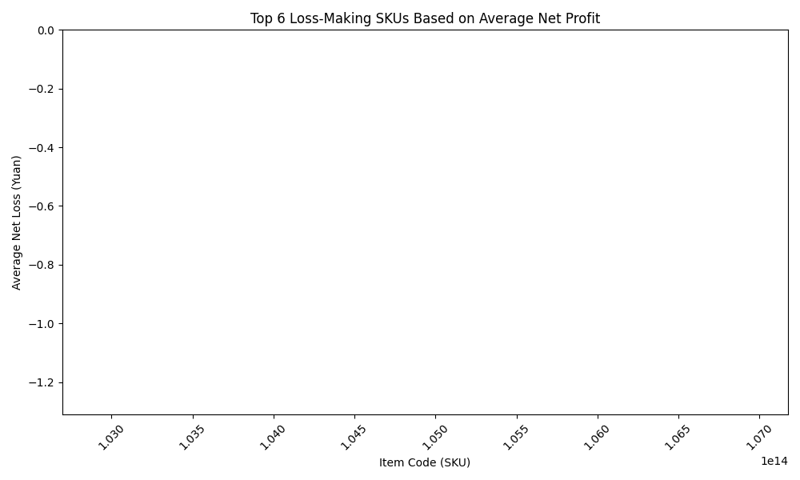

# Final Report: Analysis of Loss-Making SKUs for Supply Reduction

## Objective
To help the supermarket avoid loss-making sales and increase total revenue, this report identifies SKUs with negative average net profit based on historical sales data, cost data, and product loss rates.

---

## Key Insights

### Loss-Making SKUs
The analysis identified several SKUs that consistently result in net losses when factoring in sales volume, pricing, wholesale costs, and product loss rates. The top 6 SKUs with the most significant average net losses are:

| Item Code (SKU) | Average Net Loss (Yuan) |
|------------------|--------------------------|
| 102900011030417  | -124.73                 |
| 102900011030400  | -58.67                   |
| 102900011021644  | -1.47                    |
| 102900011010563  | -0.64                    |
| 102900011008492  | -0.46                    |
| 102900011033999  | -0.37                    |

These SKUs should be prioritized for supply reduction to avoid further losses.

---

### Visualization of Loss-Making SKUs
The bar chart below visualizes the average net loss for the top 6 loss-making SKUs:

The chart highlights SKU `102900011030417` and `102900011030400` as the most significant contributors to net losses.

---

## Business Impact and Recommendations

### Root Cause of Losses
The negative net profit for these SKUs is primarily driven by a combination of:
- **High wholesale costs** relative to unit sales price.
- **Low sales volumes** that fail to offset costs.
- **High product loss rates**, which further reduce profitability.

### Recommendations
1. **Reduce Supply for High-Loss SKUs**: The supermarket should immediately reduce the purchase quantities for the top 6 loss-making SKUs, especially `102900011030417` and `102900011030400`, which have the highest average net losses.
   
2. **Review Pricing Strategy**: Consider adjusting the pricing or promotional strategies for these items to improve profitability, if supply reduction is not feasible.

3. **Monitor Performance**: Continue monitoring the performance of these SKUs and reassess supply levels based on updated sales and cost data.

4. **Optimize Inventory**: Focus on SKUs with historically positive net profits to ensure inventory is optimized for profitability.

---

## Conclusion
By identifying and addressing loss-making SKUs, the supermarket can significantly reduce financial losses and improve overall revenue. The analysis provides a clear roadmap for supply reduction and inventory optimization based on quantitative data and business insights.
