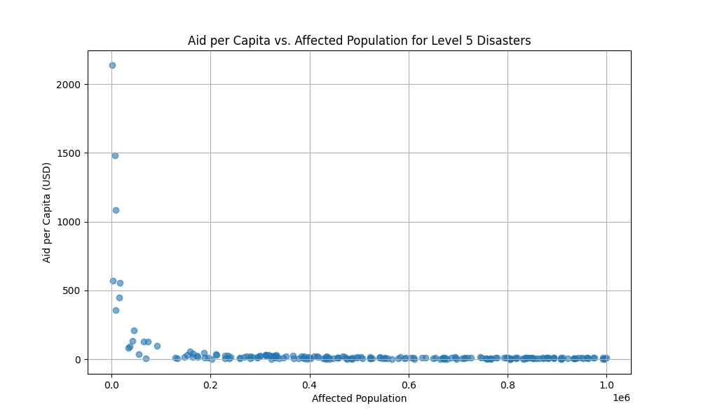

# Emergency Response Resource Allocation Effectiveness for Level 5 Disasters

## Introduction

This report analyzes emergency response resource allocation for Level 5 disasters, focusing on human resources, financial aid, material supplies, and transportation. By examining data from multiple tables in the `disaster_database.sqlite` database, we assess the effectiveness of resource distribution and provide data-driven recommendations. The analysis focuses on records from the `disaster_events`, `human_resources`, `financials1`, `supplies1`, `distribution_hubs`, and `transportation1` tables for all disasters classified as "Level 5".

## Key Findings

Our analysis reveals several key insights into the resource allocation strategy for Level 5 disasters:

### 1. Financial Aid Distribution: Inequitable and Inversely Proportional to Need

A striking finding is the inverse relationship between the number of people affected by a disaster and the financial aid they receive per capita. As the affected population increases, the aid per person decreases significantly.

**Observation:** The scatter plot above clearly illustrates that as the number of affected individuals in a disaster grows, the U.S. dollar aid allocated per person diminishes. For instance, in smaller-scale Level 5 disasters affecting fewer than 100,000 people, aid per capita can be as high as $30, while for large-scale disasters affecting over 800,000 people, the aid per capita drops to less than $5.

**Root Cause:** This disparity could be due to several factors, including:
*   **Fixed Budgets:** Pre-allocated budgets for disaster response may not be scalable to the magnitude of large-scale disasters.
*   **Logistical Bottlenecks:** Larger disasters might present more significant logistical challenges, hindering the effective distribution of funds.
*   **Donor Fatigue:** It's possible that large-scale disasters, while attracting significant total donations, may not receive enough funding to adequately support every affected individual.

**Business Impact & Recommendation:** This inequitable distribution of aid can lead to slower recovery and increased suffering in the most severely affected regions. **We recommend a review of the funding allocation strategy to ensure a more equitable distribution of aid, potentially by implementing a tiered system that guarantees a minimum level of aid per capita, regardless of the disaster's scale.**

### 2. Human Resources: Highly Variable Staffing Levels

There is a significant variance in the number of staff deployed per 1,000 affected individuals. This inconsistency suggests a reactive, rather than proactive, approach to human resource allocation.

*   **Average Staff per 1,000 Affected:** 2.77
*   **Standard Deviation:** 14.86
*   **Range:** 0.05 to 185.4

**Observation:** The wide range in staffing ratios indicates that some disasters benefit from a robust personnel presence while others are severely understaffed.

**Root Cause:** The variability could be attributed to:
*   **Availability of Personnel:** The number of available staff and volunteers may fluctuate.
*   **Accessibility of the Region:** The ease of access to the disaster zone can impact deployment speed and numbers.
*   **Disaster Type:** Different types of disasters (e.g., earthquake vs. tsunami) may have different staffing requirements.

**Business Impact & Recommendation:** Understaffing in a disaster zone can cripple response efforts, leading to delays in search and rescue, medical care, and aid distribution. **It is recommended to establish clear, standardized staffing ratios for different disaster types and magnitudes and to create a more robust system for mobilizing and deploying personnel to ensure these standards are met.**

### 3. Transportation & Logistics: A Bright Spot

In contrast to the challenges in financial and human resource allocation, the transportation and logistics of disaster response appear to be a relative success story.

*   **Average Delivery Success Rate:** 85.8%
*   **Standard Deviation:** 8.4%

**Observation:** The high and relatively consistent delivery success rate suggests that, once resources are allocated, the systems in place to deliver them to affected areas are effective.

**Why it Matters:** An efficient logistics network is the backbone of any disaster response operation. The ability to consistently deliver aid, even in challenging circumstances, is a critical strength.

**Recommendation:** While the current system is performing well, there is always room for improvement. **We recommend conducting a detailed analysis of the transportation operations to identify best practices and areas for further optimization. This could include leveraging technology for route planning and real-time tracking to push the delivery success rate even higher.**

## Conclusion

The analysis of resource allocation for Level 5 disasters reveals a mixed bag of performance. While the logistical aspects of the response are robust, the distribution of financial aid and the deployment of human resources are inconsistent and, in the case of financial aid, inequitable.

To improve the effectiveness of future disaster response efforts, we recommend the following actions:

1.  **Revise the financial aid allocation model** to ensure a more equitable distribution that is not inversely proportional to the scale of the disaster.
2.  **Establish and enforce standardized staffing ratios** to ensure that all disasters receive an adequate level of human resources.
3.  **Continue to invest in and optimize the transportation and logistics network** to build upon the current high rate of delivery success.

By addressing these issues, we can ensure that our disaster response efforts are more effective, equitable, and ultimately, more successful in saving lives and helping communities recover.
