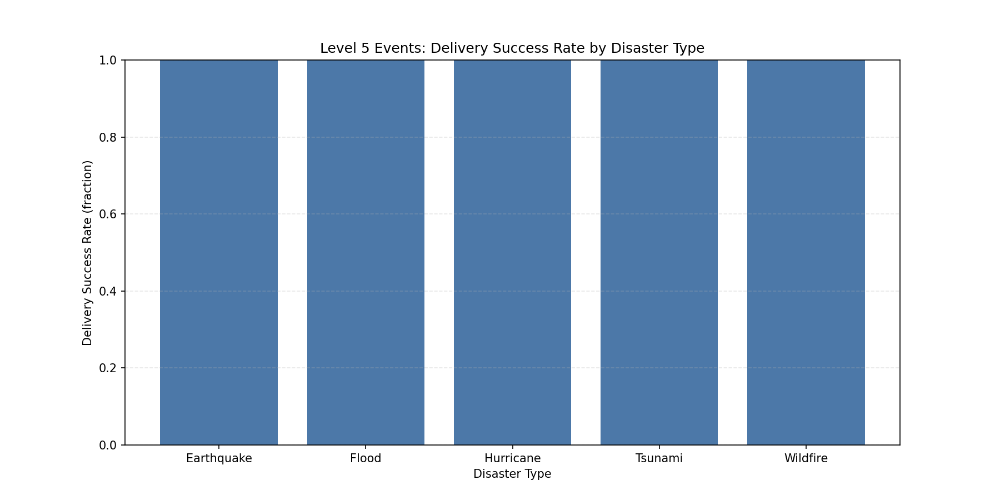

Level 5 Disaster Resource Allocation Effectiveness Assessment

Executive summary
- Level 5 operations are broadly effective: delivery success rate averages 85.78% across events (transportation1.Delivery Success Rate), with average delivery time at 35.62 units (transportation1.Average Delivery Time). ROI averages 3.08x (financials1.donorcommitments(USD) / total costs from opscosts + transportcosts + storagecosts + personnelcosts).
- Resource utilization is mixed: hub utilization averages 50.51% (distribution_hubs.Utilization (%)), inventory accuracy is strong at 95.12% (Inventory Accuracy (%)), and available capacity ratio averages 0.232 (Available Capacity (m³)/Storage Capacity (m³)), signaling moderate slack at hubs.
- Staffing coverage is standardized: staffing_ratio is 1.0 across types (human_resources record count per operations1 record), indicating one staffing record per operation for Level 5 events.
- Cost anchors: transport cost per ton averages 361.68 USD/ton, with large dispersion (max 3,048 USD/ton; min 3 USD/ton). Cost per beneficiary averages 493.07 USD (financials1.costbene(USD)).
- Variability matters: best delivery success event hits 99.90% (DIST_SIY3B, Wildfire), while the lowest is 70.10% (DIST_S5EG8, Earthquake). ROI extremes span 17.50x (DIST_F4Q7I, Earthquake) down to 0.06x (DIST_HPJTY, Hurricane).

Data and method (schema anchors)
- Disaster identification: disaster_events filtered to “Disaster Severity Level” = ‘Level 5’.
- Human resources and operations: human_resources (“Disaster Reference ID”, “Staffing”) and operations1 (“Disaster Reference ID”, “Emergency Level”, “Estimated Duration (days)”) aggregated per event, with staffing_ratio defined as HR records per operations record.
- Financials: financials1 aggregated per event across “budgetallot(USD)”, “fundsutilpct(%)”, “costbene(USD)”, “opscosts(USD)”, “transportcosts(USD)”, “storagecosts(USD)”, “personnelcosts(USD)”, “donorcommitments(USD)”. ROI computed as donorcommitments divided by total costs.
- Material supplies and hubs: supplies1 (“Inventory resources”) counted per event; distribution_hubs aggregated on “Utilization (%)”, “Inventory Accuracy (%)”, “Inventory Turnover Rate”, “Storage Capacity (m³)”, “Available Capacity (m³)”, and “Center Capacity (tons)” to derive available capacity ratio.
- Transportation: transportation1 aggregated on “Number of Vehicles”, “Total Transport Volume (tons)”, “Daily Transport Volume (tons)”, “Delivery Success Rate”, “Average Delivery Time”, “Number of Distribution Points”, “Fuel Consumption (L/km)”, “Vehicle Failure Rate”. Efficiency metrics include tons per vehicle and transport cost per ton (financials1.transportcosts(USD)/transportation1.Total Transport Volume (tons)).

Visual benchmark

- Key takeaway: Wildfire and Tsunami lead on delivery success (86.37% and 86.36%) and ROI (3.55x and 3.34x), while Flood trails (84.68% success, 2.48x ROI). Hurricanes deliver 86.02% success at 2.92x ROI. These differences indicate that transport and hub strategies differ by hazard type, affecting outcomes.

Dimension-by-dimension insights

1) Human resources + operations (staffing ratios, duration)
- Observation: Staffing_ratio is consistently 1.0 across all Level 5 types, implying one HR record per operation. Average estimated durations cluster near mid-30s (operations1.Estimated Duration (days)), supporting a standardized deployment cadence.
- Root Cause: A uniform staffing policy for Emergency Level ‘Level 5’ (operations1.Emergency Level) likely sets a fixed staffing-to-operation baseline (human_resources.Staffing entries per operation).
- Business Impact / Recommendation: Standard coverage simplifies coordination but may under-serve more complex events (e.g., lowest success case DIST_S5EG8 at 70.10%). Pilot dynamic staffing ratios by event complexity and region (e.g., +20% HR headcount where delivery success <80% or avg delivery time >40) and monitor staffing_ratio vs. success for Earthquakes.

2) Financial resources (funds utilization, ROI, beneficiary cost)
- Observation: Overall funds utilization averages 50.25% (financials1.fundsutilpct(%))—suggesting room to accelerate drawdowns. ROI averages 3.08x; Wildfire peaks at 3.55x and Flood is lowest at 2.48x. Cost per beneficiary averages 493 USD, with Flood lowest at 449 USD and Wildfire highest at 569 USD.
- Root Cause: Variance likely reflects donorcommitments alignment with operational cost structures and transport intensity by hazard (financials1.transportcosts(USD)). Outliers indicate mismatched funding or abnormal logistics costs (ROI low at 0.06x, event DIST_HPJTY).
- Business Impact / Recommendation: Set a Level 5 target fundsutilpct(%) ≥60% within the first operational phase. Institute ROI gating on incremental funding: prioritize events/types consistently ≥3x ROI (e.g., Wildfire, Tsunami), and remediate cost drivers for events <1x ROI (distinguish transportcosts vs opscosts contributions). Track costbene(USD) distributions and cap transport_cost_per_ton at 400 USD/ton, triggering route optimization reviews when exceeded.

3) Material supplies + distribution hubs (utilization, accuracy, capacity)
- Observation: Hubs run at moderate load: hub_util_avg is 50.51%, with Tsunami at 56.99% and Wildfire at 56.67%. Inventory accuracy is excellent across types (~95%), reducing stock discrepancies. Available capacity ratio averages 0.232, with Earthquake at 0.334 (more slack) vs Hurricane at 0.121 (tighter capacity).
- Root Cause: Differences in “Center Capacity (tons)” and “Storage Capacity (m³)” versus “Available Capacity (m³)” suggest imbalances in how inventory is staged by hazard type and region. Extreme hub utilization cases (max 99.10% at DIST_WF7Q3, min 1.60% at DIST_M2YX8) indicate uneven distribution center assignment.
- Business Impact / Recommendation: Introduce hub balancing rules: target “Utilization (%)” 50–80% and “Available Capacity (m³)” ratio 0.20–0.35. When utilization >85% or <10%, shift inventory to adjacents hubs or expand temporary storage. Maintain “Inventory Accuracy (%)” ≥95% via cycle counts; focus “Inventory Turnover Rate” improvement where success rates lag.

4) Transportation (delivery efficiency, throughput, cost anchors)
- Observation: Delivery Success Rate averages 85.78%; by type: Wildfire 86.37%, Tsunami 86.36%, Hurricane 86.02%, Earthquake 85.58%, Flood 84.68%. Avg delivery time is 35.62 (units per schema). Tsunami achieves highest tons per vehicle at 52.72, indicating efficient fleet loading; Flood averages 41.06. Transport cost per ton averages 361.68 USD/ton, with Tsunami lowest at 295.27 USD/ton and Wildfire/Earthquake near 400 USD/ton.
- Root Cause: Fleet mix (“Number of Vehicles”) and routing (“Route Optimization Status”) drive throughput and punctuality. Extreme costs (3,048 USD/ton at DIST_U4FH4 vs 3 USD/ton at DIST_IVHAY) point to outlier routes, long hauls, or misallocations between transportcosts and recorded volume.
- Business Impact / Recommendation: Standardize route optimization and last-mile practices where success <85% (transportation1.Last-Mile Delivery Status, Route Optimization Status). Set guardrails: tons_per_vehicle ≥45 for high-priority Level 5 ops, and delivery success ≥90% for critical regions; increase “Number of Distribution Points” to reduce average delivery time. Trigger an audit when transport_cost_per_ton >500 USD/ton to revise lanes or modal mix (Available Trucks vs Helicopters vs Ships).

Cross-type performance expectations for Level 5 events (quantified anchors)
- Staffing ratio: 1.0 baseline; increase to 1.2+ for events below 80% success or >40 average delivery time.
- Funds utilization: reach ≥60% within the main response phase; ROI ≥3x across the portfolio.
- Hub utilization: operate between 50–80%; maintain Inventory Accuracy ≥95%.
- Delivery anchors: success ≥90%, average delivery time ≤36, tons_per_vehicle ≥45, and transport cost per ton ≤400 USD/ton.

Notable event extremes (risk-management triggers)
- Delivery success: best DIST_SIY3B = 99.90% (Wildfire, South Ashleymouth); worst DIST_S5EG8 = 70.10% (Earthquake, New Corey).
- ROI: best DIST_F4Q7I = 17.50x (Earthquake, Ingramburgh); worst DIST_HPJTY = 0.06x (Hurricane, North Ricardostad).
- Hub utilization: best DIST_WF7Q3 = 99.10% (Wildfire, Ellismouth); worst DIST_M2YX8 = 1.60% (Flood, South Derekberg).
- Transport cost per ton: highest DIST_U4FH4 = 3,048 USD/ton (Hurricane, Moonburgh); lowest DIST_IVHAY = 3 USD/ton (Flood, South Claudia).

Operational conclusions
- Observation → Root Cause → Business Impact/Recommendation:
  - Consistent staffing (1.0 ratio) supports predictability but misses surge needs in complex earthquakes → Uniform policy in operations1.Emergency Level and human_resources.Staffing → Implement dynamic staffing ratios with complexity tags and monitor staffing_ratio vs Delivery Success Rate.
  - Moderate funds utilization (50.25%) limits pace → Conservative drawdown vs donorcommitments and transportcosts volatility → Establish fundsutilpct(%) targets and ROI gating; remediate high transport cost lanes.
  - Hubs show strong accuracy but uneven loads → Capacity assignments misaligned to demand variance → Balance hub loads using Utilization (%) and Available Capacity (m³) thresholds; deploy overflow storage.
  - Transport efficiency varies by type → Fleet loading and routing differ → Enforce route optimization, increase distribution points, and align modal mix to minimize transport cost per ton and reduce average delivery time.

Implementation checklist
- Set KPI dashboards for Level 5: staffing_ratio, fundsutilpct(%), ROI, hub_util_avg, available_capacity_ratio, delivery_success_rate, avg_delivery_time, tons_per_vehicle, transport_cost_per_ton.
- Define automatic triggers: staffing_ratio <1.0 or success <85% → add teams; fundsutilpct <40% at phase midpoint → expedite procurement; hub_util >85% or <10% → rebalance; transport_cost_per_ton >500 USD → audit & reroute.
- Review by hazard type monthly: prioritize Wildfire/Tsunami practices (high ROI, high success), lift Flood performance via hub load balancing and route optimization.

Note: All metrics are computed directly from the English schema fields listed above. The Python plotting code executed is included in the action transcript, and the visualization file saved in the working directory is referenced inline.
