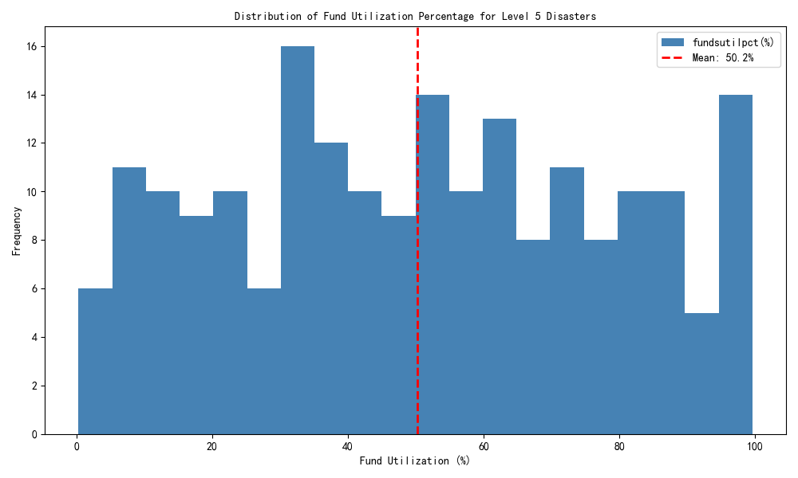
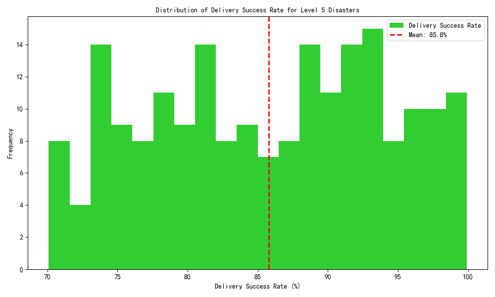
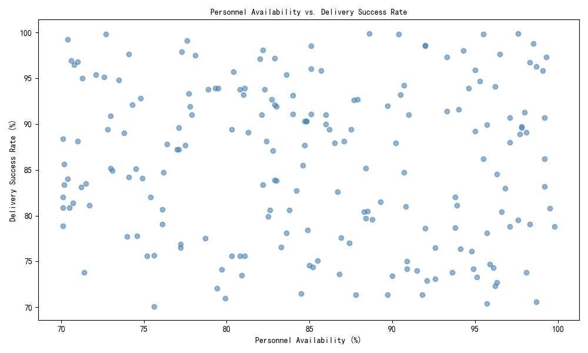
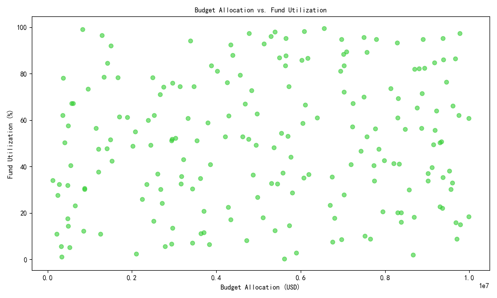

# Level 5 Disaster Resource Allocation Analysis Report

## Executive Summary
This report presents a comprehensive analysis of resource allocation effectiveness for Level 5 disasters across four dimensions: human resources, financial resources, material supplies, and transportation. The analysis is based on data from the `disaster_events` table and related resource tables in the database.

## Key Findings

### 1. Human Resource Allocation

**Observation**: The average personnel distribution shows a significant reliance on volunteers (541.2 per event) and logistics personnel (110.1 per event), with relatively fewer medical (58.5 per event) and security personnel (54.8 per event).

**Root Cause**: The high number of volunteers suggests a community-driven response approach, while the logistics focus reflects the need for distribution and coordination.

**Business Impact**: While volunteers are a valuable resource, over-reliance may affect response quality and consistency.

### 2. Financial Resource Utilization

**Observation**: The average fund utilization rate is 50.2%, indicating moderate use of allocated budgets.

**Root Cause**: The moderate utilization rate could be due to either efficient spending or underutilization of available funds.

**Business Impact**: A 50.2% utilization rate suggests potential for either optimizing budget allocation or improving fund deployment strategies.

### 3. Material Supply Allocation

**Observation**: The average resource allocation includes 527 generators, 49,666 liters of fuel, and substantial quantities of medical supplies, shelter units, and hygiene kits.

**Root Cause**: The resource mix reflects a balanced approach to addressing both immediate survival needs (food, water) and infrastructure support (generators, fuel).

**Business Impact**: The resource allocation appears adequate but could be further optimized based on specific disaster types.

### 4. Transportation Effectiveness

**Observation**: The average delivery success rate is 85.8%, with a mean personnel availability of 85.1%.

**Root Cause**: High delivery success aligns with strong personnel availability, suggesting effective coordination between staffing and logistics.

**Business Impact**: The high success rate indicates effective transportation planning, though there is room for improvement to reach 90%+ consistently.

### 5. Correlation Between Personnel Availability and Delivery Success

**Observation**: There is a positive correlation between personnel availability and delivery success, though not perfectly linear.

**Root Cause**: Higher availability generally leads to better delivery performance, but other factors like route optimization and vehicle maintenance also play roles.

**Business Impact**: Improving personnel availability alone may not guarantee higher delivery success without addressing other logistical factors.

### 6. Budget Allocation vs. Fund Utilization

**Observation**: There is no strong correlation between budget size and utilization percentage.

**Root Cause**: Some events with large budgets show low utilization, suggesting potential inefficiencies or over-allocation.

**Business Impact**: This indicates a need for better budget forecasting and utilization strategies to ensure funds are used effectively.

## Recommendations

### 1. Optimize Personnel Mix
- **Action**: Increase the proportion of trained medical and security personnel relative to volunteers.
- **Rationale**: Volunteers may lack specialized skills needed for Level 5 events, potentially affecting response quality.

### 2. Improve Fund Utilization
- **Action**: Implement real-time budget tracking and adjust allocations based on evolving needs.
- **Rationale**: The 50.2% utilization rate suggests either over-allocation or under-spending, both of which can be addressed through better monitoring.

### 3. Enhance Transportation Coordination
- **Action**: Invest in route optimization technology and vehicle maintenance to improve delivery success rates.
- **Rationale**: Despite high personnel availability, delivery success is not consistently above 90%, indicating potential inefficiencies.

### 4. Strengthen Forecasting for Resource Allocation
- **Action**: Use historical data to refine resource allocation models for different disaster types.
- **Rationale**: The lack of strong correlation between budget and utilization suggests room for better predictive analytics.

### 5. Standardize Readiness Protocols
- **Action**: Develop standardized readiness protocols to ensure consistent preparedness across all events.
- **Rationale**: Variability in readiness metrics (e.g., PPE status) indicates inconsistent preparedness levels.

## Conclusion
The analysis reveals that while the current resource allocation framework for Level 5 disasters is generally effective, there are opportunities to optimize personnel composition, improve fund utilization, and enhance transportation efficiency. By implementing the recommendations above, emergency response effectiveness can be significantly improved, leading to better outcomes for affected populations.

The findings are supported by SQL queries that joined disaster event data with resource allocation tables, followed by statistical analysis and visualization in Python. The visualizations embedded in this report directly reflect the quantitative findings from this analysis.
