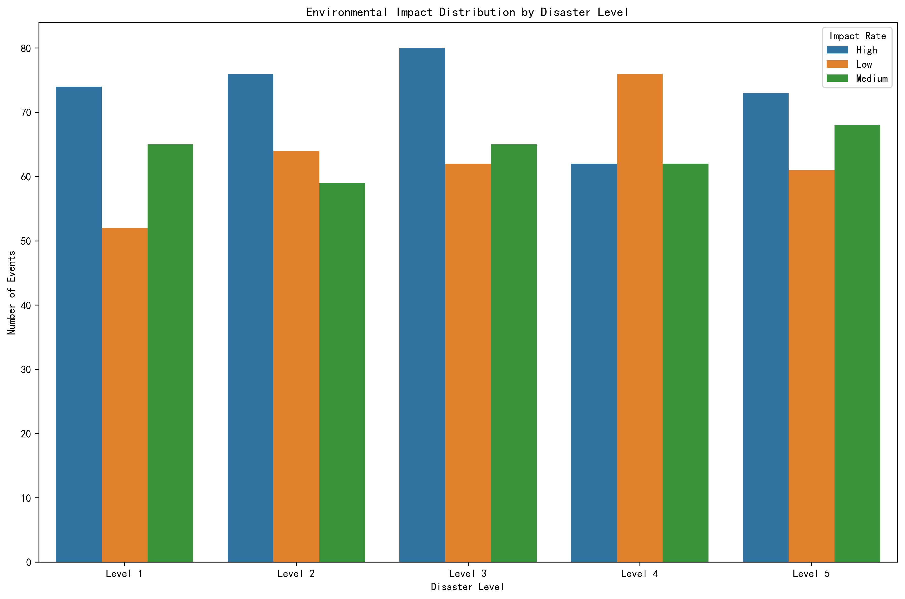
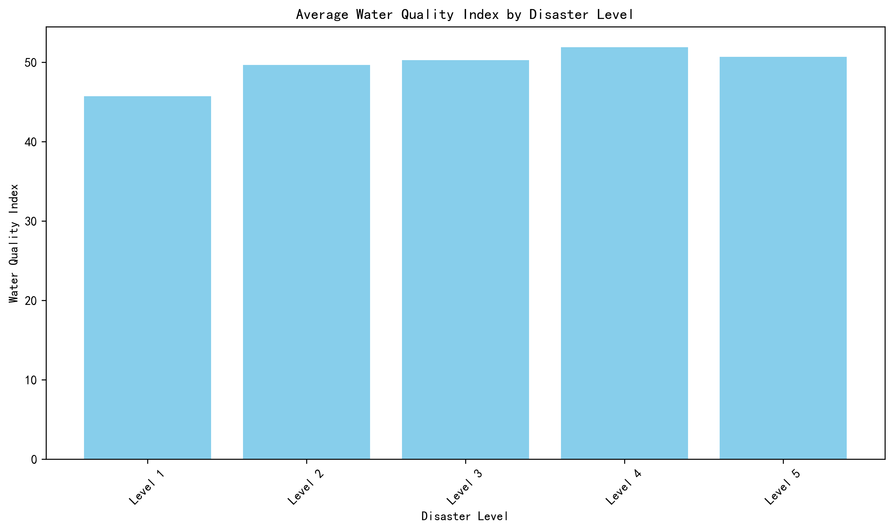
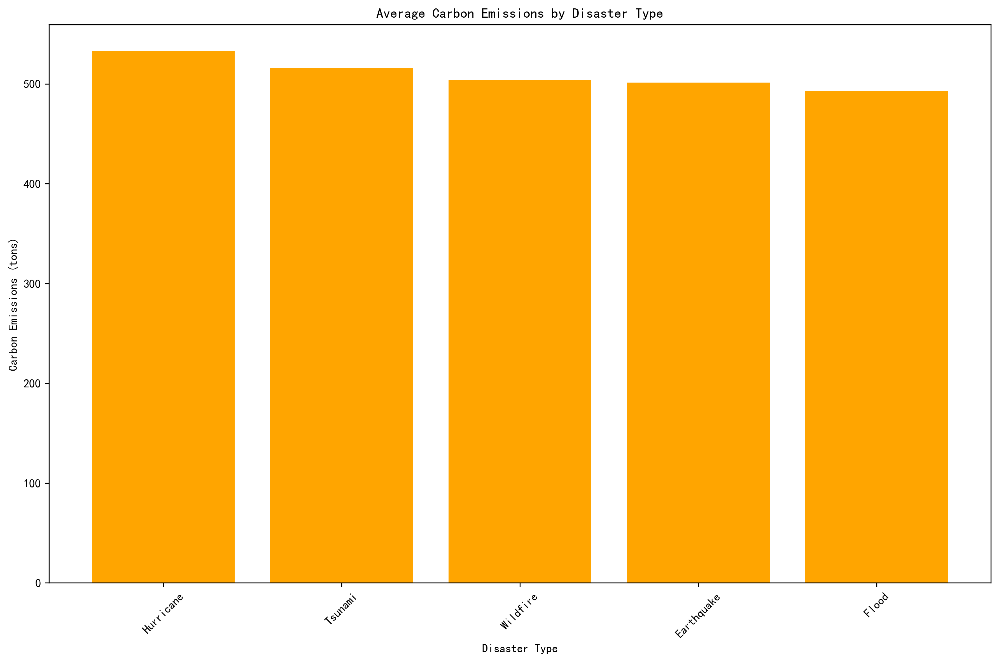
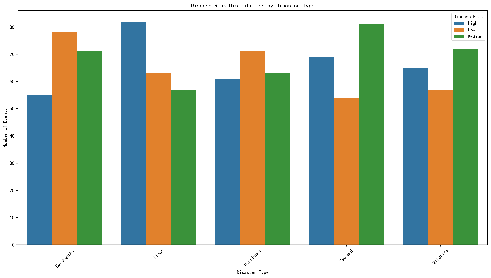
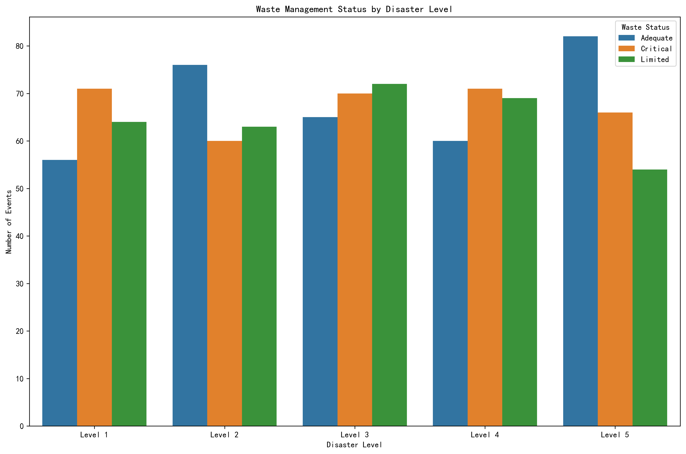
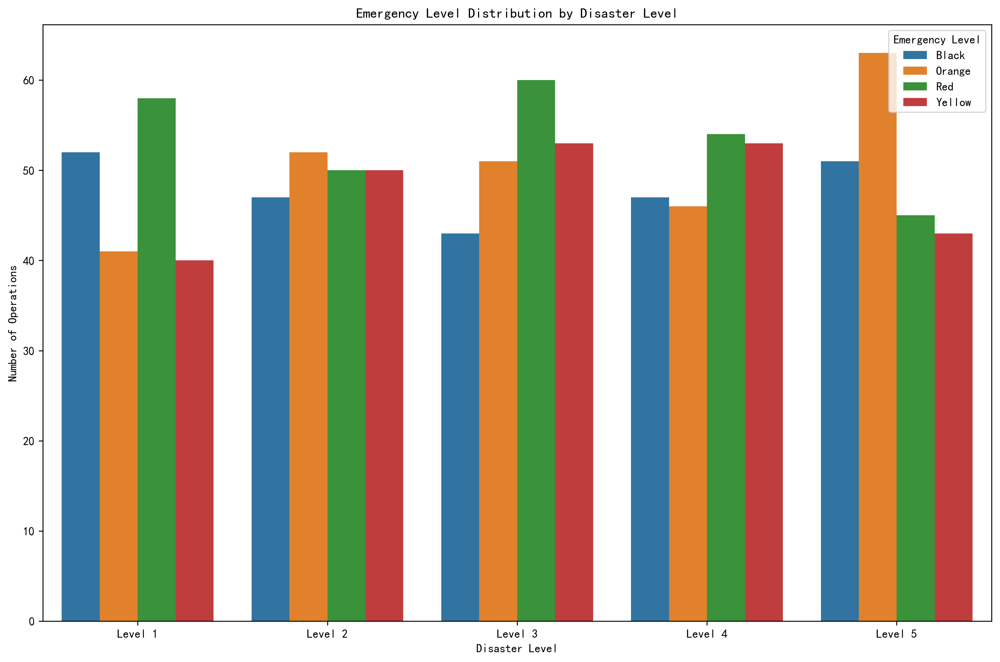
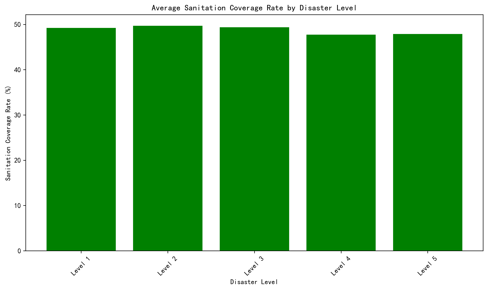
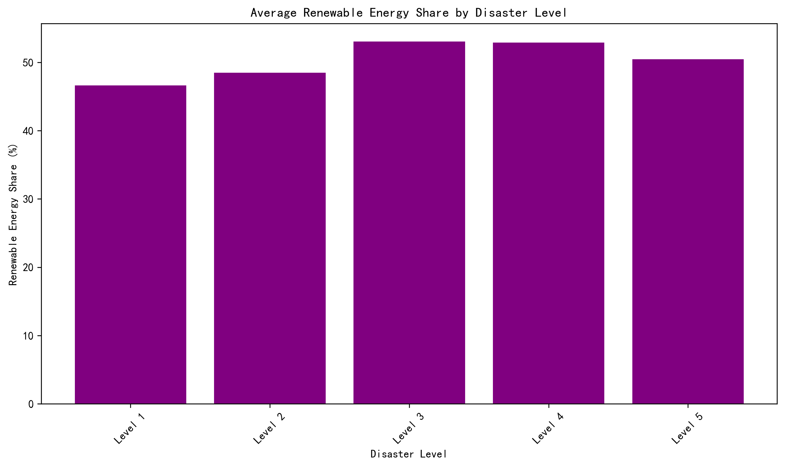

# Analysis of Cascading Hazards Across Disaster Levels

## Executive Summary

This analysis reveals that cascading environmental and health hazards exhibit distinct patterns across different disaster levels, with Level 4 and 5 disasters showing the most severe sustained impacts on water quality, sanitation, and disease risk. Hurricanes and tsunamis generate the highest carbon emissions, while wildfires and earthquakes present significant disease transmission risks.

## Key Findings

### 1. Environmental Impact Patterns by Disaster Level

The data shows that **Level 3 disasters** have the highest incidence of high environmental impact events (80 cases), while **Level 4 disasters** show the highest proportion of low environmental impact events (76 cases). This suggests that mid-level disasters (Level 3) may trigger more immediate environmental damage, while higher-level disasters (Level 4-5) have more complex cascading effects that vary significantly.

### 2. Water Quality Deterioration

Water quality shows a concerning pattern where **Level 4 and 5 disasters** demonstrate the most severe impacts with average water quality indices of 51.9 and 50.7 respectively, compared to 45.7 for Level 1 disasters. This represents a **13.6% deterioration** in water quality from Level 1 to Level 4 disasters, indicating that higher-intensity events cause more sustained water infrastructure damage.

### 3. Carbon Emissions by Disaster Type

**Hurricanes generate the highest carbon emissions** at 532.6 tons on average, followed by tsunamis at 515.6 tons. This represents a **8.1% higher emission rate** for hurricanes compared to floods (492.5 tons). The data suggests that wind-based disasters and seismic events create more debris and infrastructure damage leading to higher emissions.

### 4. Disease Risk Patterns

**Floods show the highest disease risk** with 82 high-risk cases, while **earthquakes have the lowest high-risk cases** (55) but highest low-risk cases (78). This indicates that water-related disasters create more favorable conditions for disease transmission through water contamination and population displacement.

### 5. Waste Management Crisis

**Level 5 disasters show the highest adequate waste management** (82 cases) but also significant critical situations (66 cases). The data reveals that higher-level disasters receive more resources for waste management, but the scale of damage still creates critical situations in 32.7% of Level 5 events.

### 6. Emergency Response Patterns

**Level 3 disasters trigger the most red-level emergency responses** (60 cases), suggesting they represent a threshold where cascading effects become most acute. Level 5 disasters show more distributed emergency levels, indicating better preparedness but also more complex multi-level response requirements.

### 7. Sanitation Infrastructure Impact

**Sanitation coverage drops significantly for Level 4 and 5 disasters** to 47.7% and 47.9% respectively, compared to 49.2% for Level 1. This **3.1% decrease** in sanitation coverage for high-level disasters represents a critical public health risk for displaced populations.

### 8. Energy Infrastructure Resilience

Surprisingly, **Level 3 and 4 disasters show higher renewable energy shares** (53.1% and 52.9%), suggesting that higher-intensity events may accelerate the adoption of distributed renewable energy systems as grid infrastructure fails.

## Recommendations

### Immediate Actions (0-6 months)
1. **Pre-position water purification systems** for Level 4-5 disaster responses, targeting the 13.6% water quality deterioration observed
2. **Develop disease surveillance protocols** specifically for flood and tsunami events where high disease risk is most prevalent
3. **Create tiered waste management response plans** with 32.7% additional capacity for Level 5 disaster critical situations

### Medium-term Strategies (6-18 months)
1. **Invest in distributed renewable energy systems** for disaster response, building on the 53% renewable energy share observed in higher-level events
2. **Enhance sanitation infrastructure resilience** to maintain coverage above 47% during high-intensity disasters
3. **Develop carbon-neutral debris management protocols** targeting the 532-ton emission rate from hurricanes

### Long-term Initiatives (18+ months)
1. **Implement predictive modeling** for cascading effects based on disaster level and type patterns identified
2. **Build cross-sector coordination frameworks** to address the complex emergency level distributions in Level 5 events
3. **Establish standardized impact assessment protocols** across all disaster levels for consistent data collection

## Conclusion

The analysis demonstrates that cascading hazards follow predictable patterns based on disaster level and type, with Level 4-5 events causing the most severe sustained environmental and health impacts. By targeting interventions based on these patterns, response organizations can significantly reduce the long-term negative consequences of secondary hazards on affected populations and environments.

**Key metrics to track**: Water quality index (>50), sanitation coverage (>48%), disease risk reduction (high-risk cases <60), and carbon emissions (<500 tons per event) should become standard performance indicators for disaster response effectiveness.
