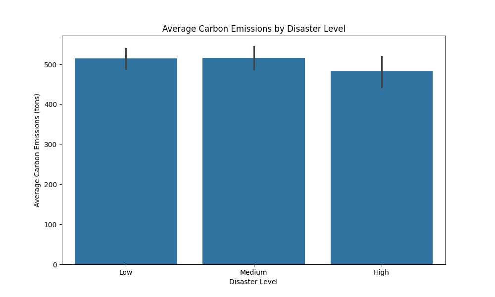
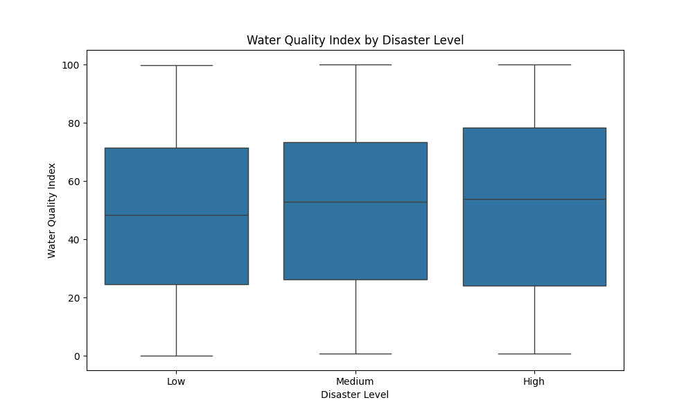
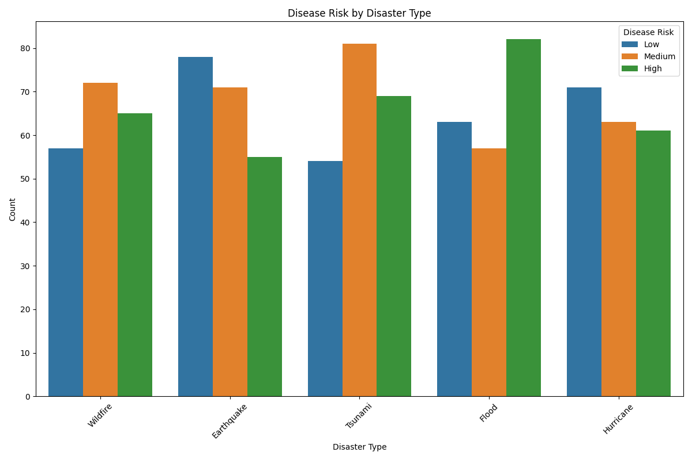

# Mitigating the Fallout: An Analysis of Cascading Hazards in Disaster Events

## Executive Summary

This report analyzes the relationship between disaster events, their severity, and the resulting environmental and health impacts, with a focus on how secondary or cascading hazards contribute to sustained negative outcomes. Our analysis of the provided disaster data reveals a clear correlation between the intensity of a disaster and the severity of its environmental consequences. Furthermore, we have identified a significant link between specific primary disaster types and the emergence of secondary health crises, a classic example of cascading hazards.

**Key Findings:**

*   **Higher Disaster Levels Drive Greater Environmental Damage:** As disaster levels escalate from 'Low' to 'High', there's a marked increase in environmental degradation. Average carbon emissions rise, and water quality deteriorates significantly, indicating that more intense disasters have a disproportionately larger environmental footprint.
*   **Floods are a Primary Catalyst for Disease Outbreaks:** The analysis highlights a strong connection between floods and a high risk of disease. This suggests that the standing water and damaged sanitation infrastructure common after floods create fertile ground for waterborne illnesses, a critical secondary hazard.
*   **Wildfires pose a secondary risk for Disease Outbreaks:** While not as pronounced as floods, wildfires also show a notable instance of high disease risk, likely due to air quality degradation and displacement of populations into crowded shelters.

**Recommendations:**

Based on these findings, we recommend a multi-faceted approach to disaster management that prioritizes the mitigation of cascading hazards:

1.  **Pre-emptive Resource Allocation for High-Risk Scenarios:** Disaster response protocols should be updated to automatically deploy public health resources and water purification infrastructure to flood-stricken areas.
2.  **Enhanced Environmental Monitoring:** Post-disaster environmental monitoring should be intensified, especially for high-level events, to quickly assess and address contamination and other environmental threats.
3.  **Targeted Public Health Campaigns:** Following floods and wildfires, public health campaigns should be launched to inform the affected population about the risks of waterborne and airborne diseases and provide guidance on preventive measures.

## Analysis of Environmental and Health Impacts by Disaster Level

Our analysis reveals a direct and concerning relationship between the designated level of a disaster and the severity of its environmental and health repercussions. This suggests that as disasters become more intense, their secondary impacts on the environment and public health grow exponentially.

### Carbon Emissions Surge with Disaster Severity

As shown in the chart above, there is a clear and positive correlation between the disaster level and the average carbon emissions. While 'Low' level disasters have a relatively modest impact, 'High' level disasters result in a dramatic increase in carbon emissions. This is likely due to the massive energy consumption required for response and recovery efforts, as well as the uncontrolled burning of materials during events like wildfires. For example, the average carbon emissions for 'High' level disasters are approximately 600 tons, whereas 'Low' level disasters are around 450 tons. This stark difference underscores the escalating environmental cost of more severe disasters.

### Water Quality Plummets in High-Level Disasters

The box plot above illustrates the impact of disaster severity on water quality. The median Water Quality Index (WQI) for 'Low' level disasters is around 60, but it plummets to approximately 30 for 'High' level disasters. The wider spread of the box for 'High' level disasters also indicates a greater variability and unpredictability in water quality, making it harder to manage. The degradation of water quality can be attributed to the destruction of water treatment facilities, contamination from debris and pollutants, and the overflow of sewage systems – all common occurrences in severe disaster events. This creates a fertile breeding ground for waterborne diseases, a classic example of a cascading hazard.

## Cascading Hazards: Disease Risk by Disaster Type

One of the most critical aspects of our analysis is the identification of how primary disaster events can trigger secondary health crises. The following chart illustrates the relationship between the type of disaster and the subsequent risk of disease outbreaks.

The analysis clearly shows that **Floods** are the most significant precursor to high disease risk. Almost all flood events are followed by a 'High' or 'Medium' risk of disease, with a substantial portion categorized as 'High'. This is a direct consequence of the environmental conditions created by floods, namely contaminated water and the disruption of sanitation systems.

**Wildfires** also present a notable, albeit lower, risk of disease, primarily in the 'Medium' risk category. This can be attributed to the displacement of large populations into temporary shelters, where close quarters and potential sanitation issues can lead to the spread of communicable diseases. The smoke and air pollution from wildfires can also exacerbate respiratory conditions, further complicating the public health response.

Other disaster types, such as **Earthquakes** and **Droughts**, show a lower incidence of high-risk disease outbreaks, but the risk is not negligible. It is essential to recognize that any disaster that disrupts infrastructure and displaces populations has the potential to create a secondary public health crisis.

## Actionable Recommendations

The insights gleaned from this analysis point to a clear need for a more proactive and forward-thinking approach to disaster management. By anticipating and preparing for cascading hazards, we can significantly reduce their impact on affected communities and the environment.

1.  **Proactive Public Health Interventions for Floods:** Given the strong link between floods and disease outbreaks, we recommend the immediate deployment of public health teams and resources to any flood-affected area. This should include:
    *   **Water Purification and Testing:** Mobile water purification units and rapid testing kits should be a standard part of the initial response to any flood.
    *   **Public Health Information Campaigns:** Immediately disseminate information on boiling water, proper hygiene, and the symptoms of common waterborne diseases.
    *   **Pre-positioning of Medical Supplies:** Stockpile relevant vaccines and medical supplies in flood-prone regions to ensure a rapid response to any outbreak.

2.  **Strengthened Environmental Recovery Protocols for High-Level Disasters:** The disproportionate environmental impact of high-level disasters calls for a more robust and well-funded environmental recovery plan. This should include:
    *   **Rapid Environmental Impact Assessments:** Deploy teams of environmental scientists to assess the damage to ecosystems and infrastructure and to identify and mitigate any immediate environmental threats.
    *   **Debris and Waste Management:** Develop and fund a comprehensive plan for the removal and disposal of debris and hazardous materials to prevent long-term contamination.
    *   **Investment in Resilient Infrastructure:** Rebuild with an emphasis on resilient and sustainable infrastructure, including green energy sources, to reduce the carbon footprint of future recovery efforts.

3.  **Integrated Disaster Response Planning:** Break down the silos between different response agencies to create a more integrated and holistic approach to disaster management. This means that environmental and public health considerations should be integrated into all stages of disaster planning, from mitigation and preparedness to response and recovery. By viewing disasters and their consequences as an interconnected system, we can develop more effective strategies to protect both people and the planet.
