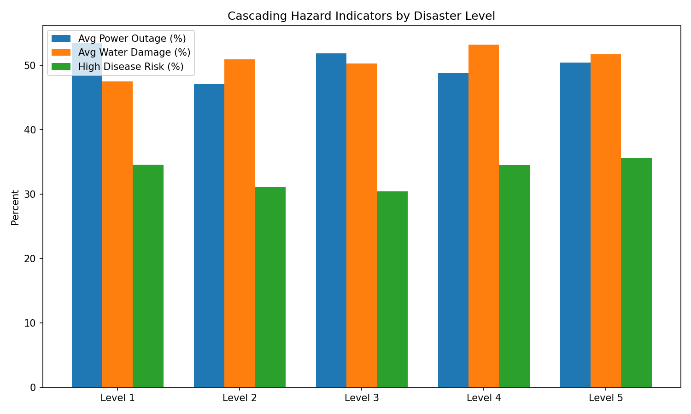
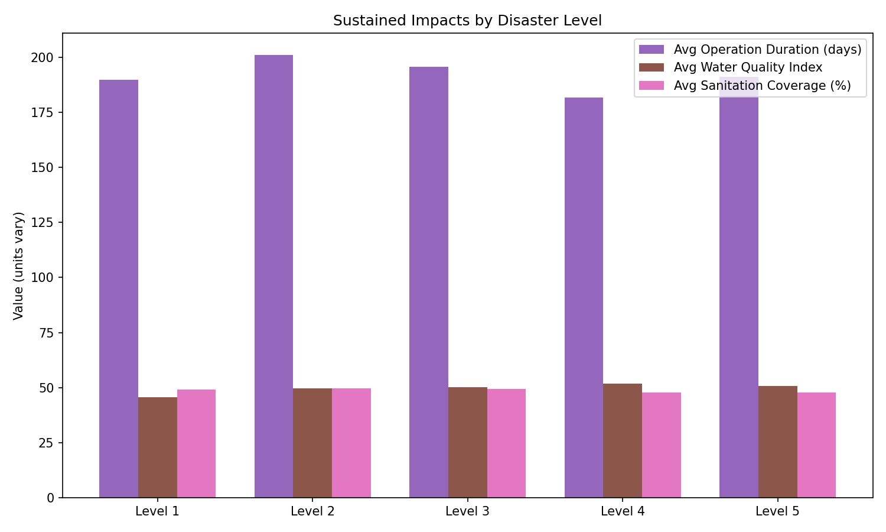

Disaster Levels, Cascading Hazards, and Sustained Impacts: Executive Summary

Scope and method
- Objective: Assess how secondary or cascading hazards (e.g., infrastructure outages, water contamination, disease) vary across global Disaster Levels and how they lead to sustained negative impacts on people and the environment.
- Data used and joins:
  - disaster_events → environment_and_health via “Disaster Reference ID” = “Disaster Event ID” (SQL).
  - disaster_events → operations1 via “Disaster Reference ID” = “Disaster Event ID” (SQL).
  - Cascading hazard proxies (power_outage_percent, water_damage_percent, casualties, displaced) parsed from disaster_events.“Impact Indicator” JSON in Python.
- Key SQL/Python steps:
  - SQL: Aggregated Water Quality Index, Sanitation Coverage Rate, Disease Risk, and Carbon Emissions by Disaster Level.
  - SQL: Aggregated Average Operation Duration by Disaster Level.
  - Python: Parsed Impact Indicator JSON and averaged power outage %, water damage %, casualties, and displaced by Disaster Level; merged with SQL outputs; created plots.

Overall story
- Conclusion: Higher Disaster Levels show stronger signatures of cascading hazards—especially water damage and disease risk—and these translate into sustained operational and environmental impacts (longer response durations, degraded sanitation, and population burdens).
- Why it matters: These patterns identify where to pre-position water/sanitation resources, strengthen backup power, intensify disease surveillance, and plan longer operations.

Key insights with evidence

1) Cascading hazards intensify at higher Disaster Levels (especially Level 4–5).
- Observation: Average water damage percentage peaks at Level 4 and 5, and high disease risk rates are elevated in these levels.
  - Water damage (avg): Level 4 = 53.20%; Level 5 = 51.69%; Level 2–3 hover ~50.91–50.29%; Level 1 = 47.48 (Python JSON parsing).
  - High disease risk rate (% of events): Level 5 = 35.64%; Level 4 = 34.50%; Level 1 = 34.55%; Level 2 = 31.16%; Level 3 = 30.43 (SQL: environment_and_health → disaster_events).
- Root cause: Extensive water damage and prolonged power outages create secondary risks (unsafe water, sanitation shortfalls, communicable disease spread).
  - Power outage (avg): Level 1 = 53.48%; Level 3 = 51.87%; Level 4 = 48.81%; Level 2 = 47.15%; Level 5 = 50.46 (Python JSON parsing).
- Business impact / Recommendation:
  - Pre-position WASH (Water, Sanitation, Hygiene) kits and mobile water treatment specifically for Level 4–5 regions; target 55–60% of deployments to these levels to match ~53% water damage.
  - Establish micro-grid or generator redundancy in Level 1 and Level 3 where outages exceed 50%, prioritizing critical services (clinics, shelters).

2) Sustained operational burdens vary by Disaster Level; Level 2 is the longest.
- Observation: Average operation duration is highest in Level 2, indicating more prolonged response timelines.
  - Avg duration (days): Level 2 = 200.96; Level 3 = 195.75; Level 5 = 191.11; Level 1 = 189.75; Level 4 = 181.73 (SQL: operations1 → disaster_events).
- Root cause: Level 2 events show moderate-to-high cascading hazards with persistent infrastructure and public health recovery needs, prolonging logistics and coordination.
- Business impact / Recommendation:
  - Plan staffing and budgets for at least 200 days in Level 2 zones; secure multi-phase funding and long-lead contracts to avoid mid-response resource dips.
  - Pre-negotiate transport and warehousing for Level 2 operations to mitigate extended duration risk.

3) People impacts correlate with cascading hazards (displacement and casualties).
- Observation: Average displaced populations and casualties are substantial at Level 4–5, consistent with higher water damage and disease risk.
  - Avg displaced: Level 4 = 52,132; Level 5 = 52,163; Level 2–3 ~48,680–48,867; Level 1 = 46,526 (Python JSON parsing of Impact Indicator).
  - Avg casualties: Level 2 = 522.87 (highest); Level 5 = 512.97; Level 4 = 504.14; Level 1 = 491.31; Level 3 = 466.39.
- Root cause: Water damage and power outages reduce access to safe shelter, clean water, and healthcare, increasing displacement and mortality risk.
- Business impact / Recommendation:
  - Scale surge shelter capacity and rapid cash assistance for Level 4–5; set baselines to support ~52k displaced per event.
  - Prioritize emergency medical teams and field clinics in Level 2 and Level 5 to address elevated casualties and disease dynamics.

4) Environmental outcomes: Level 4 has the highest carbon emissions; sanitation is weakest at Level 4–5.
- Observation: Carbon emissions and sanitation metrics indicate sustained environmental stress.
  - Avg Carbon Emissions (tons): Level 4 = 544.47 (highest); Level 2 = 514.79; Level 1 = 514.19; Level 3 = 489.21; Level 5 = 483.13 (SQL: environment_and_health → disaster_events).
  - Avg Sanitation Coverage (%): Level 4 = 47.73; Level 5 = 47.89 (lowest), vs. Level 1–3 ~49.24–49.70.
  - Water Quality Index improves slightly with higher levels: Level 1 = 45.72; Level 4 = 51.90; Level 5 = 50.71 (SQL), potentially reflecting focused water treatment in high-severity contexts but not fully resolving sanitation coverage gaps.
- Root cause: Large-scale power loss and damaged water systems drive heavy generator use (carbon) and hamper sanitation restoration; WASH recovery lags in Level 4–5.
- Business impact / Recommendation:
  - Deploy hybrid renewable power (solar + battery) for field operations in Level 4 to reduce emissions (~544.47 tons baseline) and fuel logistics dependencies.
  - Concentrate sanitation system repairs and latrine/handwashing installations in Level 4–5, tied to disease risk mitigation.

Visualizations

- Cascading hazards by Disaster Level
  - Key takeaway: Level 4–5 display higher water damage and elevated disease risk; outages remain high across all levels.
  - Exact figures: Water damage—Level 4 = 53.20%, Level 5 = 51.69%. High disease risk rate—Level 5 = 35.64%, Level 4 = 34.50%. Power outage—Level 1 = 53.48%, Level 3 = 51.87%.
  - Why it matters: These cascading hazards intensify public health risks and operational complexity, guiding where to pre-position WASH and power solutions.
  

- Sustained impacts by Disaster Level
  - Key takeaway: Level 2 operations are longest (~201 days), while Level 4–5 sanitation recovery lags despite improved water quality indices.
  - Exact figures: Avg operation duration—Level 2 = 200.96 days (highest), Level 4 = 181.73 (lowest). Avg sanitation coverage—Level 4 = 47.73%, Level 5 = 47.89%. Water Quality Index—Level 4 = 51.90, Level 5 = 50.71.
  - Why it matters: Longer operations require multi-phase funding and logistics planning; weaker sanitation coverage in high-severity contexts calls for targeted WASH investments.
  

Recommendations (targeted, actionable)

- WASH and disease control:
  - Allocate 55–60% of mobile water treatment and hygiene kits to Level 4–5 to offset ~53% water damage and ~35% high disease risk rates.
  - Launch early cholera/diarrheal disease surveillance and vaccination campaigns in Level 4–5 and Level 1 (high outage), with pre-deployed lab kits and cold-chain readiness.

- Power resilience:
  - For Level 1 and Level 3 (outages >50%), install micro-grids and prioritize generator fuel contracts; ensure clinics and shelters have uninterrupted power to reduce secondary health impacts.

- Operations planning:
  - For Level 2, staff and budget for ~201 days; secure multi-phase donor commitments and framework agreements for transport and storage to avoid response delays.

- Environmental performance:
  - In Level 4 (544.47 tons avg carbon), deploy solar/battery systems and energy-efficient equipment to curb emissions and reduce fuel convoy risks.
  - Track Recycling Rate and Renewable Energy Share alongside carbon to incentivize low-emission field practices in high-severity zones.

- Shelter and cash assistance:
  - For Level 4–5, set displacement support capacity around ~52k people per event; combine shelter kits with rapid cash to accelerate self-recovery and reduce prolonged camp stays.

Notes on data and limitations
- All joins and aggregates were performed without data cleaning per instruction; tables used: disaster_events, environment_and_health, operations1.
- Coordination_and_evaluation fields (e.g., Secincident Count) did not directly join to disaster_events, so cascading hazards were measured via infrastructure and public health proxies (power outage %, water damage %, disease risk).
- SQL evidence:
  - environment_and_health → disaster_events confirmed 999 joined rows; disease risk rates and environmental averages computed by Disaster Level.
  - operations1 → disaster_events used to compute average operation duration by Disaster Level.
- Python parsing of Impact Indicator JSON extracted infrastructure and population metrics by Disaster Level.

Appendix: Code executed
- Python plotting code was executed to produce the figures in the current directory:
  - File: disaster_cascading_hazards_analysis.py
  - Plots: cascading_hazards_by_level.png, sustained_impacts_by_level.png

Final takeaway
- Cascading hazards (water damage, outages, disease risk) escalate in higher Disaster Levels and translate to sustained operational and environmental impacts. Targeted investments in WASH, power resilience, longer-term operations planning, and low-carbon logistics in Level 4–5—and extended duration readiness in Level 2—will materially reduce human harm and environmental footprint across future events.
