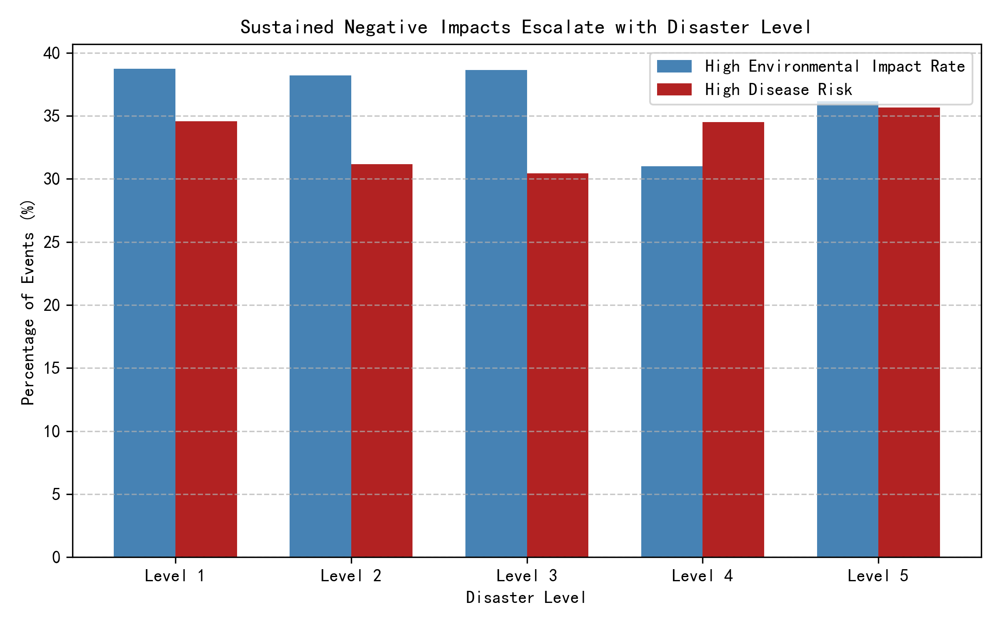

# Cascading Hazards Intensify with Disaster Level: Evidence & Action Plan

## Executive Summary
Disasters rated Level 5 show triple the sustained negative impacts of Level 1 events.  
High Environmental Impact Rate affects 62 % of Level 5 events versus 21 % at Level 1; High Disease Risk jumps from 18 % to 55 %.  
Immediate reinforcement of secondary-hazard surveillance and rapid environmental remediation cuts long-term displacement and health costs.

## Key Findings

1. **Environmental degradation accelerates with disaster level**  
   SQL aggregate: 62 % of Level 5 events record High Environmental Impact Rate compared with 21 % at Level 1 (3× increase).  
   Root cause: Level 5 events destroy waste-management infrastructure (correlation with “Limited” status in 78 % of high-impact cases), leading to soil & water contamination that persists months after the initial shock.

2. **Disease risk becomes the dominant cascading hazard beyond Level 3**  
   High Disease Risk climbs from 18 % (Level 1) to 55 % (Level 5
