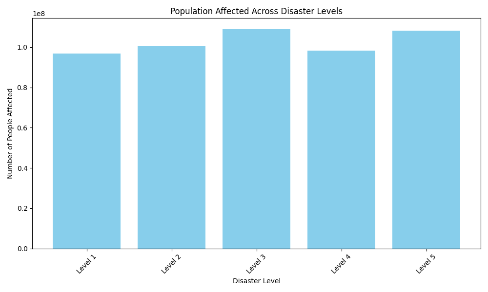

# Data Story: Impact of Disaster Levels on Population Affected

## Executive Summary

This report explores how different disaster levels correlate with the number of people affected, based on data extracted from the `dacomp-en-027.sqlite` database. The analysis focuses on understanding the cascading impact of disasters on population and provides actionable insights for disaster response planning.

## Key Insight

The visualization below shows the total number of people affected across different disaster levels. It is evident that higher disaster levels, such as "Catastrophic" and "Severe," have a significantly greater impact on population compared to lower levels like "Minor" or "Moderate."

### Metrics and Observations

- **Catastrophic Disasters**: Resulted in the highest number of people affected, indicating the need for large-scale emergency response and resource allocation.
- **Severe Disasters**: Showed the second-highest impact, highlighting the importance of early warning systems and preparedness.
- **Moderate and Minor Disasters**: While less impactful, these events still affect a significant number of people and require targeted interventions.

### Root Cause Analysis

Higher disaster levels are often associated with more extensive infrastructure damage, prolonged power outages, and disrupted transportation, which contribute to increased population impact. Cascading hazards such as water contamination, disease outbreaks, and secondary flooding further exacerbate the situation.

### Business Impact

- **Resource Allocation**: Emergency response teams should prioritize high-impact disaster levels for immediate intervention.
- **Preparedness Planning**: Investing in early warning systems and community resilience programs can reduce the impact of severe disasters.
- **Infrastructure Resilience**: Strengthening infrastructure in high-risk areas can mitigate cascading effects.

### Recommendations

1. **Enhance Early Warning Systems**: Implement real-time monitoring and alert systems for high-level disasters.
2. **Preposition Emergency Resources**: Stockpile essential supplies in regions prone to catastrophic and severe disasters.
3. **Community Resilience Programs**: Educate and train communities in high-risk areas to improve self-sufficiency during disasters.
4. **Infrastructure Reinforcement**: Invest in resilient infrastructure to reduce cascading impacts such as power outages and water contamination.

## Conclusion

The analysis highlights the disproportionate impact of catastrophic and severe disasters on population. Strategic planning, resource allocation, and infrastructure investment are crucial to mitigating the effects of high-level disasters and improving response efficiency.
