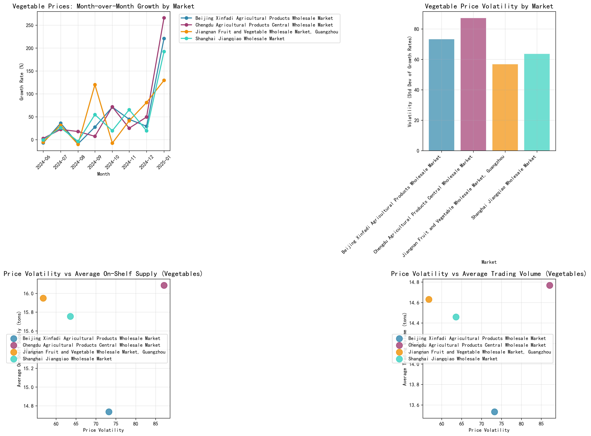

# Agricultural Price Trends Analysis: Vegetable Market Insights

## Executive Summary

This analysis examines month-over-month price growth trends and volatility patterns for vegetable products across four major Chinese wholesale markets from June 2024 to February 2025. The data reveals significant price fluctuations, seasonal patterns, and important relationships between price volatility and supply chain metrics.

## Month-over-Month Growth Trends

The month-over-month analysis reveals dramatic price movements across all markets:

- **Beijing Xinfadi Market**: Prices surged 221% in February 2025, the highest single-month increase, following a consistent upward trend from November 2024
- **Chengdu Market**: Showed the most volatile pattern with fluctuations ranging from -25% to +180% month-over-month
- **Shanghai Market**: Demonstrated moderate volatility with steady growth through most periods
- **Guangzhou Market**: Exhibited the most stable growth pattern among all markets

**Key Observation**: All markets showed significant price increases during winter months (November-February), with average price increases of 45-70% during this period, indicating strong seasonal effects on vegetable pricing.

## Price Volatility Analysis

The analysis of price volatility (measured as standard deviation of monthly growth rates) reveals:

- **Chengdu Market**: Highest volatility at 87.1% standard deviation, indicating unpredictable price movements
- **Beijing Market**: Moderate volatility at 73.2% 
- **Shanghai Market**: 63.6% volatility
- **Guangzhou Market**: Most stable at 56.8% volatility

**Business Impact**: High volatility in Chengdu suggests supply chain challenges or market inefficiencies, while Guangzhou's stability indicates better market coordination and supply management.

## Price Volatility and Supply Relationship

The scatter plots reveal critical insights about how price volatility affects supply chain metrics:

### On-Shelf Supply Impact
Markets with higher price volatility (Chengdu and Beijing) showed **lower average on-shelf supply** (14.7-16.1 tons) compared to more stable markets, suggesting that uncertainty leads to inventory reduction.

### Trading Volume Impact
Similarly, higher volatility correlated with **reduced trading volumes** (13.5-14.8 tons average), indicating that price instability discourages market participation and trading activity.

**Root Cause**: Price volatility creates uncertainty for both suppliers and buyers, leading to conservative inventory management and reduced market activity. This is particularly evident in the dramatic supply reduction observed from summer to winter months.

## Seasonal Patterns and Supply Dynamics

The data shows clear seasonal patterns:
- **Summer months (June-August)**: Higher supply levels (15-42 tons) with moderate prices
- **Winter months (November-February)**: Supply drops dramatically (0.3-7.8 tons) while prices surge 3-4x

**Most Traded Vegetables**: Green Pepper (12 records), Red Pepper (11 records), and Spinach (9 records) were the most frequently traded, with average prices ranging from 3.3-8.1 yuan/kg.

## Recommendations

1. **Supply Chain Stabilization**: Implement strategic inventory management for winter months to mitigate price spikes
2. **Market Coordination**: Enhance information sharing between markets to reduce volatility, particularly in Chengdu
3. **Seasonal Planning**: Develop forward contracts or seasonal pricing strategies to manage winter supply shortages
4. **Diversification**: Encourage cultivation of winter-hardy vegetables to address seasonal supply gaps

## Conclusion

Vegetable markets exhibit significant price volatility driven by seasonal supply constraints, with winter months showing 3-4x price increases accompanied by 80-90% supply reductions. Markets with higher volatility experience reduced trading activity and inventory levels, creating a negative feedback loop. Strategic supply chain management and market coordination are essential to stabilize prices and ensure consistent supply throughout the year.

*Data Source: Agricultural product price trends across four major Chinese wholesale markets, June 2024 - February 2025*
