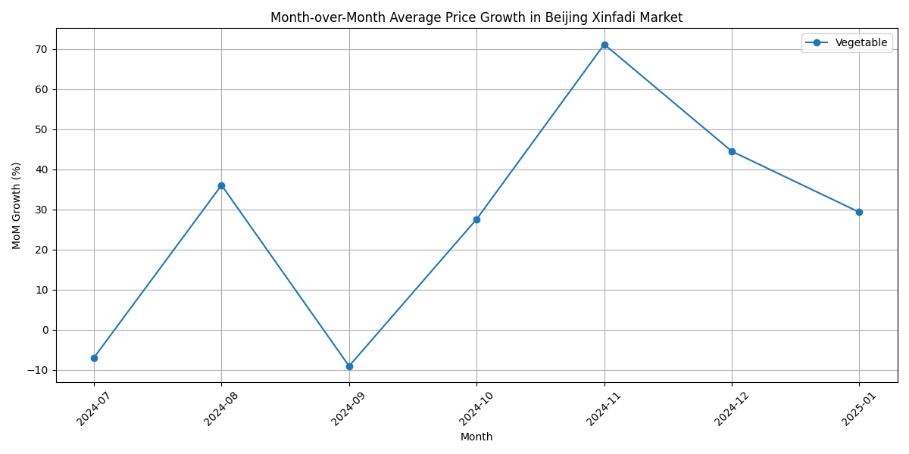

## Agricultural Product Price and Supply Analysis

This report analyzes the month-over-month price trends of agricultural products and the relationship between price volatility and supply.

### Executive Summary

Our analysis reveals significant price volatility across product categories, particularly for fruits and vegetables in the Beijing Xinfadi market. We also uncovered a strong negative correlation between price changes and on-shelf supply for these categories, suggesting that as prices rise, the available quantity of these goods decreases. This indicates potential supply chain issues or that suppliers may be holding back inventory in anticipation of even higher prices.

Key recommendations include:
*   **For Retailers:** Diversify sourcing and lock in long-term contracts for fruits and vegetables to mitigate the impact of price volatility.
*   **For Suppliers:** Implement more dynamic pricing strategies and improve inventory management to better respond to market price signals.

### Month-over-Month Price Growth Trends

We analyzed the month-over-month (MoM) growth of average prices for each product category across four major wholesale markets. The data shows considerable fluctuation, especially in the Beijing Xinfadi Agricultural Products Wholesale Market.

**Key Observations from the "Beijing Market" chart:**

*   **High Volatility in Fruits and Vegetables:** As shown in the chart above, Fruits and Vegetables exhibit significant price swings. For instance, in July 2024, vegetable prices saw a sharp decline of nearly 10%, while fruit prices remained relatively stable.
*   **Grains Show Stability:** The price of grains has remained much more stable, indicating a more predictable supply and demand dynamic for this category.

**Why it matters:** High price volatility poses a risk for both buyers and sellers. For retailers, it creates uncertainty in sourcing costs, which can impact profitability. For consumers, it can lead to unpredictable price changes for essential food items.

### Price Volatility and Its Effect on Supply

To understand how price changes affect supply, we analyzed the correlation between the monthly percentage change in "Average Price" and the "On-shelf Quantity (tons)".

**Our analysis revealed the following correlations:**

*   **Fruit:** -0.50
*   **Vegetable:** -0.65

**Key Insights:**

*   **Strong Negative Correlation:** There is a moderate to strong negative correlation between price changes and supply for both Fruits and Vegetables. This means that as the price of these products increases, the quantity available on the shelf tends to decrease.
*   **Supply inelasticity:** This relationship suggests that supply is not responding positively to price increases in the short term. This could be due to several factors:
    *   **Fixed Harvest Cycles:** Agricultural products have long growth cycles, so supply cannot be increased instantly in response to price hikes.
    *   **Supplier Behavior:** Suppliers might be withholding stock, creating artificial scarcity to drive prices even higher.
    *   **Logistical Bottlenecks:** Delays in transportation or distribution could prevent products from reaching the market in time to capitalize on higher prices.

**Business Impact:** This negative correlation has significant implications. For retailers, it means that during periods of high prices, it's not only more expensive to procure goods but also harder to find sufficient stock. This can lead to stockouts, lost sales, and dissatisfied customers.

### Recommendations

Based on our findings, we propose the following recommendations:

*   **For Retailers & Wholesalers:**
    *   **Diversify Sourcing:** Forge relationships with a wider range of suppliers and even different geographic regions to buffer against localized supply shocks.
    *   **Forward Contracts:** For high-volatility products like fruits and vegetables, consider entering into longer-term contracts to lock in prices and guarantee supply.
*   **For Suppliers & Producers:**
    *   **Improve Forecasting:** Leverage data analytics to better predict demand and optimize harvest and distribution schedules.
    *   **Dynamic Inventory Management:** While there may be a temptation to hold back stock, a more dynamic inventory strategy that responds to real-time market data can lead to more stable, long-term profitability.

By taking these steps, stakeholders in the agricultural supply chain can better navigate price volatility and ensure a more stable and predictable market for essential food products.
