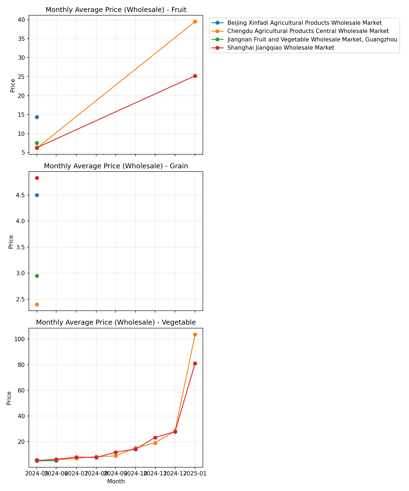
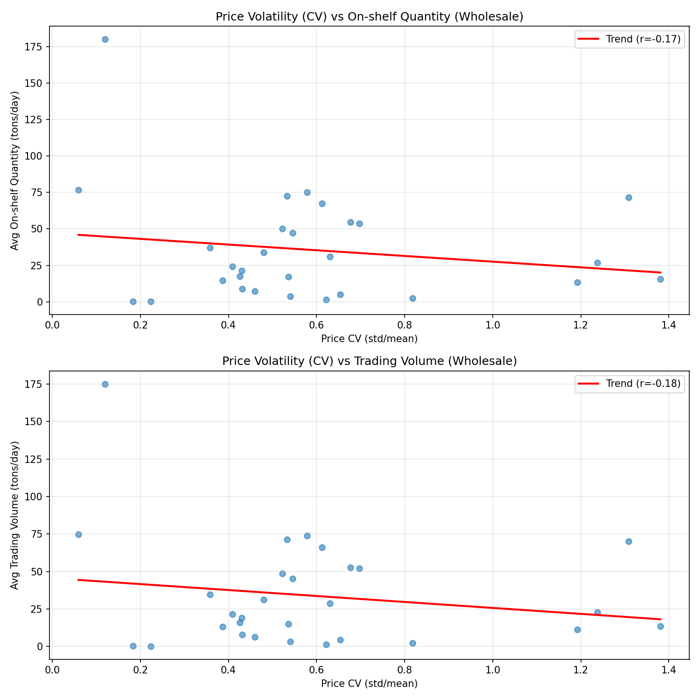

MoM Average Price Trends across Markets and the Impact of Price Volatility on Supply (Wholesale)

Executive Summary
- Vegetable prices are increasing across major markets, with substantial month-over-month (MoM) growth in Chengdu (+266.0% in the latest month) and Shanghai (+192.4%). Fruit prices exhibit extreme MoM spikes (+539.9% in Chengdu; +301.5% in Shanghai), but coverage is limited to 2 months, so interpret with caution.
- Price volatility (measured by coefficient of variation, CV) is weakly and negatively correlated with supply: Pearson r = -0.172 vs On-shelf Quantity and r = -0.178 vs Trading Volume. Practically, months with higher price volatility tend to coincide with lower supply levels and lower turnover.
- Overall average MoM growth across all category-market pairs is 190.6%, heavily influenced by sparse Fruit entries and large percentage changes. Vegetables have more months of data (17) with a more stable MoM average of +51.3%.

Data & Method
- Source: SQLite table agricultural_product_price_tren (fields: Product Category, Market Name, Collection Date, Average Price, On-shelf Quantity (tons), Trading Volume (tons), Price Type).
- Scope: Wholesale Price records (price_type = 'Wholesale Price') from 2024-06-10 to 2025-02-27.
- Method: In Python (pandas/matplotlib), monthly aggregation by category-market, MoM computed with pct_change on monthly average price; volatility measured as CV = std/mean of monthly prices; relationships assessed via Pearson correlation with On-shelf Quantity and Trading Volume.

MoM Price Trends by Product Category and Market
- Conclusion: Vegetables show consistent upward price movement across Chengdu and Shanghai; Fruit exhibits extreme but sparsely observed spikes; Grain lacks wholesale coverage.
- Evidence:
  - Category-level MoM (Wholesale):
    • Fruit: avg MoM +420.7% (months=2), latest +301.5%.
    • Vegetable: avg MoM +51.3% (months=17), latest +192.4%.
    • Grain: no wholesale MoM observations (months=0).
  - Market-level MoM (Wholesale):
    • Chengdu Agricultural Products Central Wholesale Market: avg MoM +112.7% (months=9).
    • Shanghai Jiangqiao Wholesale Market: avg MoM +77.3% (months=9).
    • Jiangnan (Guangzhou): avg MoM +3.0% (months=1).
    • Beijing Xinfadi: no wholesale MoM observations in this period.
- Visualization:
  
  Key takeaway: In Feb 2025, Vegetable prices reached 103.75 (Chengdu) and 81.12 (Shanghai), while Fruit stood at 39.51 (Chengdu) and 25.23 (Shanghai). Recent MoM jumps are large: Vegetable latest MoM +266.0% (Chengdu) and +192.4% (Shanghai); Fruit latest MoM +301.5% (Shanghai) and +539.9% (Chengdu). This matters because sustained price acceleration increases procurement costs and risk exposure, particularly for vegetables which have broader month coverage.

Price Volatility and Its Effect on Supply
- Conclusion: Higher price volatility aligns with lower supply availability and lower trading activity, but the relationship is weak.
- Evidence (Wholesale): Pearson r between price CV and supply metrics:
  • CV vs On-shelf Quantity: -0.172 (weak negative).
  • CV vs Trading Volume: -0.178 (weak negative).
- Interpretation (Root Cause): Volatility likely reflects supply tightness, seasonality, or uneven inflows; when prices fluctuate widely, sellers may stock less (lower on-shelf quantity) and trading may slow, reinforcing volatility.
- Visualization:
  
  Key takeaway: In Feb 2025, Fruit exhibits high volatility (CV ~1.19–1.24) with higher supply levels (13.44 tons/day in Chengdu; 26.95 in Shanghai) compared to Vegetables’ lower volatility (CV ~0.18–0.22) but surprisingly low on-shelf quantities (~0.33–0.36 tons/day). Across months, the aggregate correlation is weakly negative (r ≈ -0.17 to -0.18), suggesting that when volatility rises, supply and turnover tend to dip. This matters because price instability can strain market liquidity and planning, prompting the need for supply smoothing.

Latest Month Snapshot (Feb 2025, Wholesale)
- Fruit:
  • Chengdu: Avg Price 39.51; On-shelf 13.44 tons/day; Trading 11.43 tons/day; CV 1.192.
  • Shanghai: Avg Price 25.23; On-shelf 26.95; Trading 22.90; CV 1.238.
- Vegetable:
  • Chengdu: Avg Price 103.75; On-shelf 0.325; Trading 0.278; CV 0.224.
  • Shanghai: Avg Price 81.12; On-shelf 0.360; Trading 0.308; CV 0.183.
- Note: Overall average MoM across all pairs = +190.6%; heavily influenced by Fruit spikes and limited months.

Observation → Root Cause → Business Impact / Recommendation
1) Observation: Vegetable prices rose sharply MoM (+266.0% Chengdu; +192.4% Shanghai), with sustained upward trend across 17 months.
   • Root Cause: Seasonal supply constraints and demand pressure; consistent month coverage suggests a genuine trend rather than sparse data noise.
   • Impact/Recommendation: Secure supply via forward contracts and diversified sourcing; implement weekly procurement reviews to hedge price risk.
2) Observation: Fruit shows extreme MoM spikes (+539.9% Chengdu; +301.5% Shanghai) but with only 2 months of wholesale observations.
   • Root Cause: Sparse coverage and base effects; likely seasonal arrivals driving sharp price swings.
   • Impact/Recommendation: Avoid overreacting to sparse spikes; expand data coverage; use price bands and dynamic reorder points to manage volatility.
3) Observation: Volatility is weakly negatively correlated with supply (r = -0.172 with on-shelf, -0.178 with trading volume).
   • Root Cause: Supply tightness and uncertainty may discourage stocking and trading, reinforcing price instability.
   • Impact/Recommendation: Smooth inflows via staggered deliveries; maintain minimal buffer stocks during high-volatility periods; communicate price guidance to market participants to stabilize expectations.
4) Observation: Market differences—Chengdu (avg MoM +112.7%) and Shanghai (+77.3%) outpace Guangzhou (+3.0%) and lack of Beijing data.
   • Root Cause: Regional supply chains and seasonality differences.
   • Impact/Recommendation: Align procurement strategies per market; prioritize stabilization efforts in Chengdu/Shanghai; deepen intelligence in Guangzhou; collect wholesale data in Beijing to close visibility gaps.

Why It Matters
- Rising and volatile prices increase procurement costs and risk. Weak negative relationships between volatility and supply imply that stability initiatives (contracts, buffers, scheduling) can modestly improve availability and turnover.
- Category-specific strategies are essential: Vegetables need sustained supply management; Fruit requires enhanced monitoring due to spikes and limited coverage; Grain needs data collection.

Analytical References
- SQL/Python basis: Monthly MoM computed via pandas groupby and pct_change on \"Average Price\" grouped by \"Product Category\", \"Market Name\", \"Collection Date (month)\"; volatility as CV (std/mean). Supply relationships assessed using Pearson correlation between price_cv and \"On-shelf Quantity (tons)\" plus \"Trading Volume (tons)\".
- Data period: 2024-06-10 to 2025-02-27; Latest month: 2025-02 (4 category-market rows).

Next Steps
- Implement market-specific procurement smoothing and buffer stocks.
- Expand wholesale data coverage (especially Beijing, Grain) to reduce noise and improve risk estimation.
- Establish a monthly volatility watchlist (CV threshold > 0.5 for alerts) paired with dynamic reorder points and supplier diversification.
