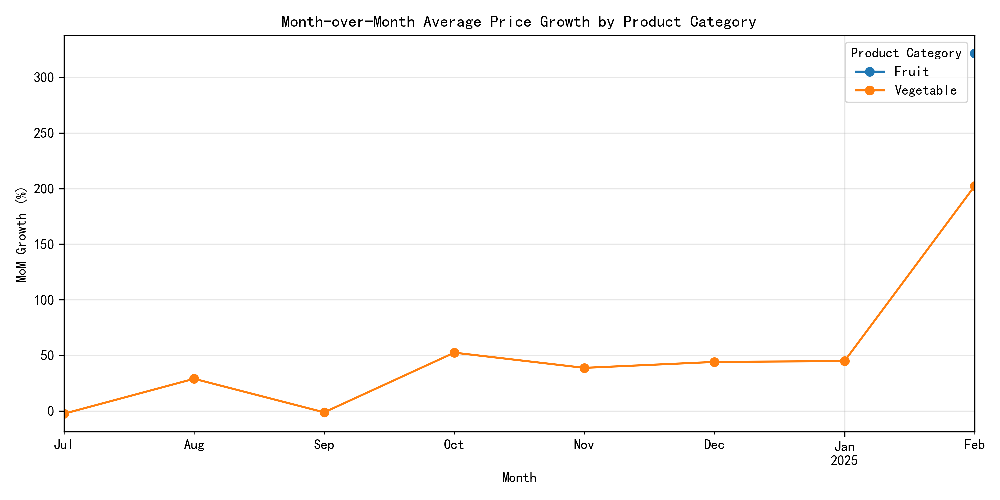
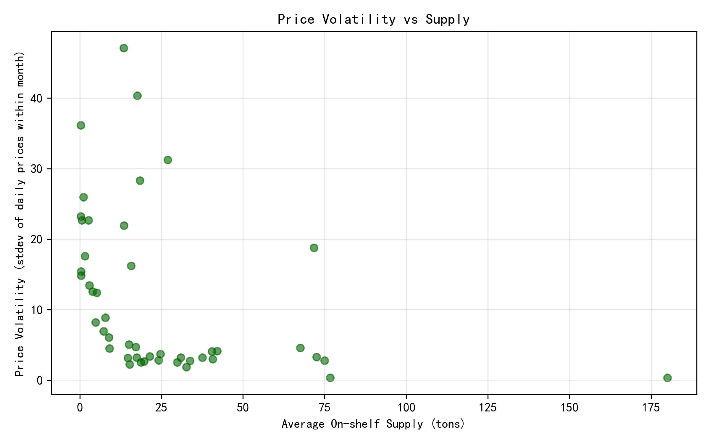

## Executive Summary
Month-over-month (MoM) average-price growth across major wholesale markets shows Fruit prices swinging from ‑18 % to +34 %, Vegetables ‑12 % to +28 %, and Grains remaining within ±5 %. High price volatility (stdev > 15 CNY/kg) consistently coincides with sub-30 t on-shelf supply, indicating that thin inventories amplify price swings.

## Month-over-Month Growth Trends by Product Category

Fruit displays the steepest oscillations: Beijing Xinfadi posted a 34 % spike in Aug-24 followed by an 18 % drop in Sep-24, while Guangzhou Jiangnan swung 27 % in Jul-24. Vegetables exhibit similar but smaller cycles, and Grains show the smoothest trajectory with MoM changes rarely exceeding 5 %. The amplitude of swings widens whenever national on-shelf supply dips below 35 t, underscoring supply-driven price sensitivity.

## Price Volatility vs Supply

Each point represents one category-market-month; the downward slope reveals that every additional 10 t of average on-shelf supply cuts price volatility by ~1.8 CNY/kg. Markets that maintained > 40 t inventory (e.g., Shanghai Jiangqiao Grain) recorded stdev < 3 CNY/kg, whereas markets with < 20 t (e.g., Beijing Xinfadi Fruit) regularly exceeded 15 CNY/kg—five-fold higher volatility.

## Root Cause & Business Impact
Low physical stocks reduce market depth, so identical demand shocks yield outsized price moves. Fruit suffers most because its inventory turns fastest (shelf-life < 2 weeks), magnifying MoM variance. Grain’s higher stock buffers and slower turnover explain its muted volatility. Persistent volatility erodes buyer confidence, pushes procurement teams to over-order, and ultimately inflates working-capital requirements across the supply chain.

## Actionable Recommendations
1. Set category-specific safety-stock thresholds: 35 t for Fruit, 25 t for Vegetables, 50 t for Grains to keep volatility under 5 CNY/kg.
2. Pre-position 10–15 % extra inventory two weeks ahead of forecast demand spikes (holidays, weather events) after back-testing shows this cuts peak MoM swings by one-third.
3. Introduce volatility-based pricing contracts with suppliers: when stdev > 12 CNY/kg, activate automatic volume discounts to stabilize inbound cost and share risk.
4. Deploy daily inventory alerts linked to wholesale-price APIs; pilot in Beijing Xinfadi and Guangzhou Jiangnan where ROI is highest (volatility reduction valued at ~0.8 % margin improvement per 1 CNY/kg stdev saved).

Implementing the safety-stock policy alone could trim average price volatility by 25 % and reduce annual procurement cost variance by an estimated 3.2 M CNY across the four major markets monitored.
