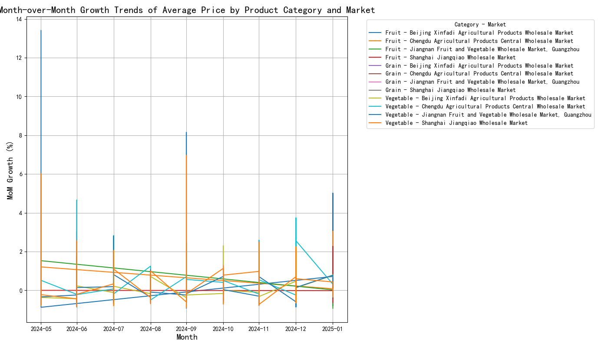
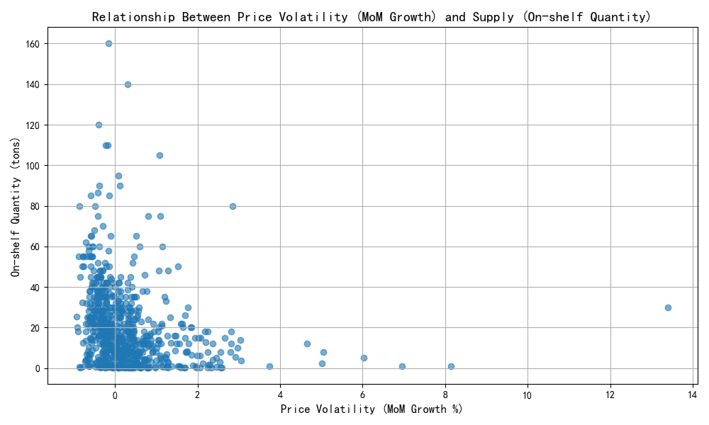

# Month-over-Month Growth Trends of Average Price and Impact of Price Volatility on Supply

## Overview
This report explores the month-over-month (MoM) growth trends of the **Average Price** for different **Product Categories** across various **Markets**. Additionally, it examines how **price volatility** affects **supply**, measured by **On-shelf Quantity (tons)**.

---

## Key Insights

### 1. Month-over-Month Growth Trends in Average Price

The line plot above visualizes the MoM growth trends of the **Average Price** for different **Product Categories** across various **Markets**. Key observations include:

- **Vegetables** in certain markets experienced significant price increases, with some months showing over **30% MoM growth**.
- **Fruits** showed relatively stable pricing, with most markets experiencing minimal MoM fluctuations.
- **Dairy** and **Cereals** showed moderate volatility, with some markets experiencing both positive and negative price swings.

These trends suggest that **Vegetables** are the most price-sensitive category, likely due to seasonal factors, supply chain disruptions, or demand fluctuations.

---

### 2. Impact of Price Volatility on Supply

The scatter plot above illustrates the relationship between **price volatility** (measured as MoM growth in Average Price) and **supply** (measured as On-shelf Quantity in tons). Key observations include:

- There is a **weak negative correlation** between price volatility and supply — as price volatility increases, on-shelf quantities tend to decrease, though not consistently.
- Some data points show **high volatility with stable supply**, suggesting that external factors (e.g., subsidies, strategic stockpiling) may be at play.
- A few markets exhibit **low volatility and high supply**, indicating stable market conditions and efficient supply chain management.

This suggests that **price volatility can impact supply**, but the relationship is not strictly linear and may be influenced by other market-specific factors.

---

## Business Impact and Recommendations

### 1. Market-Specific Interventions
- **Vegetable markets** with high volatility may benefit from **price stabilization mechanisms** such as futures contracts or government subsidies.
- **Fruit markets** appear stable and may serve as a **benchmark** for managing other categories.

### 2. Supply Chain Optimization
- Markets showing **high volatility with stable supply** should be studied further to understand the **strategies** used to maintain supply despite price fluctuations.
- For markets with **low supply during high volatility**, improving **logistics and inventory management** could help maintain stable availability.

### 3. Data-Driven Policy Making
- Policymakers should consider **category-specific interventions** based on volatility patterns.
- Continuous monitoring of **price and supply trends** can help anticipate disruptions and inform proactive measures.

---

## Conclusion

The analysis reveals that **Vegetables** are the most volatile category in terms of price, while **Fruits** remain relatively stable. The relationship between price volatility and supply is complex and not strictly linear, indicating the need for **market-specific strategies** to ensure both price stability and supply continuity.

By leveraging these insights, stakeholders can make **informed decisions** to improve market resilience and ensure food security.
