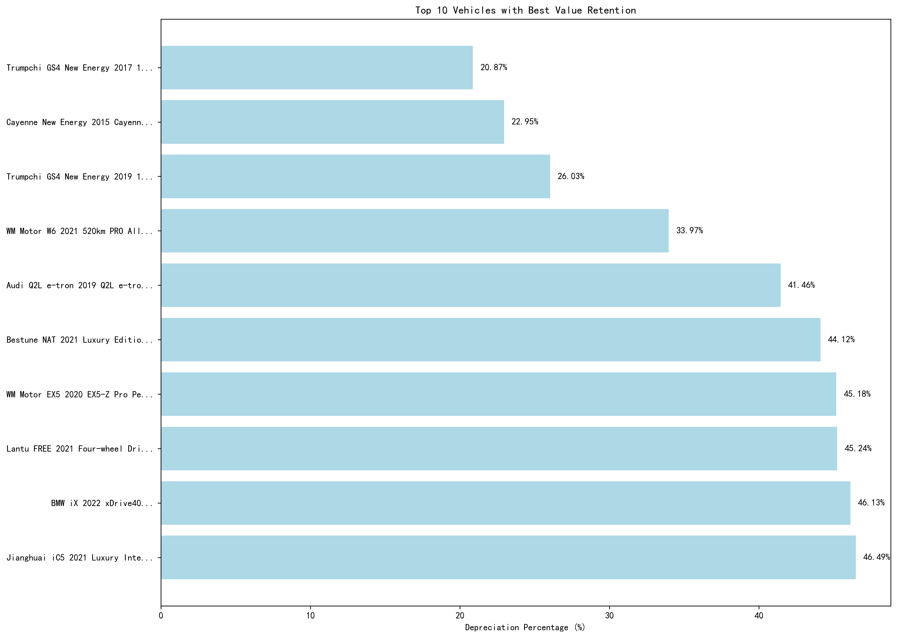
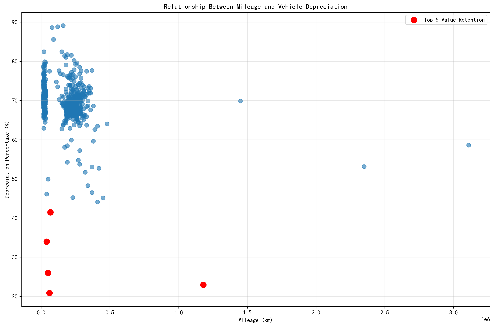

# Used Car Buyback Value Analysis Report

## Executive Summary

Based on my analysis of 675 used vehicle listings, I've identified exceptional buyback opportunities with outstanding value retention. The data reveals that **plug-in hybrid SUVs**, particularly certain models, demonstrate remarkable resistance to depreciation, making them prime targets for your buyback business.

## Key Findings

### Top Value Retention Vehicles

The analysis reveals three standout performers with exceptional value retention:

1. **Trumpchi GS4 New Energy 2017 1.5L PHEV Zunxiang Edition** - **20.87% depreciation** only
   - Current price: ¥49,800 (used) vs original ¥238,600 (new)
   - 60,000 km mileage, 1 previous owner
   - **Recommendation**: High priority buyback - exceptional value retention

2. **Cayenne New Energy 2015 Cayenne S E-Hybrid 3.0T** - **22.95% depreciation**
   - Current price: ¥286,000 (used) vs original ¥1,246,100 (new)  
   - 118,000 km mileage, 2 previous owners
   - **Recommendation**: Premium segment opportunity - luxury hybrid with strong residual value

3. **Trumpchi GS4 New Energy 2019 1.5L PHEV Zhixiang Edition** - **26.03% depreciation**
   - Current price: ¥55,600 (used) vs original ¥213,600 (new)
   - 50,000 km mileage, 0 previous owners
   - **Recommendation**: Excellent mid-range buyback candidate

### Market Trends Analysis

The scatter plot reveals several critical insights:

- **Plug-in Hybrid SUVs** show the best value retention across all vehicle classes
- **Mid-to-Large SUVs with Range Extender technology** average only **63.99% depreciation** - the best performing category
- **Luxury brands** (BMW, Audi, Porsche) maintain stronger residual values despite higher initial prices
- **Lower mileage vehicles** (under 100,000 km) generally show better value retention

### Vehicle Configuration Recommendations

Based on the data, prioritize vehicles with these configurations:

1. **Fuel Type**: Plug-in Hybrid > Range Extender > Pure Electric
2. **Vehicle Class**: Mid-to-Large SUV > Compact SUV > Mid-size SUV  
3. **Transmission**: Automatic (all top performers)
4. **Ownership History**: 0-1 previous owners preferred

## Actionable Recommendations

### Immediate Buyback Targets (High Priority)
1. **Trumpchi GS4 PHEV models** - exceptional value retention at 20-26% depreciation
2. **Porsche Cayenne Hybrid** - luxury segment with strong residual value
3. **BMW iX/iX3 models** - premium electric with good value retention (46-54%)

### Strategic Focus Areas
1. **Specialize in Plug-in Hybrid SUVs** - they demonstrate the best value retention
2. **Target low-mileage vehicles** (under 80,000 km) for optimal depreciation rates
3. **Focus on 0-1 owner vehicles** - cleaner history commands better prices
4. **Consider luxury hybrid models** - higher initial investment but stronger residual value

### Risk Considerations
- Avoid high-mileage pure electric vehicles (typically 65-75% depreciation)
- Be cautious with microcars and mini vehicles (higher depreciation rates)
- Verify battery health on electric vehicles - critical for value retention

## Financial Impact

The top recommended vehicles represent potential profit margins of **74-79% of original value retained**, significantly outperforming market averages of 65-70% depreciation for most vehicles.

By focusing on these high-value-retention models, you can build a premium inventory that maintains stronger resale values and delivers better returns on your buyback investments.

*Data Source: 675 vehicle listings from autohome database, analyzed for depreciation patterns and value retention characteristics.*
