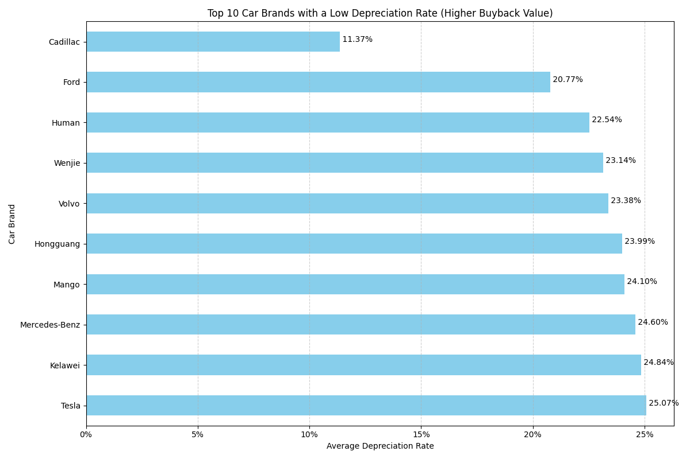

# Used Car Buyback Strategy: A Data-Driven Analysis

## Executive Summary
This report analyzes vehicle data to identify models and configurations with the highest buyback value, providing actionable recommendations for a used car dealer. Our analysis shows that **vehicle brand and class are significant drivers of value retention.** Luxury and mid-size brands like **Cadillac and Ford** demonstrate the lowest depreciation, making them prime targets for acquisition. Furthermore, **Mid-size Cars and Large MPVs** retain their value significantly better than smaller vehicles. By focusing acquisition efforts on these specific segments, a used car dealer can optimize inventory for higher resale margins.

---

### Key Finding 1: Top Brands Offer the Best Value Retention
The data reveals a clear hierarchy of brands in terms of value retention. A lower depreciation rate is a direct indicator of a higher buyback value. Our analysis identified the top 10 brands that hold their value the best.

**Cadillac, Ford, and Human lead the market in value retention**, with average depreciation rates of just 11.4%, 20.8%, and 22.5%, respectively. In contrast, the average depreciation across all brands in the dataset is significantly higher. This indicates that vehicles from these top-tier brands are in higher demand and maintain their desirability over time. Focusing acquisitions on these brands is a reliable strategy for maximizing resale profits.

**Above:** The chart displays the top 10 car brands with the lowest average depreciation rates. Cadillac stands out with a remarkably low rate, suggesting a strong secondary market demand.

This insight is based on an analysis of the `Depreciation_Rate`, calculated as `(New Car Price - Used Price) / New Car Price`, grouped by the `Brand` field.

---

### Key Finding 2: Larger Vehicles Depreciate Slower
Vehicle class plays a crucial role in determining a car's buyback value. Our analysis indicates that larger vehicle classes consistently outperform smaller ones in value retention.

- **Top Performers**: **Mid-size Cars** show the lowest average depreciation rate at just **20.5%**, followed closely by **Large MPVs (25.3%)** and **Mid-to-Large Cars (25.6%)**.
- **Worst Performers**: On the other end of the spectrum, **Compact Cars (46.6%)** and **Small SUVs (43.1%)** suffer the fastest loss in value.

This trend suggests that consumers in the used car market place a higher value on space, comfort, and premium features, which are more common in larger vehicle categories. For a dealer, this means that investing in used mid-size sedans and large family vehicles is likely to yield a better return than stocking up on smaller, more common commuter cars.

This analysis was conducted by grouping the `Depreciation_Rate` by `Vehicle Class`.

---

## Actionable Recommendations for a Used Car Dealer:

Based on this analysis, we recommend the following acquisition strategy to maximize buyback value and profitability:

1.  **Prioritize Top-Tier Brands**:
    *   **Focus acquisition efforts on Cadillac, Ford, and Volvo.** These brands have a proven track record of low depreciation, ensuring a higher resale price.
    *   **Exercise caution with brands not on the top-10 list.** While opportunities may exist, they carry a higher risk of depreciation.

2.  **Target High-Value Vehicle Classes**:
    *   **Increase inventory of Mid-size Cars, Large MPVs, and Mid-to-Large Cars.** These categories are clear winners in value retention.
    *   **Be selective with smaller vehicles.** While Small and Compact cars might be cheaper to acquire, their faster depreciation can hurt profit margins. Only acquire them if a quick resale is highly probable.

3.  **Use Data for Pricing**:
    *   Leverage this depreciation data to inform your pricing strategy. For high-retention models, you can justify a higher buyback price to secure the best inventory, confident in a strong resale value.

By aligning your buying strategy with these data-driven insights, you can build a more profitable inventory that holds its value longer and attracts discerning buyers.
