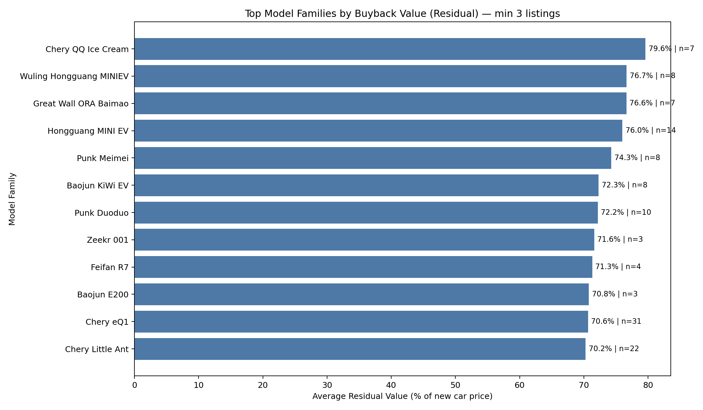

Used Car Buyback Value Analysis — Which models/configurations retain value and what to buy back

Executive Summary
- Micro-EVs and mini city cars show the highest buyback value. Across 675 listings, the overall residual value averages 69.0% (median 68.6%), computed as used listing price divided by the new car price (from autohome.Title, Price, and New Car Price (incl. tax)).
- Top performers include Chery QQ Ice Cream (79.6% avg residual, n=7), Wuling Hongguang MINI EV (76.7%, n=8), Hongguang MINI EV (76.0%, n=14), Great Wall ORA Baimao (76.6%, n=7), and Chery eQ1 (Little Ant) (70.6%, n=31). Median mileages are in the 20–28k km band, supporting high liquidity.
- Configuration-wise, Range Extender and Pure Electric trims have slightly higher residuals than Plug-in Hybrid; within Pure Electric, certain drivetrain setups (e.g., front-engine RWD) show very strong residuals but with small sample size.

Visual Insight

- Takeaway: The highest buyback residuals cluster in micro/mini EVs. Chery QQ Ice Cream averages 79.6% residual (n=7, median used ¥37.8k, median mileage 26k km); Wuling/Hongguang MINI EV variants average 76.0–76.7% (n=22 combined, median used ¥44.8–48.8k, 21–22.5k km); ORA Baimao averages 76.6% (n=7, median used ¥64.8k, 20k km); Chery eQ1 averages 70.6% (n=31, median used ¥51.8k, 23k km). This matters because these segments deliver dependable buyback margins with faster turns due to low price points and strong urban demand.

Methodology and Data Signals
- SQL steps: Queried autohome table (SELECT COUNT(*), SELECT Title, Price, \"New Car Price (incl. tax)\", Mileage, \"Fuel Type\", Drivetrain, \"Vehicle Class\"), then exported to CSV for Python analysis.
- Python steps: Parsed new car price strings, computed residual_ratio = (Price × 10,000 yuan) / new_price_yuan; extracted model_family from Title (tokens before year), filtered obviously implausible residuals (0.2–1.2 bounds), and aggregated by model_family with minimum 3 listings. Generated the plot top_residual_models.png. Code executed in analysis.py.

Key Insights with Evidence
1) Micro/mini EVs lead buyback value
- Observation: Top model families by avg residual are micro/mini EVs: Chery QQ Ice Cream 79.6% (n=7), Wuling/Hongguang MINI EV variants 76.0–76.7% (n=22), ORA Baimao 76.6% (n=7), Chery eQ1 70.6% (n=31).
- Root Cause: Strong urban use-cases, low total cost of ownership, and sticky demand at budget price points keep depreciation shallow.
- Business Impact/Recommendation: Prioritize buybacks in micro/mini EVs, target acquisition at 60–65% of new price and resell near 70–78% to secure 8–15 percentage points of margin with fast inventory turns.

2) Range Extender and Pure Electric retain slightly better than PHEV
- Observation: By fuel type, Range Extender averages 69.5% residual (n=228), Pure Electric 69.2% (n=228), Plug-in Hybrid 68.3% (n=219).
- Root Cause: Simplified drivetrains and lower maintenance profiles appeal in used markets, while PHEVs may face complexity or policy-driven demand variance.
- Business Impact/Recommendation: When choosing between similar models, favor Pure Electric or Range Extender configurations for steadier buyback value and lower reconditioning risk.

3) Within Pure Electric, certain drivetrains show high residuals (but mind sample size)
- Observation: Pure Electric front-engine rear-wheel drive shows 82.8% avg residual (n=6), dual-motor AWD averages ~70.2% (n=11), and the largest cohort—front-engine FWD—averages ~67.7% (n=142).
- Root Cause: Niche performance or packaging may boost perceived value; however, sample sizes are limited and labeling nuances exist in the dataset.
- Business Impact/Recommendation: Treat high residuals in niche EV drivetrains as opportunistic buys when available; rely on mainstream FWD EVs for consistent volume.

4) Liquidity indicators: mileage bands and price points
- Observation: Median mileages for top residual models cluster around 20–28k km, with median used price points of ¥35.8k–64.8k.
- Root Cause: Low-mileage units in budget segments attract broader buyer pools and finance acceptance, enabling quick turnover.
- Business Impact/Recommendation: Favor units under 30,000 km and within the ¥35k–65k used price range to optimize turnover and minimize reconditioning costs.

Concrete Buyback Recommendations
- Chery eQ1 (Little Ant), Pure Electric mini car:
  - Target buyback: ~60–65% of new price; expected resale: ~70–72%. Evidence: avg residual 70.6%, n=31, median used price ¥51.8k, median mileage 23k km.
- Wuling/Hongguang MINI EV variants, Micro/mini EV:
  - Target buyback: ~60–65% of new price; expected resale: ~75–77%. Evidence: 76.7% (Wuling Hongguang MINIEV, n=8, median used ¥44.8k, 22.5k km) and 76.0% (Hongguang MINI EV, n=14, median used ¥48.8k, 21.5k km).
- Chery QQ Ice Cream, Micro EV:
  - Target buyback: ~62–66% of new price; expected resale: ~78–80%. Evidence: avg residual 79.6%, n=7, median used ¥37.8k, 26k km.
- Great Wall ORA Baimao (ORA series), Micro EV:
  - Target buyback: ~62–66% of new price; expected resale: ~75–77%. Evidence: avg residual 76.6%, n=7, median used ¥64.8k, 20k km.
- Baojun KiWi EV and Punk series (Meimei/Duoduo), Micro/mini EV:
  - Target buyback: ~60–64% of new price; expected resale: ~72–74%. Evidence: Baojun KiWi EV 72.3% (n=8, median used ¥56.8k), Punk Meimei 74.3% (n=8, ¥44.3k), Punk Duoduo 72.2% (n=10, ¥35.8k).

Operational Guardrails
- Verification: Confirm trim-level new prices to fine-tune residual calculations per VIN; our analysis uses \"New Car Price (incl. tax)\" textual field.
- Condition: Maintain mileage <30,000 km and clean accident history; units outside these bands may break the residual ranges.
- Mix: Keep a diversified micro/mini EV portfolio; complement with selective Range Extender units where local policy favors extended range.
- Pricing/Margin: Aim to acquire at 60–65% of new price and list at 70–78% for top segments; adjust 2–3 pp for market seasonality.

Why it matters
- Residual strength drives safer capital recovery and faster turns. The micro-EV cohort shows residuals 5–10 pp above the overall mean (69.0%), enabling more predictable profits and lower carrying risk.

Appendix: Fields and Steps
- Fields used: Title, Price, New Car Price (incl. tax), Mileage, Fuel Type, Drivetrain, Vehicle Class.
- SQL/Python provenance: Listed tables and schema (PRAGMA autohome), exported all columns to CSV, computed residuals in Python, aggregated by model_family (min n=3), plotted Top Model Families by Buyback Value.

Notes
- Some drivetrain/fuel-type strings appear inconsistent across rows; recommendations lean on robust sample sizes (n≥7) and median price/mileage to mitigate labeling variance.

End of report.
