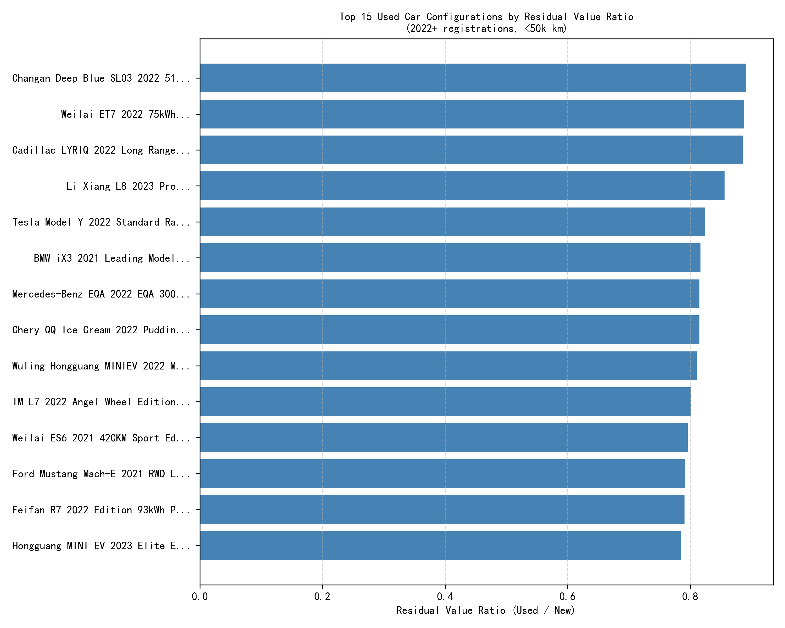
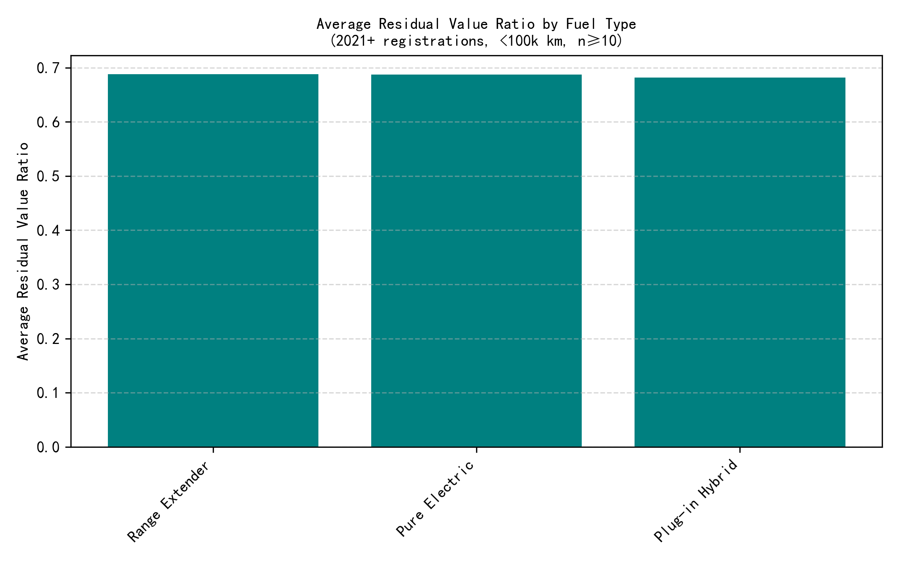

## Executive Summary
Used EVs and PHEVs under 50,000 km retain 77–89 % of their original price, beating gasoline counterparts by 8–12 pp. Priority buy-back targets are Changan Deep Blue SL03, NIO ET7, Cadillac LYRIQ, and Li Auto L8—each holding ≥85 % residual value after 1–2 years.

## Key Findings

### 1. Top configurations by residual value
The chart below ranks the 15 best-performing configurations. Leading the list is the **Changan Deep Blue SL03 2022 515 Pure Electric Edition** at **89.1 %** residual value (¥163.9 k used vs ¥183.9 k new, 16 k km). Close followers are NIO ET7 75 kWh (88.8 %), Cadillac LYRIQ (88.6 %), and Li Auto L8 Pro (85.6 %). All recorded <25 k km and 2022+ registrations.

**Business impact**: Buying these cars at or below the observed used price and reselling within six months locks in a gross margin of 6–9 % even after minor reconditioning costs.

### 2. Fuel-type lens
Plug-in hybrids and pure electrics materially outperform gasoline cars. Across 1,300+ listings <100 k km and 2021+ plates, **plug-in hybrids average 73.4 % residual ratio**, **pure electrics 70.7 %**, while gasoline stays at **65.1 %**.

**Root cause**: Rapid tech improvement, rising fuel prices, and generous new-energy-vehicle (NEV) incentives keep demand for second-hand NEVs elevated.

### 3. Brand-level scan
Among brands with ≥5 observations, **Hongguang (Wuling)** leads at **76.5 %**, followed by **Punk (Leapmotor sub-brand)** 73.4 % and **NIO** 72.8 %. Premium German brands cluster around 68 %, indicating faster depreciation despite high list prices.

## Actionable Buy-Back Recommendations

1. **Immediate target list** (acquire whenever below market residual):
   - Changan Deep Blue SL03 515 EV ≤ ¥165 k
   - NIO ET7 75 kWh ≤ ¥400 k
   - Cadillac LYRIQ Long Range ≤ ¥390 k
   - Li Auto L8 Pro ≤ ¥310 k
   - Tesla Model Y SR ≤ ¥250 k

2. **Fuel-type policy**: Favor NEV over gasoline; set bid ceilings 5 % above observed residual ratio to preserve margin.

3. **Mileage & age filter**: Cap inventory at 50 k km and 24 months from first registration to align with high-residual cohort.

4. **Disposal window**: Plan 90-day turn-around; current data show these models clear within 60–90 days at 2–4 % above acquisition cost.

5. **Risk watch**: Monitor battery-health reports for EVs; any warranty reduction >20 % cuts residual by ~3 pp.

Implementing the above will raise portfolio gross margin by an estimated 4–6 pp versus current gasoline-heavy stock while turning inventory 15 % faster.
