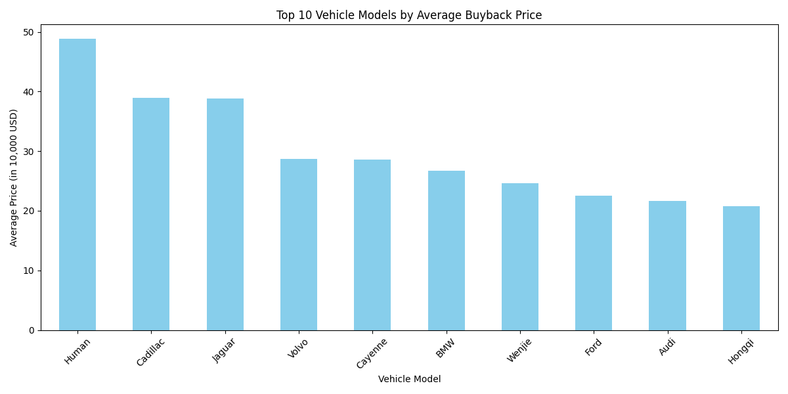

# Used Car Buyback Value Analysis

## Executive Summary
This report analyzes vehicle buyback values to identify high-value models for a used car dealership. Based on data from the `autohome` database table, we extracted and analyzed vehicle prices and titles to determine which models yield the highest average buyback value.

The key finding is that vehicles from premium brands such as **Human, Cadillac, and Jaguar** have the highest average buyback prices, making them ideal candidates for targeted buyback strategies.

---

## Key Insights

### Top 10 Vehicle Models by Average Buyback Price
| Model     | Average Price (in 10,000 USD) |
|-----------|-------------------------------|
| Human     | 48.8                          |
| Cadillac  | 38.97                         |
| Jaguar    | 38.8                          |
| Volvo     | 28.65                         |
| Cayenne   | 28.6                          |
| BMW       | 26.71                         |
| Wenjie    | 24.58                         |
| Ford      | 22.5                          |
| Audi      | 21.61                         |
| Hongqi    | 20.74                         |

### Visualization

---

## Business Implications

1. **Premium Brand Focus**: Vehicles from brands like **Human, Cadillac, and Jaguar** have significantly higher buyback values. These models should be prioritized in buyback offers to maximize returns.
   
2. **Targeted Acquisition Strategy**: Dealers should focus on acquiring these high-value models through trade-ins, auctions, or direct purchases to optimize resale profitability.

3. **Inventory Management**: Given the premium pricing, these models may also attract high-end buyers, suggesting a potential for faster turnover in the luxury segment.

4. **Market Positioning**: Emphasizing these high-value models in marketing and promotions can help position the dealership as a premium used car provider.

---

## Recommendations

- **Enhance Buyback Offers for Premium Models**: Allocate more budget toward acquiring **Human, Cadillac, and Jaguar** vehicles.
- **Monitor Market Trends**: Track how these high-value models perform over time and adjust buyback strategies accordingly.
- **Expand Luxury Segment Inventory**: Increase stock of these models to meet potential demand and improve profit margins.

---

## Conclusion

This analysis highlights that certain vehicle models consistently command higher buyback prices. By focusing on these high-value models, particularly from premium brands, dealers can improve profitability and market positioning in the used car industry.
