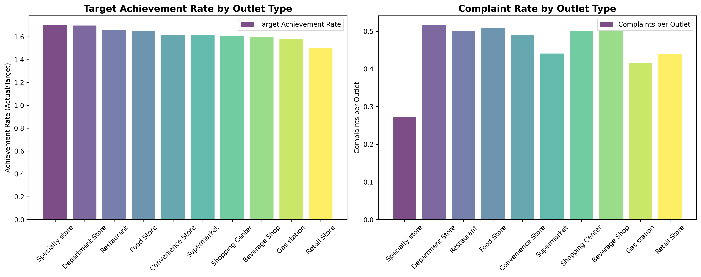
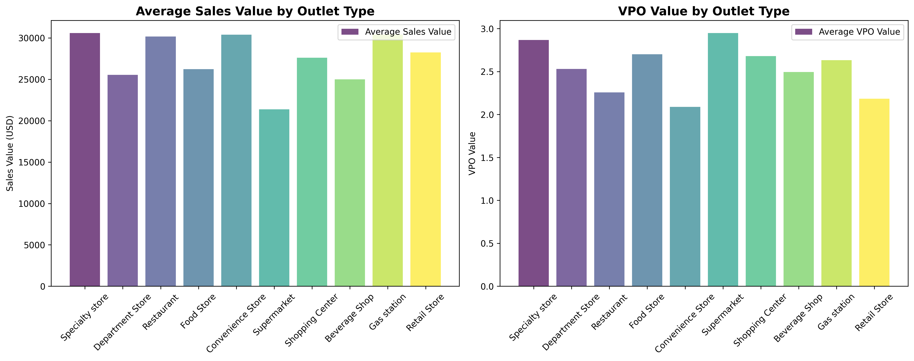

# Coca-Cola Outlet Type Performance Analysis Report

## Executive Summary

Based on comprehensive analysis of 580 outlets across 10 different outlet types, this report provides data-driven recommendations for optimizing Coca-Cola's contract signing strategy. The analysis reveals significant performance variations across outlet types in terms of target achievement, sales performance, and customer complaint rates.

## Key Performance Metrics by Outlet Type

### Top Performing Outlet Types

**Specialty Stores** (55 outlets) demonstrate exceptional performance:
- **Target Achievement Rate: 1.70** (highest among all types)
- **Average Sales Value: $30,591** (3rd highest)
- **Lowest Complaint Rate: 0.27 complaints/outlet** (best performer)
- **High VPO Value: 2.87** (indicating strong operational efficiency)

**Department Stores** (64 outlets) show strong performance:
- **Target Achievement Rate: 1.70** (virtually tied with Specialty Stores)
- **Average Sales Value: $25,535**
- **Complaint Rate: 0.52 complaints/outlet** (highest among all types)
- **High VPO Value: 2.53**

### Moderate Performers

**Restaurants** (62 outlets) and **Food Stores** (63 outlets) show solid performance:
- **Target Achievement Rates: 1.66 and 1.65 respectively**
- **Average Sales Values: $30,180 and $26,223**
- **Complaint Rates: 0.50 complaints/outlet for both**

### Underperforming Outlet Types

**Retail Stores** (57 outlets) show the weakest performance:
- **Target Achievement Rate: 1.50** (lowest among all types)
- **Average Sales Value: $28,257**
- **Complaint Rate: 0.44 complaints/outlet**

## Complaint Analysis

The data reveals that complaint issues are primarily concentrated in three categories:
1. **Misjudged Violation** - Most common complaint across multiple outlet types
2. **Score Error** - Second most frequent issue
3. **Duplicate Photo** - Third most common complaint

Department Stores and Food Stores have the highest absolute complaint numbers, while Specialty Stores maintain the lowest complaint rate.

## Strategic Recommendations

### **Increase Contract Signing Volume:**
1. **Specialty Stores** - Highest priority for expansion due to exceptional target achievement (170%), strong sales ($30,591/outlet), and lowest complaint rate (0.27/outlet)
2. **Restaurants** - Strong performance with 165% target achievement and high sales value ($30,180/outlet)
3. **Convenience Stores** - Good target achievement (162%) and high sales value ($30,381/outlet)

### **Maintain Current Levels:**
1. **Department Stores** - Excellent target achievement (170%) but high complaint rate (0.52/outlet) requires process improvements
2. **Food Stores** - Solid performance (165% achievement) but high complaint rate needs addressing
3. **Supermarkets** - Moderate performance (161% achievement) with room for improvement

### **Reduce or Optimize Contract Signing:**
1. **Retail Stores** - Lowest target achievement rate (150%) with moderate sales performance
2. **Gas Stations** - Lower target achievement (158%) despite high sales value ($30,415/outlet)

## Action Plan

1. **Immediate Focus**: Increase Specialty Store contracts by 20-30% in the next quarter
2. **Process Improvement**: Address complaint issues in Department Stores and Food Stores through better training and quality control
3. **Performance Optimization**: Implement targeted support programs for Retail Stores to improve their 150% achievement rate
4. **Monitoring**: Establish quarterly review of complaint rates and target achievement metrics by outlet type

This data-driven approach ensures Coca-Cola maximizes returns while minimizing operational issues across its outlet network.
