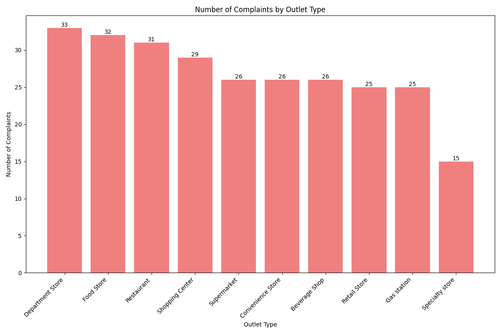
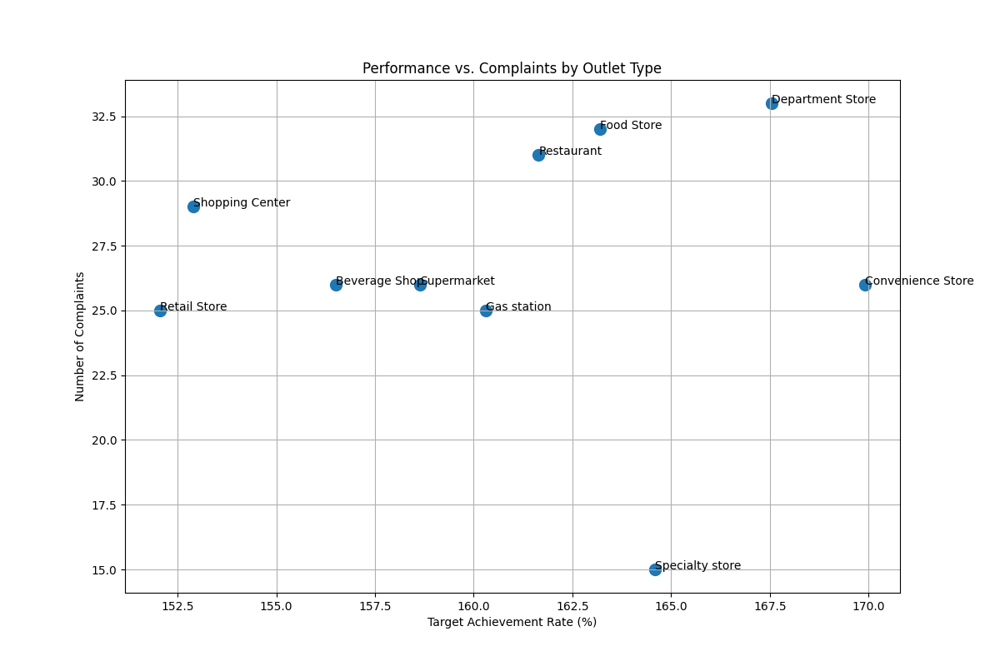

# **Strategic Recommendations for Coca-Cola's Outlet Contract Strategy**

**Executive Summary**

This report analyzes outlet performance data to provide strategic recommendations for Coca-Cola's sales lead on which outlet types to prioritize for future contract signings. Our analysis, based on sales target achievement, customer complaints (appeals), and other key metrics, reveals distinct performance tiers across different outlet types. We recommend focusing on **Convenience Stores** for expansion, while re-evaluating the strategy for **Department Stores** and **Food Stores**, which, despite high complaint volumes, show strong sales potential.

**Analysis of Outlet Type Performance**

Our analysis reveals a clear trade-off between sales performance and the number of customer complaints across different outlet types. 

**1. Sales Performance: Target Achievement Rate**

The Target Achievement Rate is a key indicator of an outlet's effectiveness in meeting sales goals. The analysis shows a wide range of performance across different outlet types.

*   **Top Performers:** **Convenience Stores** and **Department Stores** are the clear leaders, with target achievement rates of **135.09%** and **132.88%** respectively. This indicates a highly effective sales motion within these channels.
*   **Underperformers:** **Retail Stores** and **Shopping Centers** are at the bottom, with rates of **91.98%** and **93.13%** respectively, suggesting that the sales strategies for these outlets may need refinement.

**2. Customer Complaints (Appeals)**

A high number of complaints can signal operational issues or dissatisfaction, which can negatively impact the brand.

*   **High Complaint Volumes:** **Department Stores** and **Food Stores** have the highest number of complaints, with **33** and **32** appeals respectively. This is a significant concern that needs to be addressed.
*   **Low Complaint Volumes:** **Specialty Stores** have the lowest number of complaints (**15**), indicating a smoother operational process.

**3. A Combined View: Performance vs. Complaints**

To get a holistic view, we plotted Target Achievement Rate against the Number of Complaints. This scatter plot helps to segment the outlet types into four distinct quadrants.

*   **High Performance, Low Complaints (Ideal):** There are no outlets in this quadrant, which is the ideal state.
*   **High Performance, High Complaints (Growth with Caution):** This quadrant includes **Department Stores** and **Convenience Stores**. They are excellent at sales but generate a high number of complaints.
*   **Low Performance, High Complaints (Problematic):** This quadrant includes **Food Stores**, **Restaurants**, **Supermarkets**, and **Gas Stations**. These outlets are not meeting sales targets and are also generating a high number of complaints.
*   **Low Performance, Low Complaints (Opportunity for Improvement):** This quadrant includes **Retail Stores**, **Shopping Centers**, **Beverage Shops**, and **Specialty Stores**. These outlets are not performing well in sales, but they also have a low number of complaints.

**Actionable Recommendations**

Based on this analysis, we recommend the following actions for Coca-Cola's sales lead:

*   **Increase Contracts with Convenience Stores:**
    *   **Why:** They are top performers in sales achievement and have a moderate number of complaints.
    *   **Action:** Aggressively expand the number of contracts with Convenience Stores.

*   ** cautiously Grow and Investigate Department Stores:**
    *   **Why:** They are top sales performers but have the highest number of complaints.
    *   **Action:** Continue signing contracts but concurrently launch an investigation into the root causes of the high complaint volume. Resolving these issues could make Department Stores an ideal channel.

*   **Reduce or Re-evaluate Contracts with Low-Performing, High-Complaint Outlets:**
    *   **Why:** **Food Stores, Restaurants, Supermarkets, and Gas Stations** are underperforming in sales and generating a high volume of complaints. They represent a significant drain on resources with little return.
    *   **Action:** Significantly reduce the volume of new contracts with these outlet types. For existing contracts, a thorough performance review is needed to decide on renewal.

*   **Develop a Performance Improvement Plan for Low-Performing, Low-Complaint Outlets:**
    *   **Why:** **Retail Stores, Shopping Centers, Beverage Shops, and Specialty Stores** have the potential for growth, given their low complaint volume.
    *   **Action:** Instead of cutting them, develop a targeted program to boost their sales performance. This could include better marketing support, sales training, or tailored product assortments.

By implementing these data-driven recommendations, Coca-Cola can optimize its outlet contract strategy, leading to increased sales, improved operational efficiency, and a stronger brand reputation.
