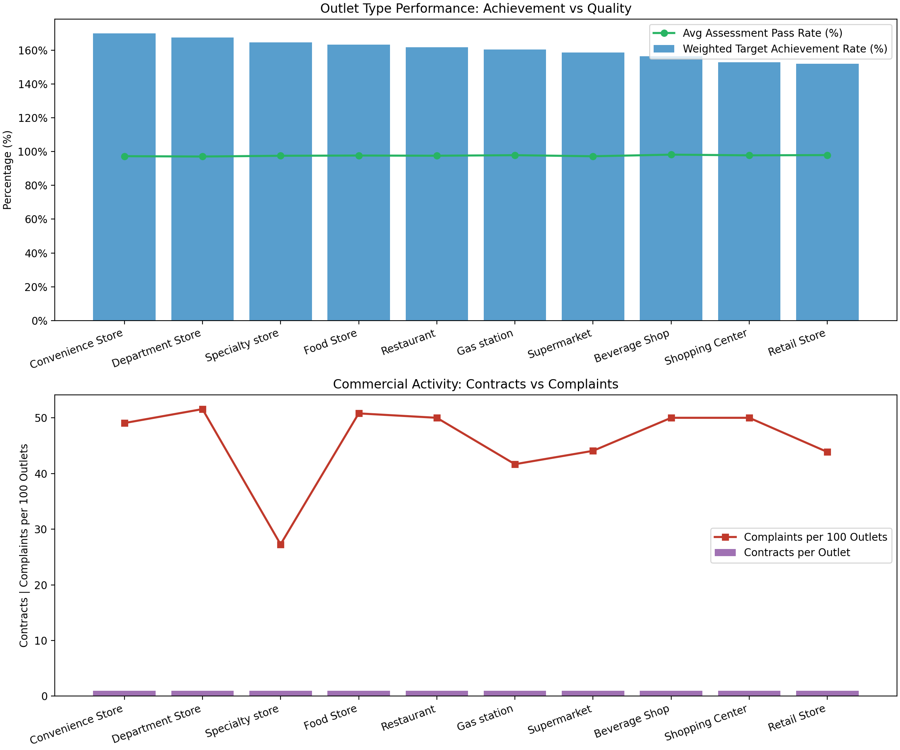

Outlet Type Strategy for Contract Signing Volume — Coca-Cola

Executive Summary
- Prioritize increasing contract signing volume in Specialty Stores and Gas Stations: they deliver high Target Achievement, strong sales, and lower complaint incidence.
- Conditionally expand Convenience Stores and Department Stores: performance is top-tier, but complaints (especially Department Stores) and quality risks require mitigation.
- Reduce or pause contracts in Beverage Shops and Supermarkets: comparatively weaker achievement and lower sales make returns less attractive.
- Optimize Retail Stores and Shopping Centers: maintain with stricter renewal criteria and operational improvement to raise achievement rates.

Data & Method (evidence)
- SQL extracts:
  - POS outlet-level mapping and performance from point_of_sale_(pos)_information → pos_outlets.csv (SELECT `Outlet ID`, `Outlet Type`, `Actual Sales (cases)`, `Sales Target`, `Customer ID`, `VPO Value`, `PC Value`).
  - Complaints per outlet from appeal_record_table → appeals_by_outlet.csv (SELECT `Outlet ID`, COUNT(*) AS complaint_count GROUP BY `Outlet ID`).
  - Contracts per outlet and total signing amount from contract_information_table → contracts_by_outlet.csv (SELECT `Outlet ID`, COUNT(*) AS contracts, SUM(`Signing Amount (CNY)`) AS signing_amount GROUP BY `Outlet ID`).
  - Assessment quality from assessment_result_table → assessment_by_outlet.csv (SELECT `Outlet ID`, AVG(`Assessment pass rate`) AS pass_rate_avg, AVG(`Score`) AS score_avg).
  - Sales value and customer Target Achievement Rate from sales_data_table → sales_by_customer.csv, tar_by_customer.csv.
- Python analysis and visualization: analyze_outlets.py computed KPIs by Outlet Type and saved the chart outlet_type_performance.png. It aggregated:
  - Weighted Target Achievement Rate = sum(actual cases)/sum(target) by Outlet Type.
  - Complaints per 100 outlets = outlets with ≥1 complaint / total outlets × 100.
  - Contracts per outlet and signing amount totals.
  - Assessment pass rate averages and customer-level sales/achievement.

Visual Summary

- Key takeaway: The highest weighted Target Achievement Rates are Convenience Stores at 169.9% and Department Stores at 167.5%, while Specialty Stores combine strong achievement (164.6%) with the lowest complaint incidence (27.27 per 100). Gas Stations and Restaurants deliver the highest customer sales (1.824M CNY and 1.871M CNY, respectively), with Gas Stations also maintaining low complaints (41.67 per 100). Most outlet types average about one contract per outlet, but returns vary.

Key Insights with Metrics and Implications
1) Specialty store: best risk-adjusted performance
- Observation: Weighted achievement is 164.6% (1.645856), complaints are 27.27 per 100 (lowest), customer target achievement averages 85.1%, contracts per outlet = 1.00, signing amount total = 30,640 CNY, sales value (unique customers) = 1,682,505 CNY.
- Root Cause: Specialty formats likely have tighter compliance and clearer execution, reflected in low complaint incidence and healthy achievement; signing amounts appear under-leveraged.
- Business Impact / Recommendation: Increase contract signing volume. Allocate incremental contracts and upsell packages to Specialty Stores; raise signing amounts to capture more upside while maintaining service quality.

2) Gas station: high sales with low complaints
- Observation: Weighted achievement 160.3% (1.603089), complaints 41.67 per 100, customer target achievement 83.8%, contracts per outlet = 1.00, signing amount total = 40,000 CNY, sales value (unique customers) = 1,824,889 CNY.
- Root Cause: High traffic and impulse purchase environments drive sales; relatively low complaint rate suggests good operational fit.
- Business Impact / Recommendation: Increase contract signing volume. Target additional contracts and larger signing amounts with bundle promotions to amplify performance with minimal risk.

3) Convenience Store: top achievement, moderate complaints
- Observation: Weighted achievement 169.9% (1.699016, highest), complaints 49.06 per 100, customer target achievement 83.1%, contracts per outlet = 0.962 (below peers), signing amount total = 37,000 CNY, sales value = 1,610,173 CNY.
- Root Cause: Strong execution and throughput; complaint incidence slightly above average likely due to operational friction in dense networks.
- Business Impact / Recommendation: Increase contracts selectively, paired with complaint-reduction measures (service SLAs, merchandising audits). The under-penetration (0.962 contracts per outlet) indicates room to grow with targeted support.

4) Department Store: strong performance, quality risk
- Observation: Weighted achievement 167.5% (1.675455), complaints 51.56 per 100 (highest), assessment pass rate 97.1% (lowest among types), contracts per outlet = 0.984, signing amount total = 45,140 CNY (highest), sales value = 1,634,227 CNY.
- Root Cause: Large-format complexity drives high performance but introduces quality and compliance gaps (lower pass rate, higher complaints).
- Business Impact / Recommendation: Conditional increase. Expand contracts only where QA plans are in place (photo qualification, staff training). Tie renewals to complaint KPIs and pass-rate improvements.

5) Restaurants: highest sales, average complaints
- Observation: Weighted achievement 161.6% (1.616435), complaints 50 per 100, contracts per outlet = 1.00, signing amount total = 41,960 CNY, sales value = 1,871,142 CNY (highest among types).
- Root Cause: Consumption occasions are favorable; customer satisfaction needs attention.
- Business Impact / Recommendation: Maintain and optimize. Focus on complaint reduction (e.g., cooler maintenance, SKU availability); consider expansion after service KPIs improve.

6) Food Store: solid performance, moderate complaints
- Observation: Weighted achievement 163.2% (1.632000), complaints 50.79 per 100, contracts per outlet = 1.00, signing amount total = 42,460 CNY, sales value = 1,652,045 CNY.
- Root Cause: Good sales execution; moderate complaint rate signals operational variability.
- Business Impact / Recommendation: Maintain with operational improvements (planogram adherence, photo qualification). Expand selectively where complaints are low.

7) Retail Store: weakest achievement, average complaints
- Observation: Weighted achievement 152.1% (1.520615, lowest), complaints 43.86 per 100, contracts per outlet = 0.982, signing amount total = 37,920 CNY, sales value = 1,610,662 CNY.
- Root Cause: Underperformance relative to targets suggests assortment or execution gaps despite decent sales volume.
- Business Impact / Recommendation: Reduce or tighten renewals. Apply stricter criteria (achievement >160%, complaints <45 per 100) before new signings; prioritize remediation over expansion.

8) Supermarket: low sales, mid achievement
- Observation: Weighted achievement 158.6% (1.586387), complaints 44.07 per 100, contracts per outlet = 1.00, signing amount total = 39,260 CNY, sales value = 1,260,978 CNY (second lowest).
- Root Cause: Larger formats may dilute beverage focus vs. other categories, limiting sales lift.
- Business Impact / Recommendation: Reduce or pause new contracts; renegotiate for performance-based terms and focus on high-performing lanes.

9) Beverage Shop: lower achievement and lowest sales
- Observation: Weighted achievement 156.5% (1.565000), complaints 50 per 100, contracts per outlet = 0.981, signing amount total = 32,420 CNY, sales value = 1,299,529 CNY (lowest).
- Root Cause: Saturation and competitive overlap likely suppress incremental returns.
- Business Impact / Recommendation: Reduce contract signing volume; concentrate resources on higher ROI outlet types.

10) Shopping Center: customer achievement high, but POS achievement lags
- Observation: Weighted achievement 152.9% (1.528974), complaints 50 per 100, contracts per outlet = 0.983, signing amount total = 42,060 CNY, sales value = 1,601,032 CNY, customer Target Achievement Rate 84.5% (strong).
- Root Cause: Customer-level goals look healthy, yet on-premise POS execution underperforms; possible attribution/coverage gaps.
- Business Impact / Recommendation: Hold. Improve POS execution (coverage target, cooler configuration) before expanding contracts.

Contract Volume Recommendations Summary
- Increase: Specialty store, Gas station, Convenience Store (targeted), Department Store (conditional).
- Maintain/Optimize: Restaurant, Food Store.
- Reduce/Pause: Beverage Shop, Supermarket, Retail Store.
- Hold: Shopping Center pending improvement in POS achievement.

Operational Next Steps
- Complaint mitigation: For expansion cohorts (Convenience & Department Stores), set SLAs, strengthen field audits, and escalate rectification for top complaint reasons.
- Quality assurance: Raise assessment pass rates (photo qualification, re-inspection plans) particularly in Department Stores and Convenience.
- Performance-based contracts: Tie signing and renewal to weighted achievement thresholds (>160%) and complaint ceilings (<45 per 100).
- Merchandising & assortment: For underperforming types (Retail, Beverage Shop, Supermarket), run targeted SKU optimization and promotional pilots before any expansion.

Why it matters
- The strategy channels investment into outlet types with the highest ROI: Specialty and Gas Stations combine strong achievement with lower complaints; Convenience and Department deliver top-line growth but need QA governance. Reducing lower-return cohorts frees budget to scale high-performing types, improving overall contract productivity and customer experience.
