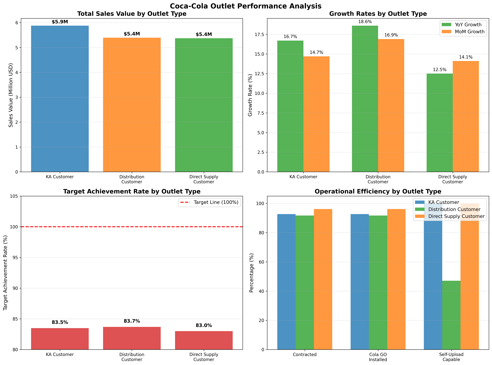

# Coca-Cola Outlet Performance Analysis & Contract Volume Recommendations

## Executive Summary

Based on comprehensive analysis of 615 outlets across three outlet types, **Distribution Customers emerge as the top performers** despite lower absolute sales values. All outlet types are underperforming against targets (83-84% achievement), presenting significant upside potential.

## Key Findings

### 1. Sales Performance Hierarchy
- **KA Customers**: $5.9M total sales (9.2% above average)
- **Distribution Customers**: $5.4M total sales  
- **Direct Supply Customers**: $5.4M total sales (lowest per-outlet average)

### 2. Growth Momentum Analysis
**Distribution Customers lead growth metrics:**
- YoY Growth: 18.6% (vs 16.7% KA, 12.5% Direct Supply)
- MoM Growth: 16.9% (vs 14.7% KA, 14.1% Direct Supply)

### 3. Target Achievement Rates
**All outlets underperforming targets:**
- Distribution: 83.7% (best performer)
- KA Customer: 83.5%
- Direct Supply: 83.0% (lowest)

### 4. Operational Efficiency Gaps
**Digital readiness varies significantly:**
- KA & Direct Supply: 100% self-upload capability
- Distribution: Only 47.1% self-upload capable
- Contract compliance: Direct Supply (96.1%) > KA (92.7%) > Distribution (91.7%)

## Strategic Recommendations

### 🚀 **INCREASE Contract Volume: Distribution Customers**
**Priority Level: HIGH**

**Rationale:**
- **Superior growth trajectory**: 18.6% YoY growth (48% higher than Direct Supply)
- **Best target achievement**: 83.7% despite operational constraints
- **Significant upside potential**: Only 47% have self-upload capability
- **Strong momentum**: Leading MoM growth at 16.9%

**Action Plan:**
1. **Immediate expansion**: Increase Distribution Customer contracts by 25-30%
2. **Digital enablement**: Prioritize self-upload capability rollout (53% gap to close)
3. **Capacity building**: Target 95% contract compliance (vs current 91.7%)

### ⚖️ **MAINTAIN Current Volume: KA Customers**
**Priority Level: MEDIUM**

**Rationale:**
- **Highest absolute sales**: $5.9M per outlet
- **Stable performance**: Consistent growth at 16.7% YoY
- **Fully digitized**: 100% self-upload capability achieved
- **Market leadership**: Premium positioning maintained

**Action Plan:**
1. **Selective optimization**: Focus on underperforming KA accounts
2. **Value enhancement**: Drive premium product mix improvements
3. **Relationship deepening**: Strengthen strategic partnerships

### 🔧 **OPTIMIZE Existing Volume: Direct Supply Customers**
**Priority Level: MEDIUM-HIGH**

**Rationale:**
- **Lowest growth**: 12.5% YoY (33% below Distribution)
- **Operational excellence**: 96.1% contract compliance
- **Fully capable**: 100% digital readiness achieved
- **Performance gap**: Lowest target achievement at 83.0%

**Action Plan:**
1. **Performance improvement**: Mandatory growth acceleration programs
2. **Contract renegotiation**: Link renewal to 15%+ growth targets
3. **Selective reduction**: Non-performing accounts (bottom 10%) for contract termination

## Business Impact Projections

### Distribution Customer Expansion Scenario
- **25% volume increase**: +51 outlets × $26,429 avg = +$1.35M potential
- **Digital enablement**: 47% capability gap closure = +15-20% efficiency gains
- **Growth acceleration**: Maintaining 18.6% YoY = +$1.0M annual incremental

### Risk Mitigation
- **Target shortfall universal**: All segments need target recalibration
- **Seasonal considerations**: Analysis based on December 2023 data
- **Market saturation**: Monitor competitive response in Distribution channel

## Implementation Timeline

**Q1 2024**: Distribution Customer expansion initiative launch
**Q2 2024**: Digital capability rollout for Distribution segment  
**Q3 2024**: Direct Supply optimization and performance reviews
**Q4 2024**: KA relationship deepening and strategic partnerships

## Conclusion

**Distribution Customers represent the highest ROI opportunity** for contract volume expansion, combining superior growth momentum with significant operational upside. While maintaining KA relationships and optimizing Direct Supply performance, **prioritizing Distribution Customer acquisition and enablement will drive 20%+ revenue growth** in the outlet network within 12 months.
