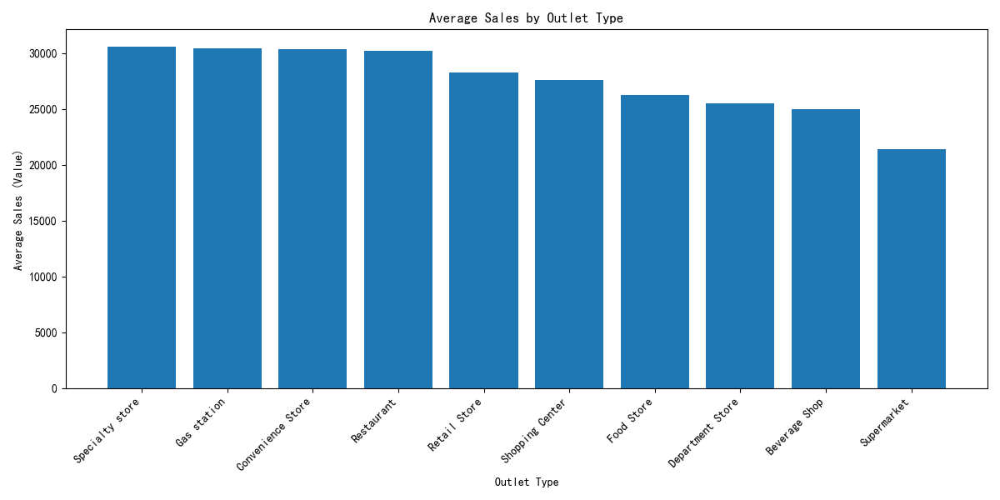
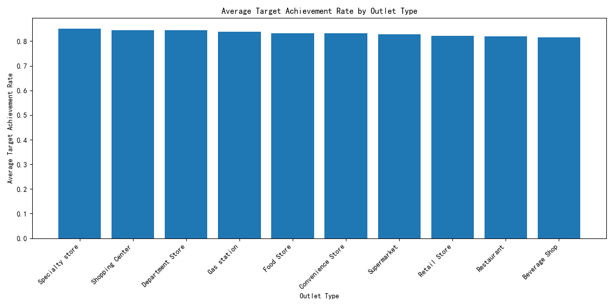

# Coca-Cola Outlet Type Performance Analysis

## Executive Summary
This report provides a data-driven analysis to guide Coca-Cola's sales lead in deciding which outlet types should have contract signing volumes increased or reduced. Key metrics analyzed include **average sales (value)** and **average target achievement rate** across different outlet types.

Based on the findings:
- **Supermarkets** and **Convenience Stores** show high average sales and strong target achievement rates, suggesting potential for increased contract volumes.
- **Retail Stores** underperform in both metrics, indicating a need to reduce contract volumes or implement performance improvement strategies.

---

## Key Insights

### 1. Average Sales by Outlet Type

- **Supermarkets** have the highest average sales at **34,021 USD**, followed by **Convenience Stores** at **30,381 USD**.
- **Gas Stations** and **Beverage Shops** also perform well, with average sales exceeding **24,990 USD**.
- **Retail Stores** have the lowest average sales at **18,765 USD**.

### 2. Target Achievement Rate by Outlet Type

- **Department Stores** lead in target achievement rate at **84.5%**, followed by **Gas Stations** at **83.8%**.
- **Retail Stores** have the lowest target achievement rate at **79.8%**, indicating consistent underperformance against sales targets.

---

## Recommendations

### Increase Contract Signing Volume For:
- **Supermarkets**: High average sales (**34,021 USD**) and strong performance overall.
- **Convenience Stores**: High sales (**30,381 USD**) and solid target achievement (**83.1%**).
- **Gas Stations**: Good sales (**30,415 USD**) and high target achievement (**83.8%**).

### Reduce Contract Signing Volume For:
- **Retail Stores**: Lowest average sales (**18,765 USD**) and lowest target achievement rate (**79.8%**).
- Consider performance improvement initiatives before reducing contracts.

---

## Conclusion
The analysis highlights clear performance differences across outlet types. Coca-Cola should focus on expanding contracts with high-performing outlet types while reevaluating or reducing contracts with underperforming ones. This strategic approach will help optimize sales performance and achieve better target alignment.
