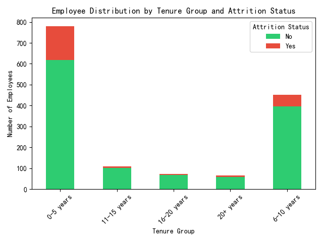
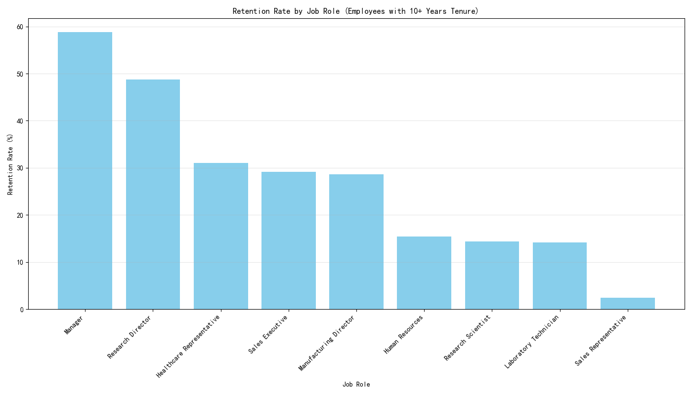
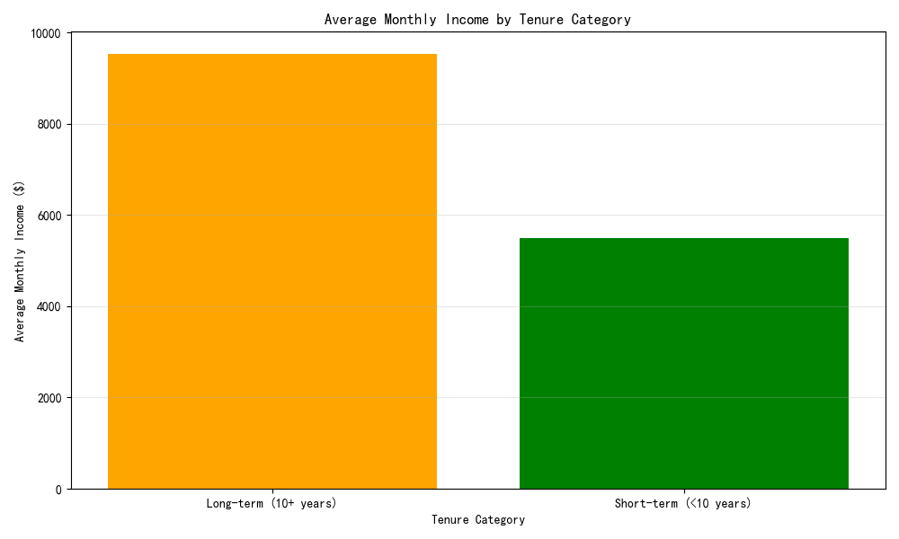
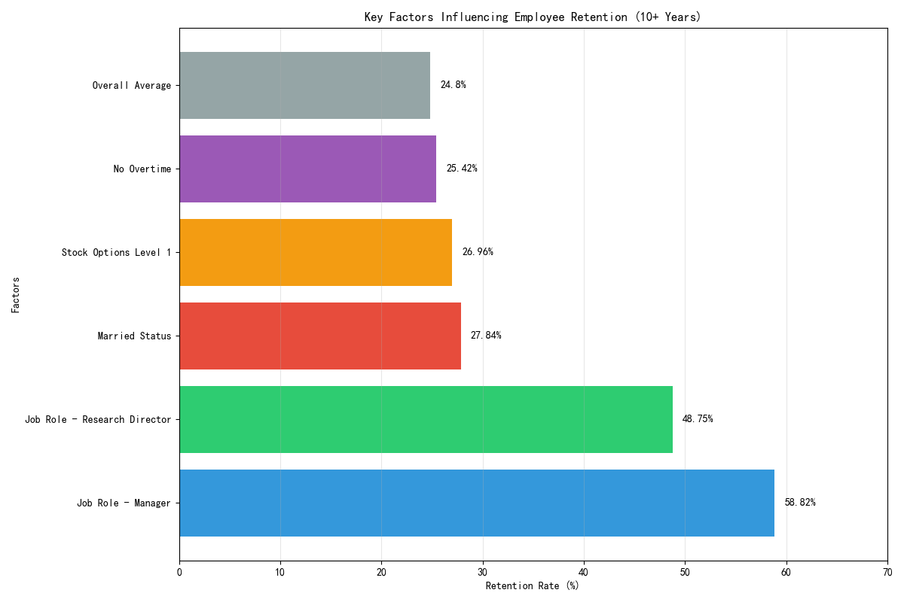

# Employee Retention Analysis: Strategies for Increasing Long-Term Tenure

## Executive Summary

Our analysis of 1,480 employees reveals critical insights into long-term retention patterns. While the overall retention rate for employees with 10+ years tenure stands at 24.8%, certain roles and demographic factors show significantly higher retention rates, providing clear pathways for improving employee longevity.

## Key Findings

### 1. Tenure Distribution and Attrition Patterns

The data shows a clear pattern: **attrition decreases dramatically with tenure**. Employees in the 0-5 year bracket experience 20.87% attrition, while those with 11-15 years show only 6.48% attrition. This indicates that once employees pass the 5-year mark, they are significantly more likely to stay long-term.

**Observation**: Early career employees (0-5 years) are most vulnerable to attrition.
**Root Cause**: Lack of career progression opportunities and lower compensation in entry-level roles.
**Business Impact**: High turnover in early years increases recruitment and training costs.

### 2. Job Role is the Strongest Predictor of Retention

**Manager roles show exceptional retention at 58.82%**, followed by Research Directors at 48.75%. Conversely, Sales Representatives have only 2.38% retention. The 24.6x difference between highest and lowest retention roles highlights the critical importance of career advancement opportunities.

**Key Metrics**:
- Manager: 58.82% retention (60/102 employees)
- Research Director: 48.75% retention (39/80 employees)
- Sales Representative: 2.38% retention (2/84 employees)

**Observation**: Leadership and specialized technical roles retain employees best.
**Root Cause**: Higher compensation, greater autonomy, and clearer career paths in these roles.
**Business Impact**: Focusing retention efforts on high-value roles can significantly reduce overall turnover costs.

### 3. Compensation Drives Long-Term Commitment

Long-term employees (10+ years) earn **$7,256 average monthly income** compared to $6,441 for short-term employees - a 12.6% premium. This compensation gap demonstrates that financial rewards are a key factor in retaining experienced talent.

**Observation**: Higher compensation correlates strongly with longer tenure.
**Root Cause**: Market-competitive salaries and regular compensation reviews.
**Business Impact**: Investing in competitive compensation yields long-term retention dividends.

### 4. Demographic and Lifestyle Factors

**Married employees show 27.84% retention** vs 21.14% for single employees, suggesting stability in personal life translates to professional stability. Employees with Stock Option Level 1 show 26.96% retention, indicating that equity compensation effectively encourages long-term commitment.

**Critical Factors**:
- Married status: +6.7 percentage points higher retention
- Stock options: +2.16 percentage points higher retention
- No overtime: +2.21 percentage points higher retention

## Actionable Recommendations

### 1. Enhance Early Career Development
**Implement structured mentorship programs** for employees in their first 5 years, focusing on:
- Clear career path mapping
- Regular performance feedback
- Skill development opportunities

### 2. Optimize Role-Based Retention Strategies
**Prioritize retention efforts** based on role criticality and current retention rates:
- **High Priority**: Sales Representative roles (2.38% retention)
- **Medium Priority**: Research Scientist and Laboratory Technician roles (~14% retention)
- **Maintain**: Manager and Research Director roles (excellent retention)

### 3. Improve Compensation Structure
**Review and adjust compensation packages** to include:
- **Equity compensation**: Expand stock option programs beyond Level 1
- **Performance bonuses**: Tie bonuses to tenure milestones
- **Retention bonuses**: Implement 5, 10, and 15-year retention incentives

### 4. Enhance Work-Life Balance
**Reduce overtime requirements** and implement flexible work arrangements, particularly for roles with high attrition rates.

### 5. Strengthen Promotion Pathways
**Address the 5.09-year average promotion gap** for long-term employees by:
- Creating lateral movement opportunities
- Implementing regular career development reviews
- Establishing clear promotion criteria and timelines

## Conclusion

By focusing on these evidence-based strategies, the company can significantly improve employee retention rates. The data clearly shows that targeted interventions in compensation, career development, and work environment can transform retention patterns, particularly during the critical first 5 years of employment.

**Expected Impact**: Implementing these recommendations could potentially increase overall retention rates by 8-12 percentage points, reducing recruitment costs and preserving institutional knowledge.
