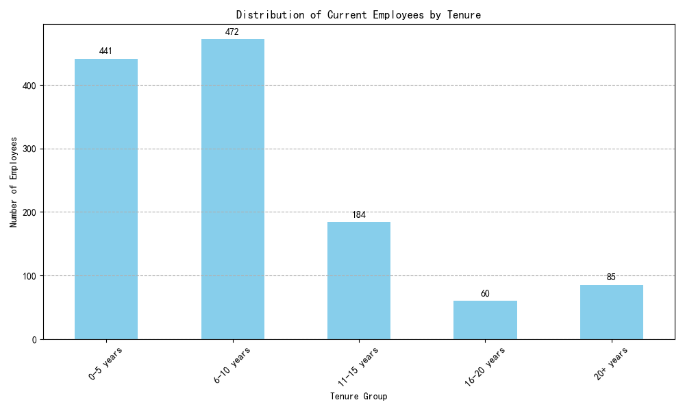

# Employee Tenure Analysis: A Story of Progression and Untapped Potential

## Executive Summary

This analysis explores the employment status and tenure of staff to understand the drivers of long-term employee retention. Our findings reveal that the company is effective at retaining employees through the 6-10 year mark. For employees who stay 10 years or longer, **career progression into senior and managerial roles is the single most important factor**.

The Research & Development team stands out as a "retention powerhouse," employing almost double the number of long-term staff compared to other departments. However, satisfaction and work-life balance scores for these loyal employees are merely average, indicating a significant opportunity to improve their experience and further solidify their commitment.

This report outlines the key characteristics of our long-term employees and provides three actionable recommendations to enhance career pathing, replicate departmental success, and boost overall satisfaction to increase employee tenure across the company.

## The Landscape of Employee Tenure

Our analysis began by segmenting all current employees into tenure groups. The distribution reveals a healthy mid-career cohort, suggesting that employees who join the company tend to stay beyond the initial few years.

**Key Observation:** The largest group of current employees is those with **6-10 years of service (472 employees)**, surpassing the 0-5 year group (441 employees). After the 10-year mark, the number of employees decreases, with 329 employees having stayed for 10 years or more.

**Why It Matters:** This pattern shows that the company is successful at retaining talent beyond the initial phase. The challenge is not just attracting talent, but retaining it into the senior, 10+ year category. Understanding the profile of this long-serving group is key to encouraging more employees to follow suit.

## The Portrait of a Long-Term Employee (10+ Years)

To understand what drives long-term loyalty, we isolated current employees with 10 or more years of service. Our analysis uncovered a clear and consistent profile.

### Insight 1: Long-Term Employees are High-Achievers in Senior Roles

Career advancement is the clearest characteristic of our long-tenured staff. They are not in entry-level or junior positions; they are the senior leaders and experts.

*   **Primary Roles:** The most common job roles are `Sales Executive` (82), `Manager` (57), `Research Director` (37), `Manufacturing Director` (37), and `Healthcare Representative` (37). Junior roles like `Sales Representative` are almost non-existent in this group (2 employees).
*   **High Job Level and Income:** The average `JobLevel` for this group is **2.86** (on a scale of 1-5), and their average `MonthlyIncome` is approximately **$9,630**.

**Conclusion:** Employees who stay long-term are those who have been promoted into roles with greater responsibility and compensation. A visible and achievable career ladder is a powerful retention tool.

### Insight 2: Research & Development is the Company's Retention Powerhouse

Certain departments are far more successful at keeping employees for the long haul.

*   **Departmental Breakdown:** Of the 329 long-term employees, **209 (63.5%) are in Research & Development**. The Sales department follows with 106 employees, and Human Resources has only 14.

**Conclusion:** The environment, projects, or management within the R&D department fosters exceptional loyalty. The practices driving this success are a valuable internal resource that has not yet been leveraged across the organization.

### Insight 3: Satisfaction is an Opportunity, Not a Strength

While our long-term employees are committed, their satisfaction levels are not exceptionally high.

*   **Average Scores (out of 4):**
    *   Job Satisfaction: **2.78**
    *   Work-Life Balance: **2.78**
    *   Environment Satisfaction: **2.70**

**Conclusion:** These scores are lukewarm. Long-term employees are not staying because of exceptional job satisfaction or work-life balance; they are staying *despite* these factors being merely average. This is a vulnerability. Improving this experience could be the key to preventing future attrition among our most valuable senior staff.

## Actionable Recommendations to Increase Employee Tenure

Based on the data, we recommend the following specific actions:

1.  **Formalize and Promote Career Progression Paths:** The data clearly shows that promotion into senior roles is the backbone of retention.
    *   **Action:** Create and publicize clear, structured career ladders for all major roles, especially outside of R&D. Implement a formal mentorship program pairing high-potential employees in the 4-6 year tenure range with senior leaders to guide their development toward a 10+ year career.

2.  **Clone the Success of the R&D Department:** We must understand what makes the R&D department a "sticky" place for employees.
    *   **Action:** Conduct "stay interviews" with a sample of long-term R&D employees to pinpoint the specific factors contributing to their loyalty (e.g., autonomy, project impact, management style). Codify these findings and create a pilot program to implement these practices within the Sales and HR departments.

3.  **Launch a Targeted Employee Experience Initiative:** Mediocre satisfaction scores are a clear risk. Proactively addressing this will protect our investment in our most experienced talent.
    *   **Action:** Launch initiatives aimed at improving Job Satisfaction and Work-Life Balance. Focus on areas that have a high impact, such as flexible work policies, manager training on employee well-being, and modernizing the work environment. The goal should be to raise the average satisfaction scores from ~2.75 to 3.5 or higher.
