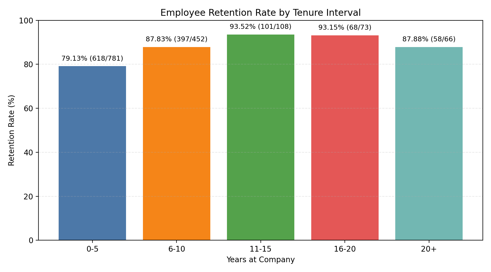

Employee tenure analysis and retention playbook

Executive summary
- Retention strengthens with tenure: from 79.1% in years 0–5 to ~93% in 11–20 years, then softens to 87.9% at 20+ years (SQL on sheet1: YearsAtCompany -> intervals; Attrition counts). Overall retention is 83.9% (1,242/1,480); long-term (10+ years) retention is 89.6% (329/367).
- Long-term retainers share traits: less overtime, less frequent travel, higher work-life balance and satisfaction, more equity and pay, shorter commutes, more years with current manager/in role, and more consistent promotion velocity.
- The at-risk pockets: early tenure (0–5 years), Sales Executives within long-term cohort, employees with frequent travel, high overtime, long time since promotion, distant commutes, and lower stock option levels.

What the data shows (with evidence)
1) Retention by tenure interval (current employment status)
- 0–5 years: 618 retained / 781 total = 79.13% retention.
- 6–10 years: 397/452 = 87.83%.
- 11–15 years: 101/108 = 93.52%.
- 16–20 years: 68/73 = 93.15%.
- 20+ years: 58/66 = 87.88%.
Source: SQL aggregation over sheet1 using CASE bins on YearsAtCompany and COUNT by Attrition.

Visualization
- Employee Retention Rate by Tenure Interval. The plot below shows retention accelerating after 5 years, peaking around 11–20 years, with a modest dip beyond 20.

Key takeaway: Retention rises from 79.1% (0–5) to 93.5% (11–15) and 93.2% (16–20), then dips to 87.9% (20+). This indicates the biggest opportunity is to lift early-tenure retention; for ultra-tenured (20+) employees, targeted engagement can prevent late-stage exits.

Python used to create the plot
- File executed: plot_retention.py (via python3). It connects to dacomp-en-031.sqlite, computes interval retention with SQL, and plots a bar chart with counts and percentages annotated.

2) Who are long-term retained employees? (YearsAtCompany ≥ 10, Attrition = 'No')
Cohort sizes
- Long-term total: 367; Retained: 329 (89.6%); Attrited: 38 (10.4%).
- Source: SELECT COUNT and conditional SUMs on YearsAtCompany ≥ 10 and Attrition.

Workload and travel
- Overtime: Retained 75.7% No (249/329) vs Attrited 55.3% No (21/38). Long-term attrited work overtime at nearly double rate: 44.7% vs 24.3%. Root cause signal: sustained workload intensity is associated with attrition.
- Travel: Among retained, Travel_Rarely is 69.9% (230/329) and Travel_Frequently 18.5% (61/329). Among attrited, Travel_Frequently rises to 26.3% (10/38). Root cause signal: frequent travel is correlated with attrition among long-tenure employees.

Satisfaction, work-life, engagement
- WorkLifeBalance: 2.78 (retained) vs 2.53 (attrited); JobSatisfaction: 2.78 vs 2.58; EnvironmentSatisfaction: 2.70 vs 2.53; JobInvolvement: 2.72 vs 2.53. These deltas indicate that higher WLB and satisfaction align with retention.

Career progression, manager stability
- Years since last promotion: 4.94 (retained) vs 6.34 (attrited) — attrited have gone longer without promotion.
- Years with current manager: 8.37 (retained) vs 7.77 (attrited); Years in current role: 8.62 vs 7.42. Stability with manager/role and clearer progression cadence coincide with retention.

Compensation and equity
- Monthly income: 9,630 vs 8,769; Job level: 2.86 vs 2.71. Retained are modestly more senior and better compensated.
- Stock options: Average 0.85 vs 0.61; Distribution for retained — Level1+ is 62.7% (206/329), vs 42.1% (16/38) for attrited. Equity appears to support longer tenure.

Distance, training, performance
- Distance from home: 9.21 vs 11.95 — longer commutes associate with attrition.
- Training times last year: 2.83 vs 2.66 — small uplift among retained suggests ongoing development helps.
- Salary hike % and performance: 15.24% vs 14.58%, rating 3.16 vs 3.13 — slightly higher for retained.

Department and roles
- Department (retained): R&D 209 (63.5%), Sales 106 (32.2%), HR 14 (4.3%). Attrited long-term: Sales has a larger share vs R&D (42.1% Sales vs 55.3% R&D), hinting Sales-specific challenges.
- Job role: Among long-term attrited (n=38), Sales Executive is 36.8% (14), overrepresented relative to their retained presence (82/329 = 24.9%). Targeted action for Sales Executives is warranted.

Demographics
- Gender among long-term: Retained 41% Female, 59% Male; Attrited 39.5% Female, 60.5% Male — no large skew.
- Marital status: Singles form 39.5% of long-term attrited vs 25.8% of retained; combined with travel/overtime, this may reflect differential tolerance for disruptive schedules.

Why this matters
- Early tenure is the largest leakage: improving 0–5 year retention from 79.1% to 85% would save ~47 departures annually in that band (6% of 781), materially reducing hiring costs and protecting team continuity.
- For long-tenured staff, preventing late-stage exits (20+ years at 87.9% retention) protects institutional knowledge; small, targeted programs can yield outsized value.

Actionable recommendations
1) Lift early-tenure (0–5 years) retention
- Observation: Retention is lowest at 79.1% in 0–5 years.
- Root cause: Onboarding and role fit risk before employees become embedded; promotion cadence matters later too.
- Actions:
  - 90/180-day onboarding and mentorship with explicit milestones.
  - Career plan by month 6; define 24–30 month expectations for progression or role broadening.
  - Early manager check-ins (“stay interviews”) at months 3/6/12.

2) Reduce overtime load and manage capacity
- Observation: Long-term attrited work overtime 44.7% vs 24.3% for retained.
- Root cause: Sustained workload intensity drives burnout.
- Actions:
  - Overtime guardrails and weekly workload dashboards; flag teams above threshold.
  - Add headcount or automate peak-load tasks; rotate on-call duties.
  - Manager goal: keep team OT rate <25% of staff for long-run sustainability.

3) Curb travel burden or offer alternatives/support
- Observation: Frequent travel among long-term attrited is 26.3% vs 18.5% in retained.
- Root cause: Travel fatigue reduces WLB and attachment.
- Actions:
  - Virtual-first selling/servicing where feasible; use regional rotations to distribute travel.
  - Travel credits, upgrade policies, and extra recovery time after trips.

4) Strengthen promotion cadence and internal mobility
- Observation: Attrited have 6.34 years since last promotion vs 4.94 for retained.
- Root cause: Career stagnation.
- Actions:
  - Set promotion/mobility SLAs: review at 24 months in role; intervention at 36–48 months.
  - Quarterly talent reviews focusing on employees with YearsSinceLastPromotion ≥ 5.
  - Provide stretch assignments and formal role rotations.

5) Increase equity participation and refreshers
- Observation: 62.7% of long-term retained have stock options Level ≥1 vs 42.1% among attrited; average stock option level is higher among retained (0.85 vs 0.61).
- Root cause: Ownership aligns incentives over multi-year horizons.
- Actions:
  - Grant at least Level 1 equity by year 3–5; introduce refresher grants at years 7–10.
  - Tie refreshers to key milestones (promotion, critical skills, leadership roles).

6) Keep manager relationships stable and effective
- Observation: Retained have more years with current manager (8.37 vs 7.77) and in role (8.62 vs 7.42), plus higher satisfaction.
- Root cause: Effective, stable leadership drives engagement.
- Actions:
  - Limit disruptive manager rotations; train managers on workload/WLB, recognition, and stay-interviews.
  - Measure manager eNPS and intervenes with coaching where low.

7) Support commuting flexibility
- Observation: Retained live closer (9.21 vs 11.95 miles/km); distance correlates with attrition.
- Actions:
  - Hybrid schedules, commuter subsidies, or relocation support prioritized for employees with DistanceFromHome ≥ 12.

8) Sales Executive–specific retention plan
- Observation: Sales Executives are overrepresented among long-term attrited (36.8%).
- Root cause: Variable travel, quota pressure, territory churn.
- Actions:
  - Stabilize territories; adjust quotas realistically; enhance sales engineering support.
  - Travel-light enablement (inside sales plays), and SPIFs tied to retention milestones (e.g., 24/36 months).

9) Nudge continuous learning
- Observation: Retained show slightly higher training counts (2.83 vs 2.66) and higher salary hikes.
- Actions:
  - Annual learning stipends; required skill pathways linked to promotion and salary growth.

Measurement plan
- Build a monthly risk dashboard filtering employees with: OverTime='Yes', BusinessTravel='Travel_Frequently', YearsSinceLastPromotion ≥ 5, DistanceFromHome ≥ 12, JobLevel in {1,3}, Sales Executive role. Track retention outcomes vs control.
- Goals: Raise 0–5 year retention from 79.1% to 85% in 12 months; reduce long-tenure (10+ years) attrition from 10.4% to <8% by targeting the risk segments above.

Data/Method notes
- Data source: dacomp-en-031.sqlite, table sheet1.
- Key fields used: Attrition, YearsAtCompany, OverTime, BusinessTravel, JobSatisfaction, EnvironmentSatisfaction, WorkLifeBalance, JobInvolvement, YearsSinceLastPromotion, YearsWithCurrManager, YearsInCurrentRole, TotalWorkingYears, DistanceFromHome, TrainingTimesLastYear, PercentSalaryHike, PerformanceRating, MonthlyIncome, JobLevel, StockOptionLevel, Department, JobRole, Gender, MaritalStatus.
- SQL: Aggregations by tenure interval and cohort splits on YearsAtCompany ≥ 10 with GROUP BY Attrition.
- Python/matplotlib: Generated retention_by_tenure.png via plot_retention.py to visualize interval retention with annotated rates and counts.

Bottom line
- Focus on the first 5 years to stem losses, and apply targeted interventions for long-tenured risk pockets (high OT, frequent travel, long time since promotion, distant commute, Sales Exec role, low equity). These actions are directly tied to the attributes that distinguish long-term retained employees in this dataset and should increase employee tenure across the company.
