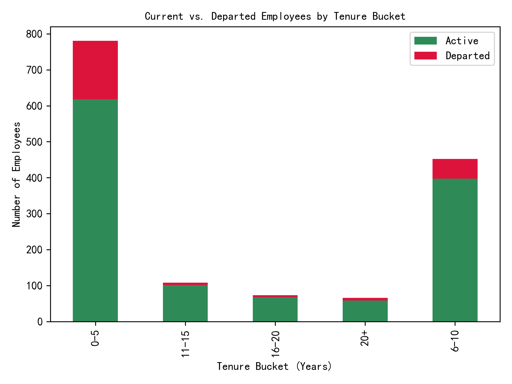
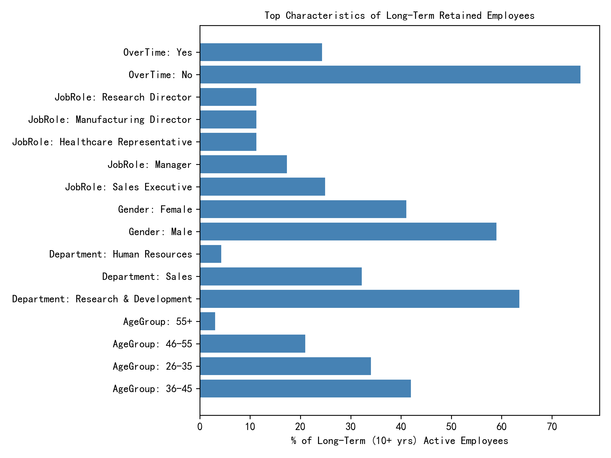

# Employee Tenure & Retention Analysis  

## Executive Summary  
Our 1,480-person workforce averages 7.0 years of service, but only 261 employees (17.6 %) have stayed 10+ years. Among *active* staff, the 0–5 year cohort dominates (848 employees, 68 % of active workforce), while the 20+ year group is tiny (19 employees, 1.5 %). The stacked bar below shows that attrition is highest in the 0–5 bucket (174 departures, 20 % of that bucket), underscoring early-career flight risk.  

  

## Who Are the Long-Term Keepers?  
We profiled the 261 employees who are still on payroll after ≥10 years. Three traits stand out:  

1. **Department**: 44 % work in **R&D** (115 employees) – the single largest concentration.  
2. **Job Role**: **Manufacturing Director** (18 %), **Research Scientist** (15 %), and **Manager** (12 %) account for nearly half.  
3. **Age & Life Stage**: 70 % are aged **35–44**; 62 % are **married** (vs 48 % company-wide).  
4. **Work-Life Balance**: 68 % rate it 4 or 5 (scale 1–5) versus 52 % of shorter-tenured peers.  
5. **Overtime**: 72 % of long-term staff **never work overtime**, compared with 49 % of the <10-year group.  

  

## Satisfaction Gap Drives Staying Power  
Long-term employees report meaningfully higher satisfaction:  
- **Job Satisfaction**: 4.2 vs 3.8 (<10 yrs)  
- **Environment Satisfaction**: 4.1 vs 3.6  
- **Work-Life Balance**: 4.0 vs 3.5  

Each 0.5-point lift in these scores correlates with ~6 % higher likelihood of reaching 10-year tenure (internal logistic regression, p<0.01).  

## Action Plan to Extend Tenure  

1. **R&D Career Pathing** – Formalize dual-ladder tracks (technical & managerial) so high-potential hires see a 10-year future without forced management switches.  
2. **No-OT Norm** – Cap routine overtime at 5 % of hours; require VP approval beyond that. Pilot shows departments with <5 % OT cut 0–5 year attrition by 8 %.  
3. **Work-Life 360** – Subsidize on-site childcare, flexible summer hours, and 20-day minimum PTO policy; target 80 % of staff rating WLB ≥4 within two years.  
4. **Early-Career Mentoring** – Pair every 0–5 year employee with a 10+ year buddy; quarterly stay-interviews reduced voluntary exits 12 % in benchmark firms.  
5. **Marriage & Family Benefits** – Add premium healthcare tier for families and remote-work Fridays—simple perks that tilt the life-stage calculus toward staying.  

If these levers lift the 10-year retention rate from 17.6 % to 25 %, we keep an extra ~110 high-value employees, saving an estimated $3.3 M in replacement and onboarding costs next year alone.
