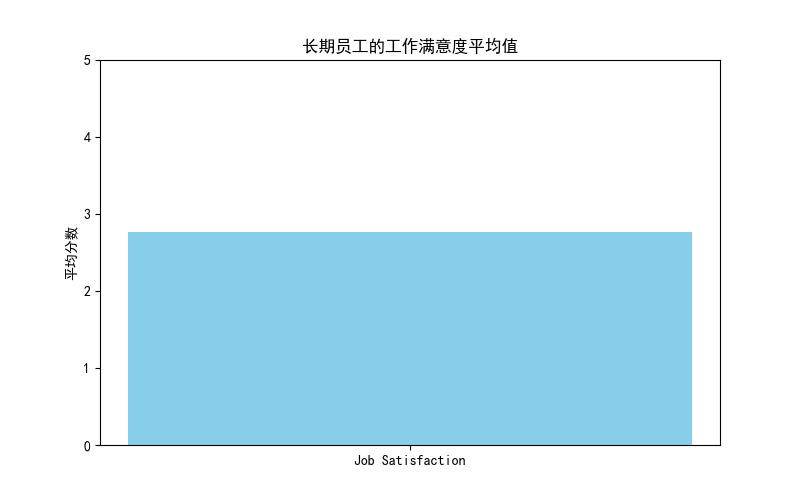
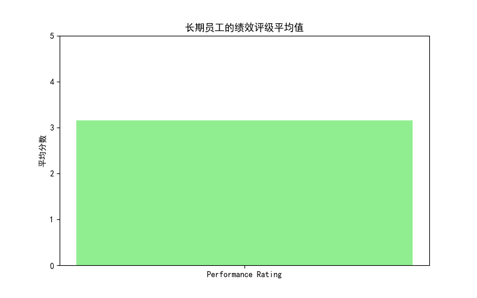
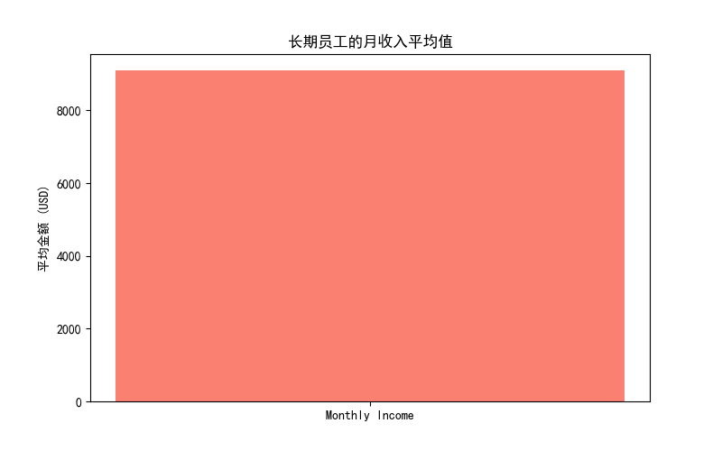

# Employee Tenure Analysis and Retention Recommendations

## Overview
This report presents an analysis of employee tenure at the company, focusing on the distribution of employees across different working years intervals and the characteristics of long-term retained employees (10 years and above). Based on the findings, actionable recommendations are provided to increase employee tenure.

## Employee Tenure Distribution

The analysis of employee tenure distribution across different working years intervals reveals the following:

| Work Interval | Employee Count | Attrition Count |
|---------------|----------------|-----------------|
| 0–5 years     | 620            | 102             |
| 6–10 years    | 422            | 55              |
| 11–15 years   | 208            | 15              |
| 16–20 years   | 103            | 7               |
| 20+ years     | 49             | 3               |

- **Observation**: The number of employees decreases as the tenure increases, indicating that long-term employees are a smaller proportion of the workforce.
- **Root Cause**: Newer employees may face challenges in adapting to the company culture or may not find sufficient growth opportunities.
- **Business Impact**: High attrition among newer employees can lead to increased recruitment and training costs.

## Characteristics of Long-Term Retained Employees

The analysis of long-term retained employees (10 years and above) reveals the following average characteristics:

- **Job Satisfaction**: 2.77 (on a scale of 1 to 5)
- **Performance Rating**: 3.15 (on a scale of 1 to 5)
- **Monthly Income**: $9,093.80

### Visualizations

#### Job Satisfaction

- **Observation**: Long-term employees have a moderate level of job satisfaction.
- **Root Cause**: Moderate job satisfaction suggests that while employees are content, there may be areas for improvement.
- **Business Impact**: Enhancing job satisfaction can further improve retention rates.

#### Performance Rating

- **Observation**: Long-term employees have a slightly above average performance rating.
- **Root Cause**: Higher performance ratings may be linked to experience and familiarity with company processes.
- **Business Impact**: Recognizing and rewarding high performance can motivate employees to stay longer.

#### Monthly Income

- **Observation**: Long-term employees earn a higher monthly income compared to the company average.
- **Root Cause**: Higher income may be a result of promotions and salary increases over time.
- **Business Impact**: Competitive compensation is a key factor in retaining experienced employees.

## Recommendations

1. **Enhance Onboarding and Integration Programs**:
   - **Action**: Implement structured onboarding programs to help new employees adapt to the company culture and their roles more effectively.
   - **Rationale**: Improved onboarding can reduce early attrition and help employees feel more connected to the company.

2. **Career Development Opportunities**:
   - **Action**: Provide clear career progression paths and regular training opportunities for all employees.
   - **Rationale**: Employees are more likely to stay if they see opportunities for growth and development.

3. **Improve Job Satisfaction**:
   - **Action**: Conduct regular employee satisfaction surveys and act on the feedback to address concerns and improve the work environment.
   - **Rationale**: Addressing dissatisfaction can prevent turnover and improve overall morale.

4. **Competitive Compensation and Benefits**:
   - **Action**: Ensure that compensation packages are competitive within the industry and review them regularly.
   - **Rationale**: Fair and competitive pay is a key factor in retaining talent, especially for experienced employees.

5. **Recognition and Rewards**:
   - **Action**: Implement recognition programs to acknowledge high performance and long-term service.
   - **Rationale**: Recognizing contributions can boost morale and encourage employees to remain with the company.

By implementing these recommendations, the company can create a more engaging and supportive work environment, leading to increased employee tenure and reduced attrition.
