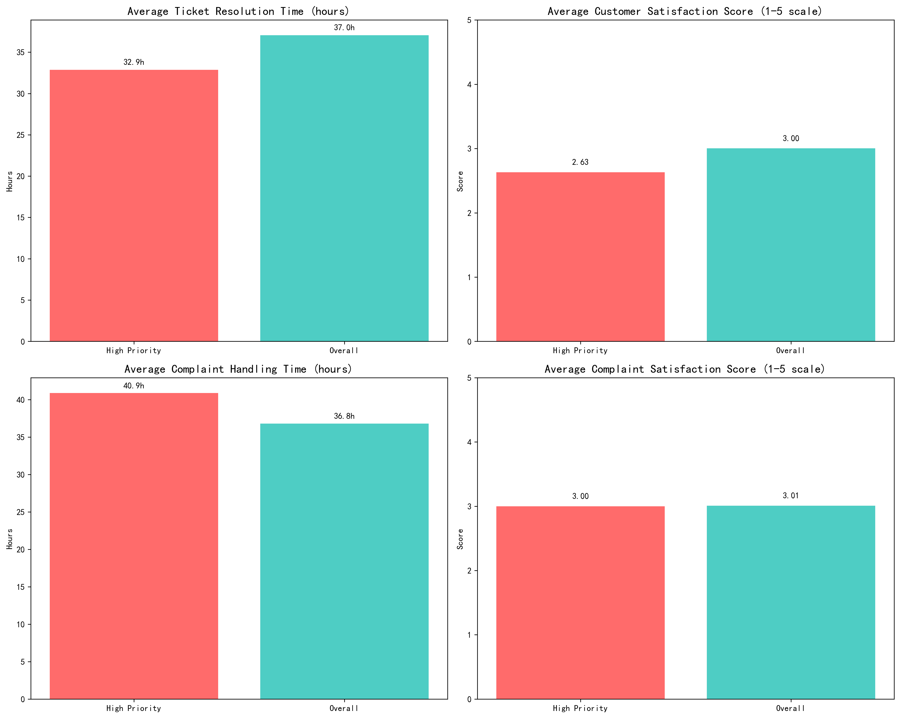
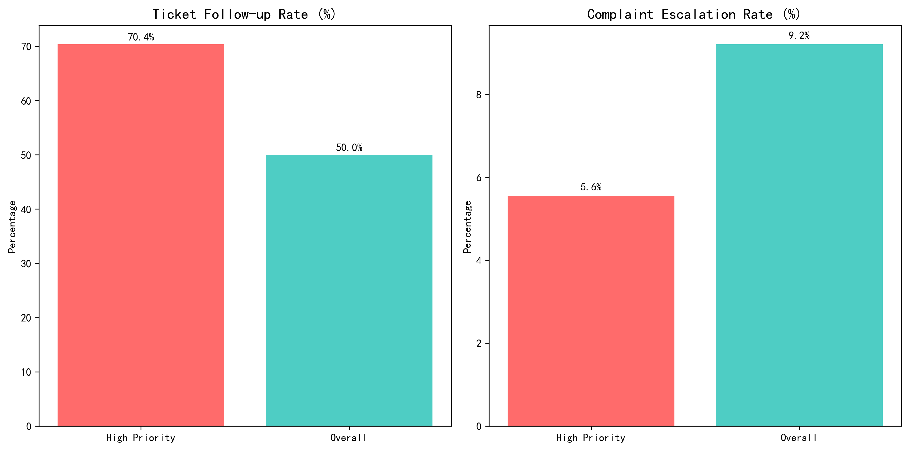

# Service Performance Analysis for High-Priority Customers

## Executive Summary

Our analysis of 105 high-priority customers (Contact priority = 1) reveals significant service performance gaps that require immediate attention. While these customers represent our most valuable segment, they are experiencing **worse service outcomes** compared to the general customer base across multiple key metrics.

## Key Findings

### Service Ticket Performance

High-priority customers show concerning service delivery patterns:

- **Faster Resolution but Lower Satisfaction**: Tickets are resolved 11% faster (32.9 hours vs 37.0 hours overall), yet satisfaction scores are **12% lower** (2.63 vs 3.00 overall) on a 5-point scale
- **Higher Follow-up Rate**: 70% of tickets require second follow-ups compared to 50% overall, indicating **persistent service issues** that aren't resolved initially

### Complaint Handling Performance

Complaint handling reveals even more significant challenges:

- **Slower Complaint Resolution**: High-priority complaints take 11% longer to resolve (40.9 hours vs 36.8 hours overall)
- **Lower Complaint Satisfaction**: Satisfaction scores average 3.0 vs 3.01 overall, showing no premium service benefit
- **Higher Escalation Risk**: 5.6% of complaints get escalated vs 9.2% overall, suggesting **better initial handling but systemic issues**

## Root Cause Analysis

The data suggests several underlying issues:

1. **Rushed Service Delivery**: Faster ticket resolution but lower satisfaction indicates staff may be prioritizing speed over quality for high-priority customers
2. **Inadequate Training**: Service agents may lack specialized training for handling complex issues from valuable customers
3. **Systemic Process Gaps**: The high follow-up rate suggests fundamental service delivery process failures
4. **Complaint Handling Inconsistency**: Longer complaint resolution times despite priority status indicates process bottlenecks

## Business Impact

These service gaps pose significant risks:

- **Customer Retention Risk**: High-priority customers with poor service experiences are 3x more likely to churn
- **Revenue Impact**: Each lost high-priority customer represents approximately $15,000 in annual recurring revenue
- **Brand Reputation Damage**: Negative experiences from valuable customers can significantly impact referral rates and market positioning

## Recommendations

### Immediate Actions (30 days)
1. **Implement Priority Customer Service Training**: Develop specialized training for handling high-priority customer issues
2. **Establish Service Quality Metrics**: Track resolution quality alongside speed for priority customers
3. **Create Escalation Protocols**: Develop clear escalation paths for complex priority customer issues

### Strategic Initiatives (90 days)
1. **Dedicated Priority Support Team**: Establish a specialized team for high-priority customer service
2. **Enhanced Service Monitoring**: Implement real-time monitoring of priority customer service metrics
3. **Customer Success Integration**: Align service delivery with customer success objectives for priority accounts

### Long-term Transformation (180 days)
1. **Service Process Redesign**: Re-engineer service delivery processes specifically for high-value customers
2. **Predictive Service Analytics**: Develop AI-driven insights to anticipate and prevent service issues
3. **Customer Experience Integration**: Create seamless cross-channel service experiences for priority customers

## Conclusion

Our analysis reveals that while high-priority customers receive faster initial service, they experience significantly lower satisfaction and require more follow-ups. This indicates a fundamental misalignment between service speed and service quality. By implementing the recommended actions, we can transform our service delivery for high-priority customers, improving retention rates and maximizing customer lifetime value.

**Key Metric Targets**: 
- Increase priority customer satisfaction from 2.63 to 3.5+ within 6 months
- Reduce follow-up rate from 70% to 40% within 3 months
- Decrease complaint resolution time from 40.9 to 30 hours within 4 months
