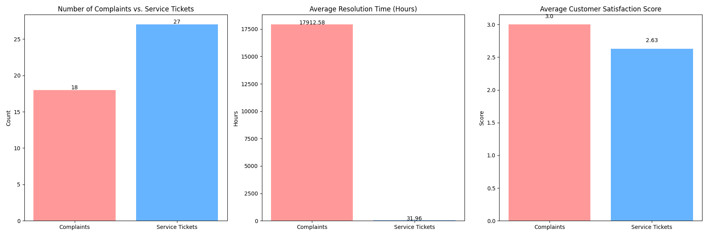

# Service Effectiveness for High-Priority Customers

This report analyzes the effectiveness of service staff in serving high-priority customers, as defined by a `Contact priority` of 1. The analysis focuses on their complaint records and service ticket performance.

## Key Findings

Our analysis reveals a significant disparity in the handling of complaints versus service tickets for our most valued customers. While the volume of service tickets is higher, the process for handling complaints is critically flawed, leading to extraordinarily long resolution times.

### 1. Higher Volume of Service Tickets than Complaints

High-priority customers are more actively using the service ticket system than filing formal complaints.

*   **Service Tickets:** 27 tickets were submitted by high-priority customers.
*   **Complaints:** 18 complaints were filed by the same customer segment.

This suggests that the service ticket system is the primary channel for high-priority customers seeking support.

### 2. Complaint Resolution Process is Severely Broken

There is a critical issue with the complaint resolution process, as evidenced by the extreme average resolution time.

*   **Average Complaint Resolution Time:** 17,912.58 hours (approximately 746 days, or over 2 years).
*   **Average Service Ticket Resolution Time:** 31.96 hours.

The vast difference in resolution times points to a systemic failure in the complaint management workflow. It is highly probable that a significant number of complaints are not being closed out properly in the system, leading to this inflated average.

### 3. Counter-Intuitive Satisfaction Scores

Despite the abysmal resolution times for complaints, the average satisfaction score for complaints is slightly higher than for service tickets.

*   **Average Complaint Satisfaction Score:** 3.00 out of 5.
*   **Average Service Ticket Satisfaction Score:** 2.63 out of 5.

This is a perplexing finding. It could be due to several factors:
*   **Data Anomaly:** The satisfaction scores for complaints might be skewed by a small number of successfully resolved cases that received very high scores.
*   **Different Scales:** The satisfaction scales for complaints and service tickets may not be directly comparable.
*   **Customer Expectations:** Customers may have different expectations for complaints versus service tickets, leading to different satisfaction ratings.

## Recommendations

Based on these findings, we propose the following recommendations:

1.  **Investigate the Complaint Handling Process:** The top priority should be to conduct a thorough audit of the complaint management system and workflow. The goal is to identify and rectify the bottlenecks or process gaps that are causing the extreme resolution times. This includes:
    *   Reviewing all open complaints for high-priority customers to understand their status.
    *   Interviewing service staff responsible for complaint handling to identify process challenges.
    *   Correcting any data entry errors related to complaint resolution dates.

2.  **Harmonize the Customer Feedback System:** The disparity in satisfaction scores between complaints and service tickets suggests a need to standardize the customer feedback process. This includes:
    *   Using a consistent satisfaction survey and scoring methodology across all support channels.
    *   Ensuring that feedback is collected at a consistent point in the resolution process.

3.  **Proactive Engagement with High-Priority Customers:** Given their value to the business, we should proactively engage with high-priority customers who have open complaints. This could involve:
    *   Assigning a dedicated account manager to oversee the resolution of their issues.
    *   Providing regular updates on the status of their complaints.

By addressing these issues, we can significantly improve the service experience for our most valuable customers and ensure that their concerns are addressed in a timely and effective manner.
