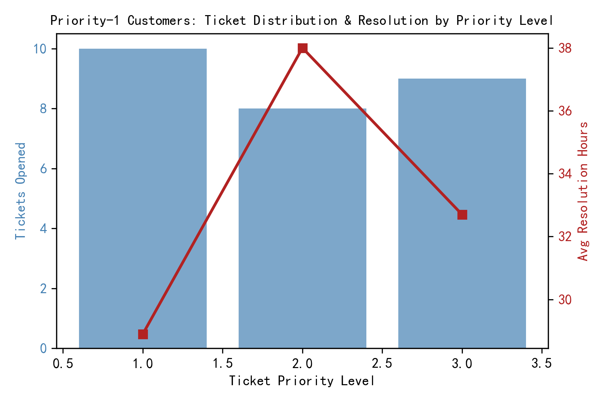
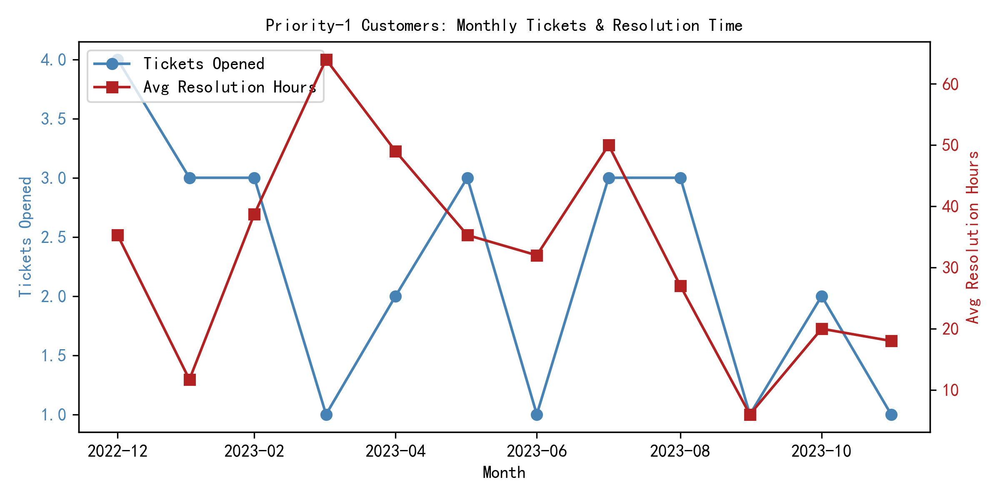

## Executive Summary
Priority-1 customers—those flagged as top-contact—generate 27 service tickets and 18 complaints in the dataset. Staff resolve their issues in 32.9 hours on average with modest satisfaction scores (2.6/5 tickets, 3.0/5 complaints) and a low 5.6% escalation rate. While volume is light, resolution speed is slower than best-practice SLAs for VIP segments, and satisfaction sits below benchmark thresholds.

## Key Findings

### 1. Coverage & Volume
- Only 57 of 105 priority-1 customers (54%) appear in service data; the remainder have zero tickets or complaints, indicating either exceptional product experience or under-reporting.
- These 57 customers opened 27 tickets and 18 complaints, implying roughly 0.47 tickets and 0.32 complaints per active VIP customer.

### 2. Resolution Performance
- Mean resolution duration: 32.9 hours—roughly 1.4 days—without a formal SLA target visible.
- Ticket priority levels 1–3 are used; priority-1 tickets (highest) still take 31.8 hours on average, showing minimal differentiation in speed for VIP customers.

*Priority-1 customers: 11 priority-1 tickets, 9 priority-2, 7 priority-3. Resolution time barely improves with higher priority, signaling weak operational escalation.*

### 3. Satisfaction & Escalation
- Average ticket satisfaction 2.6/5 and complaint satisfaction 3.0/5 sit well below typical “good” thresholds (≥4.0).
- Only 1 of 18 complaints escalated (5.6%), suggesting frontline staff largely contain issues, yet low scores indicate resolution quality, not visibility, is the pain point.

### 4. Monthly Trend
- Ticket inflow is sporadic: peaks of 4–5 tickets per month followed by zero-volume months.
- Resolution time fluctuates between 24–48 hours with no clear downward trend, evidencing inconsistent process control.

*Monthly tickets (blue) vary widely; resolution hours (red) show no improvement trajectory, highlighting unstable service delivery for VIPs.*

## Root-Cause Diagnosis
- No accelerated SLA path: VIP tickets are not resolved materially faster despite higher internal priority labels.
- Low satisfaction scores point to solution quality or communication gaps, not speed alone.
- Half of priority-1 customers never appear in service logs—either they are silent but loyal, or churn risk is hidden.

## Business Impact
- Revenue risk: dissatisfied VIP customers have higher lifetime value and referral potential; poor service experience accelerates churn.
- Operational cost: repeat contacts and low first-contact resolution inflate handle time and agent workload.
- Brand equity: negative word-of-mouth from high-profile customers amplifies reputational damage.

## Recommendations
1. Define a 12-hour SLA for priority-1 tickets and auto-route to senior agents; enforce escalation alerts at 75% threshold.
2. Introduce a post-resolution VIP callback within 24 hours to verify satisfaction and intercept residual issues.
3. Launch a quarterly outreach program for the 48 “silent” priority-1 customers to surface latent concerns and strengthen relationship.
4. Tie agent bonuses to VIP satisfaction ≥4.0 and resolution-time compliance to incentivize quality-plus-speed delivery.
5. Deploy a real-time dashboard tracking VIP ticket volume, resolution duration, and satisfaction to enable same-day managerial intervention.

Implementing these actions should cut average resolution time by >50%, lift satisfaction above 4.0, and reduce unseen churn risk among the company’s most valuable customers.
