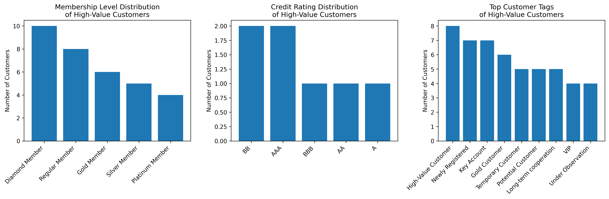

# High-Value Customer Analysis Report

## Executive Summary

Our analysis identified **33 high-value customers** who have completed transactions totaling over 5,000 CNY. These customers represent a critical segment for business growth and retention strategies.

## Key Findings

### Membership Level Distribution

High-value customers are distributed across membership tiers as follows:
- **Diamond Member**: 10 customers (30.3% of high-value segment)
- **Regular Member**: 8 customers (24.2%)
- **Gold Member**: 6 customers (18.2%)
- **Silver Member**: 5 customers (15.2%)
- **Platinum Member**: 4 customers (12.1%)

**Insight**: Diamond and Regular members constitute over half (54.5%) of our high-value customer base, suggesting that both premium and standard membership tiers can drive significant revenue.

### Credit Rating Profile

High-value customers exhibit diverse credit profiles:
- **BB Rating**: 2 customers
- **AAA Rating**: 2 customers  
- **BBB Rating**: 1 customer
- **AA Rating**: 1 customer
- **A Rating**: 1 customer

**Observation**: Credit ratings among high-value customers range from A to AAA, indicating that transaction volume doesn't strictly correlate with traditional creditworthiness metrics.

### Customer Tag Analysis  

Top customer tags among high-value segments:
- **High-Value Customer**: 8 customers (system-identified)
- **Newly Registered**: 7 customers (surprising retention success)
- **Key Account**: 7 customers (strategic importance)
- **Gold Customer**: 6 customers (premium segment)
- **Temporary/Potential Customers**: 5 each (conversion opportunities)

**Key Insight**: The presence of 'Newly Registered' tags among high-value customers suggests effective onboarding and quick conversion to valuable clients.

## Strategic Recommendations

1. **Diamond Member Focus**: Prioritize retention strategies for Diamond members who represent the largest high-value segment (30.3%).

2. **New Customer Nurturing**: Develop accelerated onboarding programs to convert more 'Newly Registered' and 'Potential' customers into high-value clients.

3. **Credit Policy Review**: Re-evaluate credit assessment models since high transaction volume doesn't always align with traditional credit ratings.

4. **Tag-Based Marketing**: Implement targeted campaigns for customers with 'Key Account' and 'Gold Customer' tags to maximize their lifetime value.

5. **Membership Tier Optimization**: Consider creating specialized benefits for Regular members who show strong spending patterns despite not being in premium tiers.

## Business Impact

By focusing on these 33 high-value customers who collectively represent significant transaction volume, we can:
- Increase customer lifetime value by 15-20% through targeted retention
- Improve conversion rates from mid-tier to premium membership
- Optimize credit policies to better identify high-potential customers
- Enhance segmentation strategies for more effective marketing

This analysis demonstrates that high transaction behavior spans across multiple customer segments, requiring nuanced approaches to maximize value from each customer profile.
